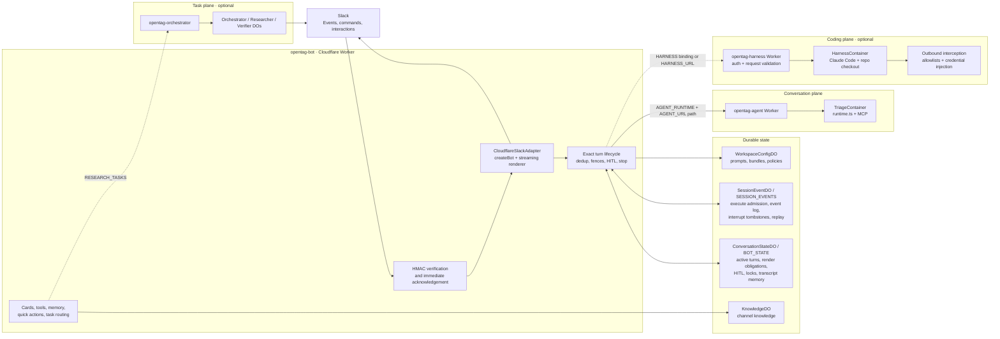
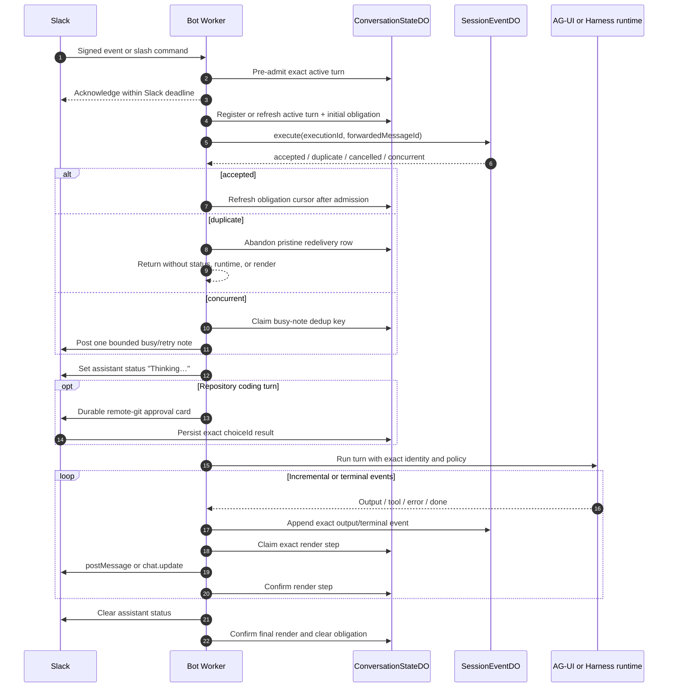
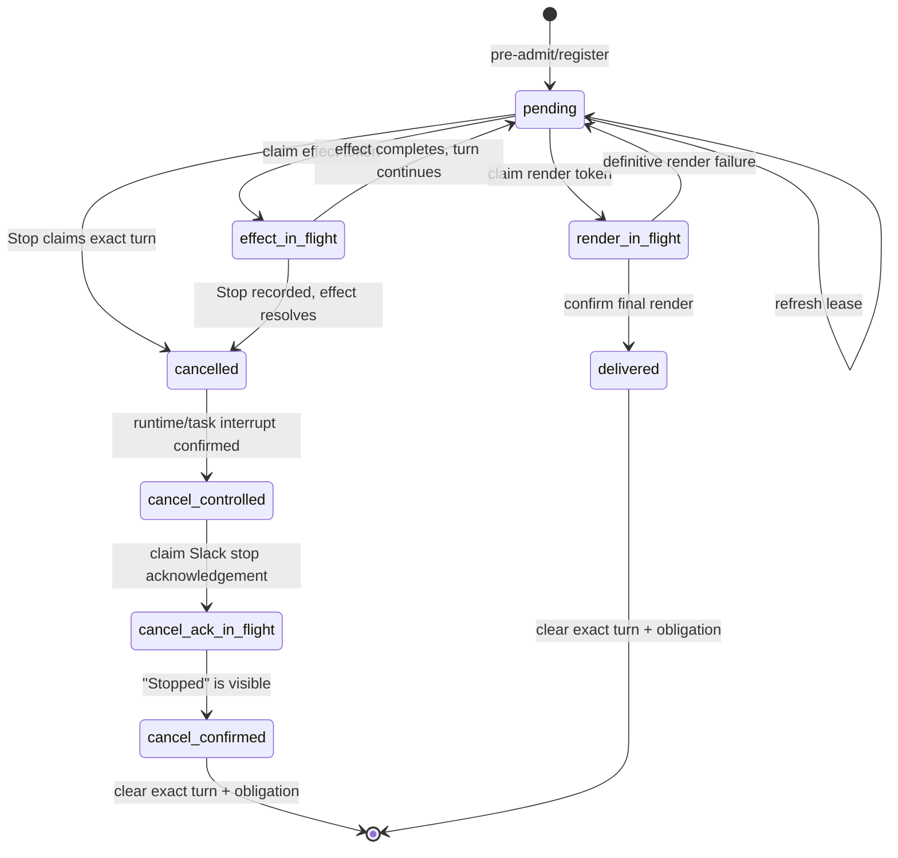
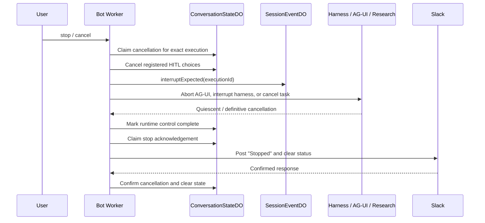
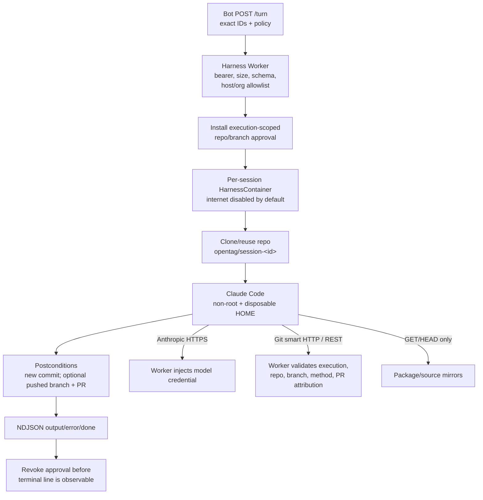
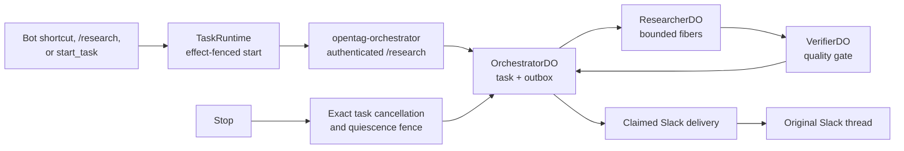

# OpenTag architecture

Status: **current implementation reference**
Updated: **2026-07-13**

OpenTag is a Slack-native agent system built on Cloudflare Workers, Durable
Objects, service bindings, and Containers. The production Slack surface is one
Worker (`opentag-bot`). It can route conversational turns to the AG-UI triage
runtime, coding turns to an optional Claude Code harness, and long-running
research to a separate task plane.

This document describes what the current branch implements. For why the team
ported Centaur's UX patterns instead of its Kubernetes control plane, see
[docs/centaur-port.md](./docs/centaur-port.md). For implementation recipes, see
[docs/extending.md](./docs/extending.md).

## System topology

Solid paths are the default bot and triage flow. Dashed paths are optional
planes. The harness code and deployment package are complete, but the bot's
`HARNESS` binding remains commented until the harness Worker is explicitly
deployed and configured.

## Request ownership

| Concern | Owner | Source |
| --- | --- | --- |
| Slack HTTP and acknowledgement | `opentag-bot` | `edge/src/worker.ts` |
| Message normalization and streaming | `CloudflareSlackAdapter` | `edge/src/slack/cloudflare-slack-adapter.ts` |
| Turn admission and terminal delivery | Slack turn lifecycle | `edge/src/slack/turn-lifecycle.ts` |
| Exact active-turn state and side-effect fencing | `ConversationStateDO` | `edge/src/store/active-turn-engine.ts` |
| Replayable execution events and interrupts | `SessionEventDO` | `edge/src/store/session-event-do.ts` |
| AG-UI conversation turns and MCP | `opentag-agent` | `runtime.ts`, `lib/triage-agent.ts` |
| Claude Code repository turns | `opentag-harness` | `edge/workers/sandbox/`, `containers/harness/` |
| Research tasks | `opentag-orchestrator` | `edge/workers/orchestrator/`, `lib/research/` |
| Channel configuration and tool policy | `WorkspaceConfigDO` | `edge/src/config/` |
| Channel knowledge | `KnowledgeDO` | `edge/src/memory/` |

## Slack ingress and pre-admission

Slack uses the Events API only. There is no Socket Mode or Railway bot.

1. `slackVerify()` validates Slack's signature before a route does work.
2. `/slack/events` handles URL verification and recognizes stop commands before
   normal bot routing.
3. Events and slash commands derive stable, versioned execution and forwarded
   message IDs from their Slack identity.
4. `preAdmitSlackTurn()` creates the durable active-turn row before the first
   profile, config, task, or model await. This closes the gap where Stop could
   arrive before the ordinary turn lifecycle registered itself.
5. Slack receives an immediate acknowledgement; the execution continues under
   `waitUntil()`.
6. `/slack/interactions` handles durable HITL synchronously. It returns `503` if
   the choice cannot be persisted, so Slack can retry instead of losing a click.
7. `quick_*` interactions become synthetic turns authored by the clicking user
   and re-enter the same admission and lifecycle path.

Conversation identity is deliberately surface-aware:

| Slack input | Conversation scope |
| --- | --- |
| Direct message event or slash command | `DM_SCOPE` (`<channel>::dm`) |
| Thread reply or command carrying `thread_ts` | The root `thread_ts` |
| Top-level channel mention | The mention's own message timestamp, which becomes the reply-thread root |
| Top-level channel slash command | Channel ID, because Slack supplies no message timestamp |

Pre-admission and the adapter must derive the same scope. The asymmetry between
top-level mentions and top-level slash commands is intentional: unrelated
mentions must not share memory, sticky overrides, or one channel-wide turn
lock, while a slash command has no message timestamp from which to create that
thread identity.

Stable wire IDs use purpose-tagged SHA-256 values:

- execution: `ot1e_<base64url digest>`
- forwarded message: `ot1m_<base64url digest>`

The synchronous and Web Crypto implementations are parity-tested because Stop
must address a turn before ingress performs any asynchronous work.

## Normal turn lifecycle

The system intentionally separates three kinds of state:

- **Conversation delivery state** answers: may this exact execution still
  render or mutate anything?
- **Session event state** answers: was this execution admitted, interrupted, or
  terminal, and what output can recovery replay?
- **Runtime state** performs the model or coding work but is never trusted as
  the only source of delivery truth.

## Active-turn and effect fences

Every production turn has one `ActiveTurnRecord` keyed by its Slack thread key.
The state machine prevents an output, a non-Slack side effect, and Stop from
claiming the same pending turn at once.

Important properties:

- An output is committed only after Slack confirms the exact final request.
- A tool or research start must claim an effect token before crossing its RPC
  boundary. If Stop wins, the result is suppressed and the created resource is
  cancelled when possible.
- Ambiguous Slack transport failures retain ownership instead of pretending
  that delivery failed definitively.
- Channel-level indexes locate active thread partitions without forcing one
  channel-wide execution slot. Separate threads can run concurrently.
- Active-turn rows expire after two hours. Claimed Stop continuations use a
  separate bounded 24-hour retry lease.

## Never-silent delivery and recovery

Before execution, the bot writes a render obligation containing the exact
execution, event cursor, and Slack destination. `ConversationStateDO` owns a
single alarm shared by obligation recovery, stop continuation, and expiry
sweeps.

When an obligation becomes due:

1. Recovery checks `SessionEventDO` for the exact execution.
2. An execution is treated as live only while the exact active-turn row still
   names it; that row is refreshed by its live owner.
3. A confirmed live execution is deferred rather than double-posted.
4. A stale SessionEventDO `executing` slot whose active-turn row expired is a
   crash orphan, so recovery proceeds instead of deferring forever.
5. A successful terminal execution with confirmed output clears silently.
6. An interrupted execution clears without posting stale output.
7. Otherwise recovery reconstructs output events from `afterEventId` and claims
   the same render fence used by the live path.
8. It posts the recovered answer or an explicit retry/error card.
9. The obligation clears only after the final Slack request is confirmed.

The lifecycle writes an initial obligation before session admission, then
refreshes its replay cursor after `execute()` is accepted. A duplicate
admission abandons only the pristine redelivery row and returns without
starting the runtime or mutating Slack. A genuinely distinct concurrent ask
receives at most one durable-deduped busy note per thread per minute. That note
is not model output from either execution and never claims or releases the live
turn's render token.

Session input events store override-stripped text so replay matches what the
agent actually executed. Recovery filters replayed output by the obligation's
exact `executionId`, even when a crash left its cursor at zero.

Harness NDJSON is appended directly under the exact execution. AG-UI
incremental Markdown is also mirrored into SessionEventDO before each Slack
update on a best-effort basis; a mirror failure is logged but does not suppress
a successfully fenced live render. Terminal session state remains explicit, so
recovery can still produce an error/retry surface when no replayable text was
captured.

This is the Cloudflare-native version of Centaur's Postgres render obligations
and startup recovery scan. Durable Object serialization replaces the external
lease; alarms replace pod-startup scanning.

## Stop and cancellation

Stop accepts natural stop/cancel phrases in a thread or DM. A top-level channel
stop must mention the bot to avoid intercepting ordinary conversation.

Production binds `SESSION_EVENTS`; exact durable interrupt is required there.
In a reduced local/test configuration without that binding, Stop treats the
durable-session step as vacuous and still performs isolate-local AG-UI abort,
active-turn cleanup, and visible acknowledgement.

The harness interrupt route revokes remote-git approval before it signals the
container. It then waits for the exact child process group to become quiescent;
an ambiguous or timed-out interrupt does not produce a false success response.
Research cancellation similarly requires a `{cancelled:true, quiescent:true}`
response and atomically suppresses pending delivery work.

## Conversation runtime selection

Inline flags are stripped before the model sees the prompt:

- `--claude` selects the Claude Code harness type.
- `--model <id>` and model aliases select a sticky thread model.
- `-rsn <effort>` is per-turn reasoning only.

Sticky model and harness preferences live in DO-backed thread state. If the
Claude Code harness is selected but not configured, ordinary non-coding turns
may fall back to AG-UI with an explicit metric. Repository coding turns treat
the harness as authoritative: they fail visibly instead of falling back to a
runtime that cannot satisfy git postconditions.

The AG-UI path injects the current Slack transcript on every run because agent
message lists are isolate-local. The harness path re-feeds up to 24,000 recent
characters when creating or restarting a session.

## Claude Code harness

The coding plane has two processes:

1. A Cloudflare Worker validates and authenticates `/turn` and `/interrupt`,
   selects one durable container by `sessionId`, installs an exact approval
   scope, and wraps the NDJSON response.
2. A Node server inside the Ubuntu container clones or reuses the allowlisted
   repository, starts Claude Code, maps `stream-json` output to OpenTag NDJSON,
   verifies postconditions, and emits `done` last.

### Harness security boundary

- The container runs non-root and receives sentinel credentials, not the real
  Anthropic, GitHub, or harness secrets.
- `enableInternet = false`; `interceptHttps = true`; only declared hosts are
  reachable through outbound handlers.
- Git clone reads require the exact execution ID and allowlisted repository.
- Git pushes require durable per-turn Slack approval and may target only the
  generated `opentag/session-*` branch.
- PR creation uses repository-scoped REST, requires the approved branch, and
  must contain the exact requester attribution line.
- GraphQL writes are denied because their opaque IDs cannot be proven to belong
  to the approved repository.
- Package and source hosts are read-only (`GET`/`HEAD`).
- Approval is revoked on terminal output, error, disconnect, interrupt, or
  upstream failure.
- Each execution receives a disposable `HOME`; cleanup completes before a
  successful terminal frame is sent.

This is not a byte-for-byte replacement for Centaur's Kubernetes NetworkPolicy
and `iron-proxy` across arbitrary protocols. It is an enforced HTTP/HTTPS
boundary for the current harness workflow and is materially stronger than the
original OpenTag design that would have placed long-lived credentials directly
inside the coding process.

### Harness postconditions

For a coding turn to report success:

- the checkout must remain on its dedicated session branch;
- `HEAD` and the git tree must differ from the baseline;
- a new commit must exist;
- when PR creation was approved, the branch must be pushed and an open PR must
  exist for it;
- the PR body must preserve the exact `Prompted by:` attribution.

The container holds Claude's successful `done` event until these checks and
execution-home cleanup pass.

## Research task plane

Research remains optional and is not a Slack ingress owner.

The shared `lib/research/` domain runs against Durable Object, memory, or
Postgres adapters. Cancellation is part of the storage contract: it cancels the
task/session and suppresses pending outbox, delivery, and alarm work. Workers
re-check task activity after external search calls so late results cannot revive
a cancelled task.

## Durable state model

| State | Keying | Retention/behavior |
| --- | --- | --- |
| Active turn | Slack thread key + execution ID | 2-hour lease; exact compare-and-set transitions |
| Stop continuation | Exact active turn | Up to 24 hours of bounded alarm retries |
| Render obligation | Thread key + execution ID | Alarm deadline; cleared only after terminal visibility |
| Session execution | Session DO per thread | Durable execution row, event cursor, interrupt tombstone |
| HITL choice | Stable `choiceId` plus conversation fallback | 10-minute durable poll window |
| Thread overrides | Conversation key | 30-day sticky model/harness state |
| Thread memory | Conversation key | Recent transcript for isolate hops and field recovery |
| Workspace config | Slack `teamId`, channel override | Prompt, access bundle, policies |
| Knowledge | Slack `teamId` / channel | Explicit channel memory |
| Research task | `teamId` orchestrator + `taskId` actors | Adapter-backed task, fiber, outbox, delivery state |

## Slack rendering limits

The renderer enforces Slack's practical limits:

- 50 Block Kit blocks per message
- 3,000 characters per Markdown section
- 35,000 characters of fallback text
- roughly one `chat.update` per 800 ms
- 50-character assistant status
- 100-character thread title

High-frequency structured chunks pass through the conflation layer: Markdown
deltas concatenate, task updates merge newest-wins by ID, and only the newest
plan survives. Quick-action payloads are size-bounded and validated before they
become synthetic turns.

## Deployment units

| Unit | Config/package | Default status |
| --- | --- | --- |
| Bot Worker | `edge/wrangler.bot.toml` | Production surface |
| Local bot Worker | `edge/wrangler.toml` | Development |
| AG-UI agent Container | `edge/workers/agent-runtime/` | Production conversation runtime |
| Claude Code harness | `edge/workers/sandbox/` + `containers/harness/` | Code-complete; opt-in deployment and bot binding |
| Research Worker | `edge/wrangler.research.toml` | Optional internal task plane |
| WASM dispatcher | `edge/workers/wasm-dispatch/` | Optional research/build path |

## Architectural invariants

1. Slack terminates only on `opentag-bot`; research rejects `/slack/*`.
2. Every externally delivered turn has stable execution and forwarded-message
   identities.
3. Durable admission happens before asynchronous enrichment.
4. Slack renders and non-Slack side effects must claim the exact active-turn
   fence before crossing their external boundary.
5. A successful terminal result is not trusted until the event log and final
   user-visible surface are both confirmed.
6. Stop never claims success before the runtime or task is controlled and the
   acknowledgement is visible.
7. Remote git writes require durable per-turn HITL approval and an exact
   repository, execution, branch, and attribution match.
8. A coding task cannot silently fall back to a non-coding runtime.
9. All Block Kit and text output is bounded before it reaches Slack.
10. Deployment remains an explicit operator action; tests and documentation do
    not imply that the optional harness has been enabled in production.

## Where to go next

- [docs/centaur-port.md](./docs/centaur-port.md): what came from Centaur and
  what was intentionally not copied
- [docs/extending.md](./docs/extending.md): safe extension recipes
- [docs/operations.md](./docs/operations.md): deploy, validate, observe, and
  troubleshoot
- [DECISIONS.md](./DECISIONS.md): locked technical choices
- [setup.md](./setup.md): configuration walkthrough
