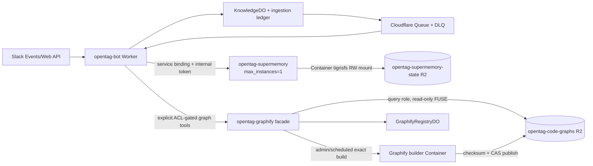

# OpenTag knowledge and code retrieval — Cloudflare-only rollout

**Status:** implementation-ready architecture and release gate. This file-only
change does not authorize a Worker/Container deployment, Cloudflare resource
creation, Railway shutdown, credential rotation, or production cutover.

**Canonical decision:** OpenTag's `KnowledgeDO`, ingestion ledger, Queue/DLQ,
and `WorkspaceConfigDO` are the authoritative knowledge workflow and policy
plane. Supermemory and Graphify are derived retrieval indexes. Supermemory is a
private `opentag-supermemory` Cloudflare Worker/Container service backed by the
dedicated `opentag-supermemory-state` R2 bucket. Graphify is a private
`opentag-graphify` Worker with separate query and builder Containers and
immutable commit-keyed artifacts in `opentag-code-graphs` R2.

The current implementation preserves the legacy Supermemory URL/key fields
only for migration tests and rollback compatibility. The production bot uses
service bindings and separate internal service tokens. Railway remains
read-only during burn-in and is removed only after explicit cutover approval.
Historical migration evidence in `goal-outputs/` is retained and is not an
active production architecture.

Live evidence reconciliation — 2026-08-02 21:16 PDT: authenticated knowledge
readiness is HTTP 200, but full readiness remains HTTP 503 on credential-broker
reachability, platform-effecter reachability, and OAuth. Tenant status is 84
rows (55 indexed, 2 pending, 27 permanent), with an empty tenant outbox and
tenant-local DLQ; the exact fresh marker still has zero authenticated
citations despite a queue `indexed` outcome. A successful provider
`documents.get(...)=done` poll is currently the ledger's `indexed` receipt;
it is not a search-convergence receipt. The local adapter regression now
asserts that `add -> poll -> search` keeps an empty search result distinct.
The installed token lacks reactions:read, users.profile:read, and manifest
readback, and only four visible public channels are confirmed. Complete
workspace coverage, private/MPIM visibility, complete-history backfill,
derived-index health, Graphify artifacts, provider CRUD/recovery, and
source-to-image provenance remain release gates. The empty Buzz probe returns
HTTP 400 `buzz_wake_unexpected_fields`; the known signed wake still stops at
relay HTTP 526, so no signed admission is claimed.

Local source reconciliation — 2026-08-02 21:56 PDT: the approved
Supermemory storage contract is now the pinned tigrisfs Container path. The
Dockerfile pins `v1.2.1` and verifies the Linux/amd64 archive checksum. The
entrypoint requires R2 S3 credentials plus account and bucket identifiers,
starts the FUSE mount, verifies an unprivileged read/write probe, and writes
the R2-ready sentinel only after success. The Worker maps R2 secrets only into
Container `envVars`, strips them from the Supermemory child, and observes the
sentinel without calling Sandbox SDK bucket-mount methods. The bot binding has
no R2 or provider credential. The Docker/FUSE build and restart gates remain
open because Docker is unavailable.

Fresh local validation passes 145 edge unit files / 1,376 tests, 8 bot Worker
e2e files / 69 tests, Graphify e2e (5 tests), Graphify policy (10 tests),
typecheck, deploy-config validation, source-pinned rollout preflight, shell
syntax, diff checks, and live artifact download/checksum/member verification.
Docker/FUSE build and restart persistence remain unverified because Docker is
unavailable. The ledger now has a durable queryability receipt separate from provider-poll
`indexed` completion. The receipt stores only source identity, revisions,
document/generation fence, bounded result counts, status, and timestamps;
internal KnowledgeDO routes reject stale fences and status aggregates expose
`unverified`, `searchable`, `no_match`, and `provider_unavailable`. Focused
tests pass locally; no live receipt is claimed.

**Implementation reconciliation — 2026-08-02 20:16 PDT:** source-typed identity
now flows through local jobs, ledger, outbox, events, derived history, DLQ, and
reconciliation. Slack is the only live connector consumer; non-Slack jobs fail
closed with a durable `unsupported_source_type` outcome until their
connector-specific fetch, mutation/delete, credential, retry/DLQ, and canary
contracts are complete. The derived Workers and both R2 buckets are now
deployed privately. Authenticated knowledge readiness is HTTP 200 and provider
tail evidence includes document write/poll plus `/v4/search` HTTP 200 after the
local model-cache overlay. The latest authoritative tenant readback is 77
ledger rows: 32 indexed, 19 leased, 2 pending, and 24 permanent failures; 30
old `local_add` rows were reopened under a correction reference, but their
provider/ledger convergence is not complete; the deployed recovery repair now
preserves ambiguous-add revisions and renews expired polls for the same
document ID, with live indexed successes observed during the drain.
Complete-history backfill,
restart durability, update/delete/tombstone receipts, parity, Graphify
artifact/citation receipts, and cutover remain release gates.

The local Slack ingestion contract now carries `observedMessageTs` for each
non-delete message, reaction, edit, and outbound write observation. Dispatch
requires that exact timestamp in the normalized canonical thread before it
stores the body or calls a derived provider; a complete-but-stale fetch records
the retryable `observed_message_missing` outcome. This is source/test-complete
locally and has not been deployed in this checkpoint.

The 20:16 validation pass completed typecheck, 1,370 unit tests, 67 bot Worker
tests, 5 Graphify Worker tests, Graphify policy tests, deployment-config and
Supermemory artifact checks, static/live rollout preflights, Graphify pin
verification, shell syntax, and staged/unstaged diff checks. Docker image
rebuild and FUSE/restart evidence remain unavailable in this environment.

## 1. Dependency boundary

| Category | Dependencies |
| --- | --- |
| Cloudflare runtime | Workers, Containers, Durable Objects/SQLite, Queues/DLQ, R2, service bindings, Wrangler |
| Required external APIs | Slack Events/Web API, GitHub repositories, the current OpenAI provider for agent runtime and Supermemory extraction |
| Optional integrations | Anthropic/Claude, Linear, Notion, Google Drive, Parallel research, Buzz relay |
| Build supply chain | npm, PyPI, GitHub source/releases, pinned Supermemory binary, pinned Graphify commit, version-matched Cloudflare Sandbox runtime |
| Removed from production path | Railway service/volume, `railway.toml` deployment, Postgres/`DATABASE_URL` for this path |
| Not required by the core path | Redis, Supabase, Vectorize, Sentry, PostHog |

Cloudflare hosting does not eliminate Slack, GitHub, or the LLM provider. It
does eliminate Railway from the production knowledge/retrieval hosting path.
The research/Postgres track remains separate and is not silently deleted by
this migration.

## 2. Target architecture



The bot never accepts a raw Supermemory API key, Graphify filesystem path,
repository URL, or artifact path from a tool caller. OpenTag derives tags,
repository scope, artifact revision, and ACL context before invoking either
derived index.

### Slack message indexing policy

The verified Slack event path captures every delivered message event for an
explicitly enabled channel, including messages authored by OpenTag or another
bot. A Slack `message` row with `subtype: "bot_message"` is an ordinary
canonical message with `authorKind: "bot"`; `bot_id` is retained as the
author identity. Canonical thread rows carry `authorKind: human | bot | system`
so search results retain attribution. Bot-authored messages are never routed
into turn admission; indexing them therefore cannot create a response loop.
Unsupported system subtypes remain explicit omitted markers.

Workspace admission has two server-owned modes. `explicit` requires an
administrator-managed source row. `all_delivered` stores a default project,
reader policy, and retention policy in the team-scoped WorkspaceConfigDO and
materializes one source row the first time Slack delivers an event for a
channel. This includes delivered public, private, DM, MPIM, and bot-message
events; Slack app installation, channel membership, Slack scopes, and event
delivery remain the outer completeness boundary. An existing disabled source
row is an explicit opt-out and cannot be re-created by the workspace default.
Switching from `all_delivered` to `explicit` transactionally disables enabled
workspace-default rows after active ingestion effects drain and converts them
to explicit opt-outs; switching back does not silently recreate those rows.
Reaction events refresh the affected thread while membership events durably
invalidate the channel ACL state.

Successful bot writes use the same source admission contract. The shared Slack
Web API client strips local knowledge metadata before sending to Slack and
emits an outbound observation for every committed write by default, including
placeholders, progress updates, and tool-status rows. Only an explicit internal
`knowledgeIndex: false` suppresses observation. The observer re-fetches the
authoritative Slack thread, so the index contains the complete thread rather
than a partial client payload. Update observations carry a deterministic
content revision in their durable identity: retries of the same update dedupe,
while a changed `chat.update` body creates a new observation and cannot be
silently collapsed into an earlier completed job. In `all_delivered` mode the
same resolver owns outbound source creation; in `explicit` mode a missing
tracked source still means no queue descriptor is created. Workspace-wide
indexing is never inferred from a caller-supplied project or bot write.

Slack event payloads do not always carry enough information to identify a
thread. A reaction payload identifies the channel and message timestamp but
does not reliably include the parent `thread_ts`; OpenTag first resolves that
timestamp through the body-free durable message-to-thread map populated after a
complete thread fetch, and only uses an exact root-message history lookup as a
fallback. An unresolved reaction is retried and remains non-indexed rather than
being attached to the message as a false root. `message_replied` and
`message_changed` deliveries use the nested `event.message.thread_ts` when
present. Slack's documented `message_deleted` delivery may contain only
`deleted_ts`; OpenTag resolves root-versus-reply from the same durable map,
preserves the exact deleted timestamp, and fails closed when the map has no
answer. A deletion with an independently proven parent may request a whole
thread refetch, but never authorizes a parent tombstone. The map contains only
team, channel, message timestamp, thread timestamp, source identity, and update
time; it is lookup metadata, not searchable message content.

Thread page retries persist the next Slack cursor and accumulated messages in
the tenant-scoped KnowledgeDO under the exact source/job identity. Queue retry
and isolate restart therefore resume from the last accepted page. Hard message
and byte bounds remain explicit permanent size-bound outcomes until the system
has a chunked thread-artifact contract; a bounded retry is not reported as a
complete thread.

### Server-owned Slack conversation inventory

Complete-history discovery may use `discoverAll: true` on the admin backfill
route. The caller supplies the team, project, time window, execution budget,
and manifest identity, but supplies no channel IDs or Slack cursors. The Worker
uses `conversations.list` with the public-channel, private-channel, IM, and
MPIM types and requests archived records as well. It includes only non-archived
conversations whose response says the installed bot is a member. Archived,
inaccessible, non-member, and unsupported conversation records remain in a
bounded exclusion receipt, so archived history is visible as an explicit
boundary rather than disappearing from the inventory.

The inventory receipt is stored in the tenant KnowledgeDO before any history
page is fetched. It includes the visible/eligible/excluded counts, sorted
eligible conversation IDs, pagination count, terminal status, bounded failure
reason, and a SHA-256 digest. The backfill scope binds that digest. A missing or
repeated cursor, API failure, page/record bound, zero eligible conversations, or
more than the 50-conversation manifest bound fails closed; the system never
turns a partial enumeration into a complete workspace claim. A retry of the
same manifest reuses the persisted receipt and cannot inject a new cursor or
silently change its eligible conversation set.

This receipt proves only the set visible to the installed Slack bot at the
inventory checkpoint. It does not prove that the app is installed with every
required scope, that every intended conversation is accessible, or that each
conversation's history, long threads, files, edits, deletions, unsupported
subtypes, and derived-index writes have reached terminal receipts. Those remain
separate live and per-source closure gates.

Private-channel authorization uses a durable membership snapshot. Membership
events invalidate the snapshot, `conversations.members` pagination supplies a
bounded canonical member set, and the KnowledgeDO computes the digest before
committing the set with an invalidation-revision compare-and-swap. The default
maximum snapshot age is five minutes and may be tightened or bounded by the
`KNOWLEDGE_SLACK_ACL_MAX_AGE_MS` deployment setting. Retrieval authorization is
issued by the KnowledgeDO as a short-lived read lease, rechecked before the
evidence handoff, and revoked by membership invalidation or replacement. The
current bounded member-set representation is JSON; a normalized indexed
membership table is the scale-up path for very large channels. Retrieval
requires a fresh snapshot containing the requesting Slack user. Public-channel
workspace visibility, DMs, and MPIMs follow the server-owned workspace
admission policy; a fresh member snapshot alone does not broaden those scopes.

Cloudflare Container disks are ephemeral. The pinned tigrisfs FUSE mount is
therefore a tested durability mechanism, not an assumption of local-disk
behavior. The
[Container architecture](https://developers.cloudflare.com/containers/platform-details/architecture/)
and [Sandbox bucket-mount guide](https://developers.cloudflare.com/sandbox/guides/mount-buckets/)
are the runtime references. A failed mount correctness, remount, or durability
test is a migration stop condition; no unapproved local-disk or database
fallback is permitted.

## 3. Supermemory contract

### Runtime

- `infra/supermemory/Dockerfile` pins Supermemory Local `server-v0.0.5` and
  verifies its binary checksum.
- `SupermemoryContainer` is named `supermemory` and configured with
  `max_instances = 1`; it is the only writer for the embedded state.
- The Worker exports `ContainerProxy`; the Container image starts pinned
  tigrisfs and mounts the dedicated R2 bucket at `/var/lib/supermemory`.
  `R2_ACCOUNT_ID` and `R2_BUCKET_NAME` are non-secret endpoint variables and
  `R2_ACCESS_KEY_ID`/`R2_SECRET_ACCESS_KEY` are Worker Secrets mapped only to
  Container `AWS_ACCESS_KEY_ID`/`AWS_SECRET_ACCESS_KEY`.
- The dedicated R2 bucket is mounted read/write at
  `/var/lib/supermemory`. The existing `$SUPERMEMORY_DATA_DIR/api-key` file is
  the server-key bootstrap contract and is never returned by the facade.
- Provider and R2 secrets enter only the Container through `envVars`. The bot
  binding, citation fields, and access bundles contain no R2 credentials. The
  entrypoint removes storage and facade credentials from the Supermemory child
  environment and redacts exact values and generated `sm_`/bearer-shaped
  values before they reach logs.
- The documented self-hosted provider, OpenAI-compatible base URL, embedding,
  performance, and telemetry settings remain configurable through an explicit
  Container-only allowlist. `SUPERMEMORY_DISABLE_TELEMETRY=1` is the image
  default; the release verifier checks the pinned binary checksum and its
  `/api-key`/data-directory/API markers before staging.
- The Worker facade requires `x-opentag-service-token`, allowlists only the
  required Supermemory routes, injects the server key inside the private
  boundary, and exposes no public Supermemory upstream server.

### Bot transport

`edge/src/memory/supermemory-client.ts` prefers the `SUPERMEMORY` service
binding and sends `x-opentag-service-token` through a bounded SDK fetch adapter.
The SDK bearer is a placeholder and is stripped before the service binding
request. `SUPERMEMORY_URL` and `SUPERMEMORY_API_KEY` are retained only as an
explicit legacy fallback while migration parity is being proven, and the
fallback is usable only when `SUPERMEMORY_MIGRATION_MODE=true` is deliberately
set. A missing service binding therefore fails closed in the normal
Cloudflare-only configuration.

The existing queue, retry, degradation, poll, update, delete, and tombstone
semantics remain unchanged. Supermemory is never the source of truth for
knowledge state. Only terminal `done` is searchable; a timeout remains
`processing_unconfirmed` and reconciliation polls the same document ID.

### Migration and rollback

1. For a prolonged migration freeze, pause delivery for the exact
   `opentag-knowledge` Queue with the Cloudflare Queue control plane. This
   stops the derived-index consumer while `KnowledgeDO`, the ledger, and
   producers remain authoritative and writable. `SUPERMEMORY_CONSUMER_MODE=paused`
   may be set as a defense-in-depth handler fence, but it calls `retryAll` and
   is bounded by the consumer retry/DLQ policy; it is not a substitute for
   queue-level pause. Preserve the Railway service read-only.
2. Seed the Cloudflare state bucket from a verified compatible export when one
   exists. If not, replay authoritative ledger content through the Queue with
   bounded rate and exact source revisions. For a new isolated state store,
   configure one immutable `SUPERMEMORY_INDEX_GENERATION`; the ledger archives
   the old provider binding and re-adds each source instead of attempting to
   update a Railway document ID. Generation-aware reconciliation re-enqueues a
   source even when its content revision is unchanged if its indexed generation
   is stale. A missing or mismatched generation is fail-closed. Compatible
   exports must be proven to contain the same provider state before retaining
   the existing generation.
3. Run representative add → poll → search, update, delete, tombstone,
   restart/remount, concurrent-read/single-writer, key-bootstrap, route-
   allowlist, log-redaction, and latency tests.
4. Compare representative searches and ledger/index revisions. Keep Railway
   read-only through the burn-in window.
5. Enable the bot service binding only after the parity and FUSE gates pass.
6. Remove Railway configuration and credentials only after an explicit
   production cutover approval and a verified rollback record.

After the new service passes its staging gates, resume Queue delivery and
remove any handler fence before expecting replayed work to converge. If a
handler fence exhausted retries before the Queue was paused, inspect the
durable DLQ records and replay only exact records through the existing
admin-controlled one-at-a-time replay route; never bulk-purge or bulk-replay
them. Rollback pauses Queue delivery, leaves authoritative ledger rows
intact, restores the legacy read path during burn-in, and never deletes or
reinitializes either state store automatically.

## 4. Graphify contract

### Source and build

Graphify is pinned to commit
`00efd6e7969837ae4a9f11d8d504dcd3b20b09df`. The image verifies that exact
checkout during the build. Only tracked repositories registered in
`GraphifyRegistryDO` may be built, and repository URLs must match both the
approved GitHub form and the server-owned `GRAPHIFY_ALLOWED_REPO_ORGS`
allowlist. The server-owned `GRAPHIFY_REPOSITORY_CATALOG` maps tracked
`repoId`s to those sources; the registration route accepts only a catalog key,
never a caller-supplied URL. Queries and rebuilds re-check that the registered
source still exactly matches the current catalog; removing or changing a
catalog entry therefore invalidates the old registration until an operator
re-registers it. Builders clone an exact 40-character commit,
verify `git rev-parse HEAD`, run code-only extraction, and never accept a
caller filesystem path or unapproved repository URL.

The local stdio MCP remains the development and architecture workflow. The
upstream Graphify HTTP server is not exposed to Slack or callers.

### Immutable artifacts and CAS

Each successful build produces:

```text
code-graphs/<repoId>/<commitSha>/manifest.json
code-graphs/<repoId>/<commitSha>/graph.json
code-graphs/<repoId>/<commitSha>/report.md
code-graphs/<repoId>/<commitSha>/source.tar.gz
```

The manifest records the Graphify commit, repository, commit, artifact key,
file sizes, and SHA-256 checksums. The Worker validates every checksum before
uploading to R2. `GraphifyRegistryDO` publishes the active pointer only with a
compare-and-swap expected previous commit, so a stale build can leave an
unreferenced immutable artifact but cannot replace the active revision.

Rebuilds run hourly (`0 * * * *`) and manually through an admin token. There are
no post-commit hooks. The query role mounts R2 read-only and the builder role
has network access only for the registry-approved clone/build operation.

### Facade and ACL

The private facade exposes only:

- `POST /v1/code/graph-search`
- `POST /v1/code/path`
- `POST /v1/code/impact`
- `GET /health`

The bot's `code_graph_search`, `code_path`, and `code_impact` tools require an
exact active turn, frozen permission snapshot, exact team/channel scope, an
explicit access-bundle grant bound to the exact `repoId`, and a tracked
repository/project. Knowledge MCP
callers additionally require operator authorization or a one-use actor token
whose team/project and `repoIds` scope contain the requested repository.
Graphify repeats the team/project/repository match as defense in depth but is
not the authorization boundary.

Supermemory-backed `search_code` remains semantic retrieval. Graphify tools are
explicit structural retrieval and are not silently fused into unified search.

## 5. Citation and API contract

All knowledge citations remain bounded and carry the authorization policy used
for retrieval. Code-graph citations add:

```ts
type CodeGraphCitation = {
  repoId: string;
  commitSha: string;
  path?: string;
  startLine?: number;
  endLine?: number;
  excerpt: string;
  relation?: string;
  confidence?: number;
  confidenceLabel?: string;
  artifactKey: string;
  contentRevision: `graph:${string}`;
};
```

If Graphify supplies a point location such as `L42`, the adapter emits
`startLine === endLine === 42`. It never invents a broader range. Every
citation also contains `sourceKey`, `sourceType: "code_graph"`, `projectId`,
`aclPolicyRef`, and `retrievedAt`.

## 6. Release gates

### Existing edge validation

```bash
cd /Users/will/Documents/opentag/edge
npm run typecheck
npm test
npm run test:e2e
```

### Supermemory stop gates

- FUSE mount/remount, R2 persistence, restart, and Container rollout recovery;
- add → poll → search, update, delete, and tombstone behavior;
- concurrent reads with one writer;
- `/api-key` bootstrap, route allowlist, and service-token separation;
- no raw credentials in logs, bot bindings, or diagnostics;
- measured cold start, model-cache, search latency, and error budgets.

### Graphify stop gates

- exact Graphify checkout, image pin, and checksum manifest;
- artifact reload after query-container restart;
- path traversal, unknown repository, wrong project, and unauthorized scope
  rejection;
- stale commit/build CAS rejection;
- graph search, path, impact depth, relation, and citation revision behavior;
- cross-project ACL isolation.

## 7. Operational invariants

1. Slack acknowledgement never waits on either derived index.
2. KnowledgeDO/ledger/Queue/DLQ remain authoritative for ingestion status and
   replay; derived-index failure is retryable/degraded, not data loss.
3. No public Supermemory or Graphify upstream HTTP endpoint is used.
4. No post-commit Graphify hook or background artifact mutation can alter the
   OpenTag dirty-worktree/deployment discipline.
5. No Worker/Container deployment, R2 bucket creation, Railway shutdown,
   secret rotation/removal, or production cutover occurs without explicit
   approval.
6. Dirty worktrees and unrelated changes are preserved during future rollout
   work; migration artifacts are additive and reversible.
