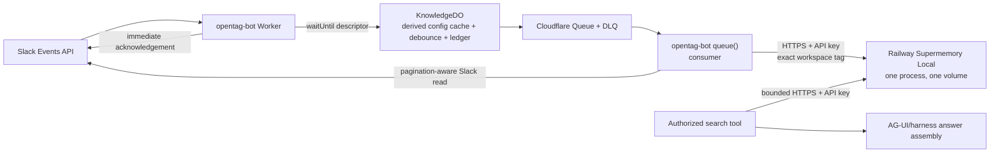

# OpenTag Knowledge Base — Supermemory Local on Railway

**Status:** implementation-ready planning specification; no deployment or cleanup is authorized by this document.
**Canonical decision:** B1 replaces the obsolete Vectorize/D1/R2/RRF, Supabase/Postgres, and Cloudflare-Container-persistence proposals. The knowledge index is **Supermemory Local `server-v0.0.5`**, running as one Railway service with one persistent Railway volume. OpenTag's Durable Objects remain the configuration, scheduling, and ledger plane; they are not a second retrieval corpus.

**Current reconciliation (2026-08-01):** OpenTag's deployed bot now has the
source-side actor-token, KnowledgeDO, queue, search, and bounded raw-query
foundations described by the current architecture. A live Slack retrieval was
verified, but reconciliation is not configured and a fresh marker may lag
indexing. This specification remains the design and rollout gate for broad
source ingestion, Supermemory activation, backup/restore, and one-channel
canary; see [docs/current-state.md](./docs/current-state.md) for actual
deployment evidence.

**Goal state:** resume from [`goal-outputs/supermemory-railway-knowledge-base/PROGRESS.md`](./goal-outputs/supermemory-railway-knowledge-base/PROGRESS.md). Railway discovery evidence is in [`goal-outputs/supermemory-railway-knowledge-base/RAILWAY-READINESS.md`](./goal-outputs/supermemory-railway-knowledge-base/RAILWAY-READINESS.md). This document is the authoritative execution plan; current implementation facts remain in `PRODUCT.md`, `ARCHITECTURE.md`, `DECISIONS.md`, and `AGENTS.md`.

## 1. Decision summary and superseded design

### Adopted B1 design

One pinned Supermemory Local process owns encrypted embedded retrieval storage on one machine. It runs in a dedicated, approved Railway project and service, mounts exactly one Railway persistent volume at `/var/lib/supermemory`, and receives Slack-derived documents only from the `opentag-bot` Queue consumer. It is never required by Slack acknowledgement or automatic ingestion's turn path and is never OpenTag's product-state spine; an explicitly selected, bounded `search_slack` tool may call it during a turn and must degrade safely.

**Encryption boundary:** “encrypted embedded” does not by itself promise end-to-end or application-level encryption of every corpus byte. The current Local contract protects embedded auth/provider credentials, Railway provides storage-layer encryption for the mounted volume, and TLS protects traffic. B0 must verify and record whether the pinned Local release additionally encrypts corpus pages at the application layer; until then, documentation and security review must not claim that stronger property.

The implementation pin is `server-v0.0.5`. At execution time, the Linux artifact/image digest and published checksum **must be re-verified and recorded** before build approval; do not substitute a floating `latest` tag. The intended Railway contract supplies `PORT` and persists state below `SUPERMEMORY_DATA_DIR=/var/lib/supermemory`, but the pinned binary's bind host, safe health endpoint, generated-key path, and complete data-path behavior remain unverified until the R1 empty-volume smoke test. B1 deliberately sets no `DATABASE_URL`; the binary's behavior when an unrelated value is inherited is also unverified, so R1 must remove it rather than claim it is ignored. Local is one process/one machine: a volume-backed service is exactly one replica, cannot use Railway replicas, and volume-backed deploys incur brief downtime.

### Explicitly superseded, not combined

The following are not B1 architecture: D1 FTS/RRF, R2 corpus storage, Vectorize indexing, a 1,536- or 3,072-dimensional OpenTag index, `text-embedding-3-large`, Supabase, PostgreSQL, Hyperdrive, pgvector, a Cloudflare Container as durable knowledge storage, or a private Railway network connection from Workers. Vectorize's 1,536-dimension ceiling remains an OpenTag invariant for any future Vectorize work, but B1 creates no Vectorize index and therefore does not exercise it. Supermemory's implementation and embedding details are owned by the pinned Local release.

No PostgreSQL/Supabase service is part of this design. Slack traffic still terminates only at `opentag-bot`; Socket Mode and a Railway Slack bot remain prohibited.

## 2. Invariants, non-goals, and autonomy

### Hard invariants

1. Slack Events, commands, and interactions terminate only at `opentag-bot`; acknowledge Slack promptly and use `waitUntil` for subsequent scheduling.
2. Automatic ingestion is exactly `waitUntil -> KnowledgeDO -> Cloudflare Queue -> opentag-bot queue() consumer -> Supermemory Local`. Slack acknowledgement and non-retrieval turn work never call Supermemory; only the explicitly selected, bounded `search_slack` tool may call it during a turn.
3. Supermemory is a sidecar retrieval index. `ConversationStateDO`, `SessionEventDO`, `WorkspaceConfigDO`, and OpenTag's durable fences remain authoritative product state.
4. Configuration and exact authorization precede automatic ingestion. Unconfigured channels enqueue nothing.
5. No Cloudflare Worker/Container deployment, Railway mutation, Slack scope change, secret mutation, or resource deletion occurs without a named stop gate and explicit user approval.
6. B1 treats tags as exact opaque namespaces, never prefixes. All B1 writes and searches use exactly `workspace:{teamId}`.
7. No live ingestion, canary, or backfill begins until backup restoration and cross-workspace authorization tests pass.

### Non-goals and deferred work

B1 does not implement `profile()`/who-knows, GitHub or other hosted connectors, automated distillation/burst optimization, arbitrary source ingestion, a metadata-as-tenant-boundary claim, a second Worker, or cross-project hard isolation. It also does not remove or migrate the existing explicit `memory_write`/`memory_search` records in `KnowledgeDO`; the ingestion ledger is an additive role until a separately specified migration. Profile and connectors are deferred until Local support and contracts are verified. Because the B1 ledger and stable `customId` intentionally identify a Slack thread without a project component, at most one project may be enabled for a given `(teamId, channelId)`; configuration rejects a second enabled project rather than converging two policies onto one document. A future project-isolation mode must either fan out every query to exact project tags and merge deterministically, or deliberately duplicate each document into exact project tags; metadata filtering alone is not a tenant boundary.

### Autonomy vocabulary

`file-only` changes tracked files and runs local validation. `read-only external` may query a service without changing it. `external mutation` creates, links, configures, deploys, rotates, changes subscriptions, backs up/restores, scales, or deletes an external resource; it always stops for explicit approval immediately before the action. This planning pass is file-only and has no authorization for a future mutation.

## 3. Target architecture and trust boundaries



`opentag-bot` is the B1 Queue consumer unless implementation evidence proves its Worker handler cannot be deployed with the Queue binding; a separate consumer Worker is not invented by default. `WorkspaceConfigDO` is authoritative for tracked-source and reader policy. `KnowledgeDO` owns only a derived versioned configuration cache plus ledger rows, alarm/debounce, and descriptor creation. The Queue consumer owns network work: full-thread Slack retrieval, normalization, Supermemory adapter calls, and durable outcome reporting. This separation keeps automatic ingestion out of the Slack acknowledgement and turn paths.

Workers cannot reach Railway private networking directly. The service therefore requires a Railway-managed public HTTPS domain and TLS. Authenticate every request with a Local API key, derive the exact tag server-side, bound request bodies/results/timeouts/concurrency, redact secrets and query text from logs, and consider a later Cloudflare Access/proxy layer only under a separately approved design. A public DNS name is not permission to expose unauthenticated Local APIs.

### Threat model and ACL

Slack messages are untrusted input; channel membership, event delivery, author identity, text, blocks, attachments, timestamps, and URLs may be malformed, replayed, or later deleted. The Queue is at-least-once. Railway service operators and logs are sensitive because documents can contain internal text. A compromised tool caller must not choose another workspace's tag. A leaked API key could read/write the Local corpus.

Mitigations: Slack signature verification stays at ingress; only `opentag-bot` can enqueue; `KnowledgeDO` validates configuration and emits team-bound descriptors; consumer derives, rather than accepts, the tag; an adapter rejects mismatched metadata and validates Local responses; token secrets are Cloudflare/Railway secret stores only; query/content never appear in normal logs; request limits, retry classification, DLQ, redaction, audit identifiers, and alerts are mandatory. Search authorization loads the caller's current workspace/channel/project policy from `WorkspaceConfigDO` before it calls Local. A result is accepted only if its exact `workspace:{teamId}` tag and metadata satisfy the current requested scope. This is defense in depth, not a replacement for exact tag derivation. Channel/project metadata filters enforce B1 product policy but are not a tenant boundary.

## 4. Exact contracts

### Configuration first

Add a schema-versioned tracked-source configuration to `WorkspaceConfigDO`, exposed only through an explicit admin/configuration path. Each record contains `teamId`, `projectId`, `channelId`, `enabled`, allowed reader policy/bundle reference, retention policy, backfill state, and `updatedAt`. IDs are immutable once enabled; disable is immediate. Validate the requesting admin's workspace and the exact channel/project authorization before persisting. Enforce at most one enabled project per exact `(teamId, channelId)`; disabled historical rows may coexist, but a conflicting enable fails closed. No default wildcard, inferred project, last-row-wins behavior, or all-channel capture exists.

### Document, tag, and source contract

For B1, the only tag is exactly:

```text
workspace:{teamId}
```

It is supplied on **every** `client.add` and `client.search.memories` request; no `workspace:` prefix query, glob, or partial match is valid. Document metadata has at minimum:

```ts
type SlackKnowledgeMetadata = {
  schemaVersion: 1;
  workspaceId: string;       // equals Slack teamId
  projectId: string;
  channelId: string;
  threadTs: string;
  sourceKey: string;         // slack:{teamId}:{channelId}:{threadTs}
  contentRevision: string;   // sha256 canonical normalized thread
  slackPermalink?: string;
  rootAuthorId?: string;
  rootTs: string;
  observedAt: string;
  indexedAt: string;
  aclPolicyRef: string;
  status: "active" | "deleted";
};
```

`sourceKey` is stable across edits and retries. `contentRevision` is distinct and changes only when canonical normalized content or policy-visible metadata changes. The initial write is `client.add` with the stable source key as `customId`; the adapter must not invent Local update/delete semantics. Before coding edit/update/delete behavior, verify the pinned Local API and pinned SDK contract, then codify it in adapter contract tests. The implementation-time package pin in `edge/package.json` and lockfile must be an exact JS SDK version (latest observed during planning: `4.24.12`, not an approval to float); prove Cloudflare Worker compatibility or use the verified Local HTTP contract.

### Full-thread normalization

The existing `getThreadMessages` calls `conversations.replies` once with a default 100-message limit and is unsuitable for ingestion. Implement a separate pagination-aware fetcher using Slack cursor pagination, explicit maximum pages/messages/bytes, rate-limit discipline, and a typed completion outcome. It must preserve chronological order, deduplicate repeated timestamps/client IDs, retain root and replies, normalize Unicode/newlines, remove volatile transport fields, and represent permitted text, author, timestamp, message subtype, blocks/attachments/files only by documented policy. Do not download private file contents in B1. Exclude bot/system noise and unsupported/deleted messages according to an explicit policy, while retaining a deterministic marker if their removal changes semantic context.

If the page/message/byte cap is reached, Slack returns `has_more`, a cursor is unusable, or a page fails ambiguously, produce `incomplete`, do not overwrite a prior complete revision, record the reason/cursor/counts, and retry/reconcile later. It is forbidden to index a silently truncated thread as complete.

### Citation contract

The search adapter returns a bounded `KnowledgeCitation[]`, not raw Local response objects:

```ts
type KnowledgeCitation = {
  sourceKey: string; projectId: string; channelId: string; threadTs: string;
  permalink?: string; contentRevision: string; excerpt: string; score?: number;
  aclPolicyRef: string; retrievedAt: string;
};
```

The answer renderer labels citations as Slack knowledge, links only approved permalinks, truncates/redacts excerpts to a configured maximum, and emits no citation when retrieval is unavailable or unauthorized. Citations always carry the revision actually retrieved.

## 5. Ingestion ledger, state machine, and convergence

`KnowledgeDO` gains schema-migrated tables keyed by `(team_id, channel_id, thread_ts)` plus immutable event/dedupe records. Required ledger fields include configuration version, project/policy references, source key, desired revision, indexed revision, `localDocumentId`, Local workflow status, poll deadline/next poll/attempt count, status, Queue attempt count, next retry, lease/dedupe key, last error class/code, incomplete reason, deletion tombstone timestamp, last successful Local operation, and timestamps. Payloads are descriptors, not thread bodies:

```ts
type KnowledgeJob = {
  version: 1; teamId: string; projectId: string; channelId: string; threadTs: string;
  sourceKey: string; configVersion: string; requestedAt: string; reason:
    "event" | "debounce" | "reconcile" | "backfill" | "delete" | "reply_delete";
  messageTs?: string;
};
```

`KnowledgeDO` accepts a valid, configured Slack event from `waitUntil`, coalesces by source key, schedules a bounded debounce alarm, persists the descriptor before queue send, and sends only after the durable row commits. Queue delivery is at-least-once; the consumer acquires a ledger lease and treats duplicate/stale config/revision work as no-op success.

For `message_deleted`, `messageTs` preserves Slack's exact deleted-message
timestamp. Only a well-formed event proving `previous_message.ts` is the root
`threadTs` may emit `delete` and create a source tombstone. A deleted reply,
including `thread_broadcast`, emits `reply_delete` for the exact parent
`threadTs`, refetches and renormalizes the complete thread, and follows the
ordinary edit/reconciliation path. Until Local replacement is verified, a
changed already-indexed revision halts as `unsupported_update_contract` and is
not searchable. Missing or contradictory `previous_message` identity never
gains tombstone authority; if an exact distinct parent and envelope
`deleted_ts` remain available it may only request that parent's refetch.

State transitions are deterministic:

```text
disabled -> configured -> pending -> queued -> leased -> fetching
fetching -> incomplete | normalized | deleted
normalized -> writing -> processing_unconfirmed -> indexed
writing -> retryable_failure -> queued | permanent_failure -> DLQ
processing_unconfirmed -> polling -> processing_unconfirmed | indexed | retryable_failure | permanent_failure
indexed -> pending (event/reconcile/edit/reply_delete) | tombstoned (disable/root delete)
incomplete -> retryable_failure | pending (reconcile)
```

`client.add` / `POST /v3/documents` is asynchronous: it returns a Local document ID and queued status, not a searchable document. Persist `localDocumentId` and workflow status atomically before releasing the lease. Poll the pinned `client.documents.get(id)` / `GET /v3/documents/{id}` contract with a bounded deadline and exponential backoff through `queued`, `extracting`, `chunking`, `embedding`, and `indexing`. Only terminal `done` may set `indexed_revision`, and every synthetic, restore, and search acceptance test waits for `done`. A terminal `failed` status maps through a documented classified retry/permanent policy. A deadline expiry becomes `processing_unconfirmed`: reconciliation continues polling the same `localDocumentId` and must not issue a second add. Apply the same rule to the verified update/replacement operation.

Only terminal `done` from a successful verified adapter operation may set `indexed_revision`. Retryable failures include transient Slack/HTTPS/429/5xx/timeout and lease loss; use bounded exponential backoff with jitter and Queue retry/DLQ policy. Definitive malformed config, schema mismatch, unsupported Local capability, forbidden Slack access, or policy violation halt that source, record a permanent error, and alert; they must not hot-loop. DLQ replay requires an operator-selected exact job/source after root cause correction; it is never automatic bulk replay.

On edit or reply deletion, fetch the complete thread and compare the canonical hash. If unchanged, no-op. If changed, use the verified pinned-API replacement/update sequence for the same `customId`, persist its returned Local document ID, and poll it to terminal `done`; until that contract is verified, halt with `unsupported_update_contract` rather than guessing. On source disable, channel untracking, a proven Slack root deletion/tombstone, or retention expiry, queue a delete/tombstone action and use the verified pinned contract to remove or mark the Local memory. The ledger remains a tombstone so retries cannot resurrect it. Reconciliation periodically enumerates configured sources/known threads with a bounded cursor and requeues drift: unindexed desired revision, stale lease, incomplete, failed, `processing_unconfirmed`, or Local/ledger mismatch. Backfill is an explicit range and channel list, dry-run count first, then low-rate descriptors; it never scans an entire workspace by default.

## 6. `search_slack` retrieval and degraded behavior

Expose one authorized, bounded `search_slack` tool on the existing agent/tool surface. Input: query, current team, optional allowed project/channel filters, and a small bounded limit. The server ignores caller-supplied tag values, derives `workspace:{teamId}`, applies current policy filters, calls `client.search.memories({ searchMode: "hybrid" })`, converts only compliant results to `KnowledgeCitation`, and returns citations plus a short structured status. If the pinned Local API cannot apply the required metadata filter server-side, the adapter may over-fetch a small bounded same-workspace candidate set and post-filter it, returning fewer results; it must never broaden authorization or send a rejected excerpt into model context.

Set conservative implementation-time constants in code/config (query length, result count, excerpt size, request timeout, concurrent calls); test each boundary. Search is authorized tool work and may run during a turn, but it is bounded and best-effort: timeout, 429, 5xx, malformed result, or unavailable Local returns `knowledge_unavailable` without failing the Slack turn, leaking query text, or triggering ingestion. The agent must say it could not consult the knowledge index, not fabricate citations. Automatic ingestion never runs in a normal turn path.

## 7. Railway service contract

### Build and runtime (future mutation gate R1)

After approval, create a new isolated Railway project recommended as `opentag-supermemory-local`, a production environment, and one service. Do not reuse any discovered project. Railway's build context is explicitly `infra/supermemory/` and its Dockerfile path is relative `Dockerfile`. Add `infra/supermemory/Dockerfile`, `infra/supermemory/entrypoint.sh`, `infra/supermemory/railway.toml`, and an init such as `tini` only after B0 verifies the upstream release's supported image/artifact, checksum, health endpoint, configuration names, first-boot key path/format, and signal behavior. The Dockerfile must pin `server-v0.0.5` by verified artifact digest/checksum, run non-root if supported, expose no database client, and define the reviewed deterministic entrypoint. It must not embed an API key.

Set non-secret variables: `PORT` (Railway-provided), `SUPERMEMORY_DATA_DIR=/var/lib/supermemory`, `OPENAI_MODEL=gpt-5.1`, `OPENAI_FAST_MODEL=gpt-5.1`, `OPENAI_TEXT_MODEL=gpt-5.1`, `SUPERMEMORY_EMBEDDING_PROVIDER=local`, `SUPERMEMORY_EMBEDDING_MODEL=Xenova/bge-base-en-v1.5`, `SUPERMEMORY_EMBEDDING_DIMENSIONS=768`, release/version marker, log level, and any pinned Local-supported host/health settings. B1 selects OpenAI because the current Local non-interactive Docker contract documents this provider. Railway receives a distinct, service-scoped `OPENAI_API_KEY` secret; it must not reuse or copy an existing OpenTag runtime key by assumption. B0 re-verifies all provider/model variable names, model availability, local embedding pin/dimensions, and the data-egress/retention approval before R1. If any verification fails, stop before R1; do not silently switch provider. **Do not set `DATABASE_URL`; remove it if inherited.** Attach exactly one persistent Railway volume at `/var/lib/supermemory`; set exactly one replica. Select region and CPU/RAM/disk size from an approved measured sizing record before provisioning, initially with a small explicit cap and volume headroom alert. The chosen region must be recorded with latency/data-residency rationale.

Enable a Railway-managed public HTTPS domain with TLS. Record the exact hostname in the Cloudflare secret `SUPERMEMORY_URL` only after an approved domain is healthy; do not use private Railway networking. Configure a non-secret health/readiness probe against the upstream-pinned endpoint; it must prove process readiness without returning corpus content or a secret. A health check is not an authorization test.

### Key lifecycle, backup, observability, cost

Local first boot writes a generated `sm_...` bearer key to stdout. The reviewed `infra/supermemory/entrypoint.sh` must use `tini`, set `umask 077`, ensure data/key/auth files are owner-only, and route stdout/stderr through a signal-safe redactor from the first process byte. It masks `sm_...`, provider-secret-shaped values, and exact configured secrets before anything reaches Railway logs, while preserving child exit and signal propagation. B0's first-boot contract test uses an empty temporary volume, reads the generated key file without printing it, captures logs, proves neither that exact key nor secret patterns occur, and proves exit/signal propagation. If the upstream key path/format or redaction cannot be proven, deployment stops. Only after this log-scan proof may a user retrieve the key from the volume in an interactive Railway shell outside Codex transcripts and enter it directly into interactive `wrangler secret put SUPERMEMORY_API_KEY`; it is never piped, logged, committed, or copied into an operations record. The volume backup protects server-side auth material; Cloudflare stores only the client-key copy. Rotation follows the verified pinned Local contract and is independently approved.

Before any live document, create an approved backup schedule and retention policy for the volume, then perform Railway's native **restore test** using **only a synthetic corpus**. Create a manual backup, stage the restored volume at the same mount on the same service, retain/unmount the original volume, record original/restored volume IDs, inspect the staged diff, and deploy under approved downtime. If a target/mount/ID mismatch appears, cancel the staged change before deployment. After deploy, prove readiness, authentication, add -> terminal `done` -> search, and restart persistence; retain the original volume for explicit reattachment rollback. If validation fails, reattach the original and redeploy. Railway native restore is not an isolated-project/service restore; old/restored volume deletion remains D1-gated. Later production restore drills require maintenance approval or a separately verified application-level export/clone method. A snapshot existence alone is not restore proof.

Emit structured redacted logs/metrics: release, service/instance, ledger status/counts, Queue attempts/DLQ depth, Slack pages/completion, Local document workflow status, Local latency/status, revision operation, result count, volume use, restart/deploy events, and cost/egress. Never log API keys, authorization headers, query text, full thread text, or raw Local payloads. Alerts cover health/readiness, repeated permanent failures, DLQ nonzero, backlog age, backup failure/staleness, restore-test staleness, volume capacity, error rate, latency, cost/egress budget, and the distinct OpenAI key/project budget. Cost guardrails are one service/one replica, explicit CPU/RAM/volume caps, retention limits, maximum thread size/pages, per-channel rate limits, a synthetic/canary corpus cap, and operator budget alerts for Railway and the OpenAI project/key.

### Deployment, upgrade, and rollback

An approved release sequence is: verify pin/checksum and compatibility; take/verify backup; record current image/config and expected downtime; deploy one replica; wait for readiness; run synthetic authenticated add/search/restart persistence checks; then advance the gated stage. Expect brief downtime because the volume cannot be mounted by replicas. Upgrade repeats the same backup and synthetic contract checks for a newer explicitly approved release; never in-place mutate data format without a verified upstream migration/rollback contract.

Rollback stops intake first (disable configuration and drain/hold Queue descriptors), retains the volume, reverts to the recorded previous verified image/config, waits for readiness, runs the prior synthetic search proof, then either re-enables only approved sources or holds for restore. If data compatibility or integrity is uncertain, restore the verified backup to the documented target rather than deleting/reinitializing the production volume. No automated destructive cleanup runs during rollback.

## 8. Current Railway readiness and cleanup boundary

The dated evidence is authoritative at [`RAILWAY-READINESS.md`](./goal-outputs/supermemory-railway-knowledge-base/RAILWAY-READINESS.md). Read-only readiness was verified 2026-07-18 with `bunx @railway/cli`, version `5.27.0`, authenticated as William Lopez-Cordero in workspace `William Lopez-Cordero's Projects` (`546abf5f-9447-4d89-84d3-5e5e08c809a0`). This checkout is unlinked. Four visible projects are `opentag-hybrid` (`8cc26395-b4e0-45b9-b325-2ac585a264d8`), `signalsci` (`2497d056-7a67-42b7-acbc-eac3c787b659`), `consulting` (`b48ccba6-310d-4df4-ae47-90f2060733aa`), and `senpi-openclaw` (`95dcf765-d0e7-490a-aad5-9cbe1c5ebdcd`); the observed inventory was 15 services, 10 active public domains, and 3 volumes. Read access is proven; create/link/deploy/configure/delete permission is unproven because no mutation was attempted.

Cleanup is separate from deployment and defaults to **RETAIN**. Sleeping/stopped is not unused: `opentag-hybrid` has four services with active domains, `consulting` has three older services with active domains, and `senpi-openclaw` has detached non-empty READY volume `70f5cb39-7923-490e-85aa-b00c7b64c1f1`. Before any deletion, refresh exact IDs plus usage, deployment/log, domain/DNS, volume/backup, owner, and dependency evidence; obtain owner confirmation; assess and test backup/rollback; then obtain explicit approval naming exact resources. Never make cleanup a deployment side effect.

Safe read-only reproduction commands:

```bash
bunx @railway/cli@5.27.0 --version
bunx @railway/cli@5.27.0 whoami --json
bunx @railway/cli@5.27.0 project list --json
bunx @railway/cli@5.27.0 status --project <project-id> --environment production --json
```

## 9. Dependency-ordered work packages

### B0 — Pin contracts and configuration foundation

- **Owner surface:** `edge/` configuration, types, tests, documentation.
- **Autonomy:** file-only.
- **Deliverables (exact paths where known):** `edge/src/config/workspace-config-do.ts`; `edge/src/config/knowledge-config.ts`; `edge/src/memory/knowledge-contract.ts`; `edge/test/knowledge-config.test.ts`; `edge/test/supermemory-contract.test.ts`; `edge/package.json`; `edge/package-lock.json`; `infra/supermemory/README.md`; `infra/supermemory/Dockerfile`; `infra/supermemory/entrypoint.sh`.
- **Dependencies:** this specification; implementation-time read-only verification of `server-v0.0.5` Local API/SDK/artifact checksum, async document-status contract, Worker compatibility, OpenAI provider/model/env contract, local embedding pin/dimensions, first-boot key path/format, and service-scoped OpenAI project/key owner plus data-egress/retention approval.
- **Procedure:** add schema-versioned tracked project/channel policy; make disabled the default; pin a verified SDK exactly or document a tested HTTP adapter; encode tag, source key, metadata, citation, limits, document polling, and unsupported update/delete behavior; implement and test `tini`/owner-only/redacted first boot; select no fallback provider; run the existing deterministic validator before handoff; add no external config or secret.
- **Acceptance criteria:** a disabled/unconfigured source cannot enqueue; `workspace:{teamId}` is the sole B1 tag; `customId` equals stable source key; `OPENAI_MODEL`, `OPENAI_FAST_MODEL`, and `OPENAI_TEXT_MODEL` resolve to available `gpt-5.1`; local `Xenova/bge-base-en-v1.5` is pinned at 768d; first boot leaks neither generated key nor secret patterns; all pinned API assumptions have tests or an explicit stop.
- **Validation commands:** `cd edge && npm run typecheck && npm test`; `python3 goal-outputs/supermemory-railway-knowledge-base/validate.py`; `git diff --check`.
- **Rollback:** revert only the B0 files; no external state exists.

### B1 — Durable descriptor, ledger, and Queue wiring

- **Owner surface:** `edge/src/memory/`, `edge/src/worker.ts`, `edge/src/env.ts`, `edge/wrangler.bot.toml`, Worker tests.
- **Autonomy:** file-only until Queue binding/deployment; then external mutation.
- **Deliverables (exact paths where known):** `edge/src/memory/knowledge-do.ts`; `edge/src/memory/knowledge-ledger.ts`; `edge/src/memory/knowledge-jobs.ts`; `edge/src/worker.ts`; `edge/src/env.ts`; `edge/wrangler.bot.toml`; `edge/test/knowledge-ledger.test.ts`; `edge/test/knowledge-queue.test.ts`.
- **Dependencies:** B0; Cloudflare Queue/DLQ names and retention/retry policy approved before configuration/deploy.
- **Procedure:** migrate KnowledgeDO ledger, debounce alarms, and descriptor outbox; add producer and `opentag-bot` `queue()` consumer interface; retain exactly-once-effect behavior atop at-least-once delivery; do not enable a producer in production.
- **Acceptance criteria:** duplicate/out-of-order descriptors converge, configuration version drift is no-op, a failed send remains recoverable, and consumer work is outside acknowledgement/turn paths.
- **Validation commands:** `cd edge && npm run typecheck && npm test && npm run test:e2e`; targeted Queue/DO tests; `git diff --check`.
- **Rollback:** keep ledger schema backward compatible, set all tracked sources disabled, remove producer/consumer only in a compatible later Worker release; **stop for explicit Cloudflare approval before any deployed binding change**.

### B2 — Pagination-aware Slack fetch and canonical normalization

- **Owner surface:** `edge/src/slack/`, `edge/src/memory/`, unit tests.
- **Autonomy:** file-only.
- **Deliverables (exact paths where known):** `edge/src/slack/knowledge-thread-fetcher.ts`; `edge/src/memory/normalize-slack-thread.ts`; `edge/test/knowledge-thread-fetcher.test.ts`; `edge/test/normalize-slack-thread.test.ts`.
- **Dependencies:** B0–B1.
- **Procedure:** implement a new cursor-aware reader, not a modification of normal turn `getThreadMessages`; normalize bounded complete threads and produce typed incomplete outcomes; enforce Slack rate limits and message/page/byte caps.
- **Acceptance criteria:** a >100-message fixture fetches all permitted pages; cursor/retry/cap failures never become a complete write; equivalent payload order/whitespace hashes identically; edits change revision.
- **Validation commands:** `cd edge && npm test -- --run knowledge-thread-fetcher normalize-slack-thread && npm run typecheck`.
- **Rollback:** leave the feature unreferenced/disabled; no production Slack behavior changes.

### B3 — Supermemory adapter and retrieval tool

- **Owner surface:** `edge/src/memory/`, `edge/src/tools/`, agent tool registration, tests.
- **Autonomy:** file-only.
- **Deliverables (exact paths where known):** `edge/src/memory/supermemory-client.ts`; `edge/src/memory/supermemory-adapter.ts`; `edge/src/tools/search-slack.ts`; registration in `edge/src/tools/index.ts`; `edge/test/supermemory-adapter.test.ts`; `edge/test/search-slack.test.ts`.
- **Dependencies:** B0 and B2; verified pinned Local add/search/update/delete contract; approved secret names only, not values.
- **Procedure:** implement bounded fetch client and contract fixtures; call `client.add` for initial `customId`, persist its returned document ID/status, and poll `client.documents.get(id)` to terminal `done`; implement `search_slack` with `client.search.memories({ searchMode: "hybrid" })`; map citations; fail closed on tag/policy mismatch; leave update/delete behind verified adapter operations and the same terminal-status polling.
- **Acceptance criteria:** no caller controls a tag; unavailable Local yields structured degraded result; no ingestion call is reachable from an ordinary turn; citations are revision/scoped; a queued/extracting/chunking/embedding/indexing document is never searchable/`indexed_revision`; a poll timeout resumes the same ID; unsupported mutation capability blocks rather than guesses.
- **Validation commands:** `cd edge && npm run typecheck && npm test -- --run supermemory-adapter search-slack`; local mock contract suite.
- **Rollback:** unregister `search_slack` and disable adapter calls; retain ledger only.

### B4 — Reconcile, deletion, backfill, and failure operations

- **Owner surface:** `edge/src/memory/`, admin/operator scripts, tests, operations docs.
- **Autonomy:** file-only; any live backfill is external mutation.
- **Deliverables (exact paths where known):** `edge/src/memory/knowledge-reconcile.ts`; `edge/src/memory/knowledge-backfill.ts`; `edge/test/knowledge-reconcile.test.ts`; `edge/test/knowledge-backfill.test.ts`; `docs/operations.md`.
- **Dependencies:** B1–B3; pinned update/delete semantics proven.
- **Procedure:** implement lease expiry, reconciliation cursor, root-only Slack tombstones, reply-deletion refetch, DLQ triage and explicit replay, dry-run backfill manifest/counts/rate limits; add operator controls that require exact team/project/channel/range. If a P1 approval expires with a page pending, keep the exact page, accepted dispositions, and reservations durable; permit only a new independently signed, one-use approval for the unchanged manifest/scope/releases/rollback and no looser budget after the prior approval expires. Every page effect rechecks the current approval.
- **Acceptance criteria:** delete/disable cannot resurrect; edit converges; incomplete threads retry safely; backfill cannot target all workspaces accidentally; DLQ is observable and replay is explicit.
- **Validation commands:** `cd edge && npm test -- --run knowledge-reconcile knowledge-backfill && npm run test:e2e`; dry-run fixture manifest.
- **Rollback:** pause sources and Queue intake, retain ledger/tombstones, cancel unstarted manifests; **stop for explicit approval before any live backfill**.

### B5 — Railway build and isolated service provisioning

- **Owner surface:** `infra/supermemory/`, Railway project/service/volume/domain.
- **Autonomy:** external mutation.
- **Deliverables (exact paths where known):** `infra/supermemory/Dockerfile`; `infra/supermemory/entrypoint.sh`; `infra/supermemory/railway.toml`; `infra/supermemory/OPERATIONS.md`; Railway project/service/volume/domain identifiers recorded in an approved operations record.
- **Dependencies:** B0 and B3 contract tests; approved region/sizing/cost/retention; backup/restore plan; exact target plan.
- **Procedure:** **STOP GATE R1:** present new project/service/environment, one volume `/var/lib/supermemory`, one replica, public domain, build context `infra/supermemory/`/Dockerfile `Dockerfile`, release digest/checksum, region/sizing, health endpoint, cost cap, rollback image, exact OpenAI service-secret owner/data-egress approval, `gpt-5.1` model availability proof, local embedding pin, and redaction-test proof; obtain explicit approval. Then create the isolated resources, set `SUPERMEMORY_DATA_DIR`, documented OpenAI/local-embedding variables, omit `DATABASE_URL`, deploy the pinned release, configure health/TLS, and capture the generated client API key only through the secret-safe interactive procedure in §7.
- **Acceptance criteria:** one healthy process reads Railway `PORT` on `0.0.0.0`; one mounted volume persists data and server-side authentication material; public TLS requires the generated API key; no database URL; no replica configuration; `OPENAI_API_KEY` is service-scoped and distinct from OpenTag runtime keys; first-boot redaction passes; identifiers and non-secret config are recorded without secrets; only the approved Cloudflare Worker secret store receives the client-key copy.
- **Validation commands:** approved Railway CLI status/domain/volume read-only checks; authenticated synthetic health/add -> terminal `done` -> search/restart persistence test; `bunx @railway/cli status --project <new-id> --environment production --json`.
- **Rollback:** disable service intake, retain volume, revert to prior verified image/config; restore only from verified backup; do not delete the project/service/volume without a separate approved cleanup package.

### B6 — Backup/restore and key rotation rehearsal

- **Owner surface:** Railway volume operations, Cloudflare/Railway secrets, `infra/supermemory/OPERATIONS.md`.
- **Autonomy:** external mutation.
- **Deliverables (exact paths where known):** `infra/supermemory/RESTORE-RUNBOOK.md`; restore evidence record with no secret values; rotation runbook.
- **Dependencies:** B5.
- **Procedure:** **STOP GATE R2:** present backup destination/retention, same-service native restore plan, original/restored volume IDs and same mount, pinned-Local-supported key-rotation steps, downtime expectation, and cleanup treatment; obtain explicit approval. With synthetic corpus only, create manual backup, stage the restored volume on the same service, retain/unmount original, inspect staged diff, cancel before deploy on any mismatch, deploy under approved downtime, and run readiness/auth/add -> terminal `done` -> search/restart proof. Rehearse rotation only if the current Local contract exposes a safe procedure; otherwise record rotation as unsupported and block live ingestion pending an accepted maintenance/re-provision plan.
- **Acceptance criteria:** restoration evidence includes original/restored IDs, same mount/service, time, staged-diff review, readiness, authentication, terminal done/search and restart persistence proof; primary API key never prints; original is retained for reattachment; rotation has a validated rollback; no live ingestion has started.
- **Validation commands:** approved Railway backup/restore/staged-volume status commands; authenticated synthetic suite against restored same service; redacted audit review.
- **Rollback:** cancel staged change before deploy if mismatched; if post-deploy validation fails, reattach original volume and redeploy; retain original service/volume/key until replacement validation succeeds; revoke only the explicitly approved old key; delete either volume only under D1.

### B7 — Staging integration and authorization proof

- **Owner surface:** Cloudflare staging Worker, Slack staging app/configuration, Railway staging endpoint, tests.
- **Autonomy:** external mutation.
- **Deliverables (exact paths where known):** `edge/test/knowledge-staging.integration.test.ts`; `docs/operations.md`; staging configuration record.
- **Dependencies:** B1–B6; production-equivalent restore proof; exact workspace/channel/project authorization matrix.
- **Procedure:** **STOP GATE C1/S1:** present exact Worker target, Queue bindings, secret names, Slack staging scopes/subscriptions, and test channels; obtain explicit approval before secret or deploy change. Deploy only staging; configure one test source disabled first; prove cross-workspace denial, cross-channel/project policy, redaction, degraded search, Queue retries, DLQ, and citations; then enable the test source.
- **Acceptance criteria:** Slack acknowledgement has no Local call; queue consumer is `opentag-bot`; every cross-workspace attempt fails closed; staging add/update and synthetic retrieval wait for terminal `done`; restore and exact-scope authorization tests pass before any production source is enabled.
- **Validation commands:** `cd edge && npm run typecheck && npm test && npm run test:e2e`; approved staging synthetic and Slack event tests; Cloudflare/Railway logs inspected redacted.
- **Rollback:** disable staging tracked source, pause Queue intake, remove staging tool registration/secret reference in a compatible approved deploy; never delete Railway data as rollback.

### B8 — One-channel production canary, scoped backfill, activation

- **Owner surface:** production `opentag-bot`, approved Railway service, exact Slack channel/project configuration.
- **Autonomy:** external mutation.
- **Deliverables (exact paths where known):** canary manifest and approval record under `goal-outputs/supermemory-railway-knowledge-base/`; `docs/operations.md` activation record.
- **Dependencies:** B7 passed; B6 restore proof current; an explicit canary budget and owner.
- **Procedure:** **STOP GATE P1:** present exact team/project/channel IDs, authorized readers, retention, maximum backlog/rate/error budget, start/end dates, release IDs, and rollback owner; obtain explicit approval. Deploy approved production Worker changes, enable exactly one channel, observe, then run a dry-run scoped backfill and approve its exact manifest separately. Expand only after deterministic gates pass.
- **Acceptance criteria:** no unapproved channel ingests; source/revision/citation samples match Slack only after terminal `done`; canary error/DLQ/backlog/cost and OpenAI per-key/project budget stay in budget; search cannot cross workspace; backfill stays inside approved range; production remains single-replica volume-backed.
- **Validation commands:** approved production status, synthetic query, sampled ledger/citation comparison, Queue/DLQ/backup/volume/cost dashboards, and `cd edge && npm test` before each release.
- **Rollback:** immediately disable that source and pause descriptors, preserve ledger/tombstones/volume, revert Worker/image to documented versions, and investigate before re-enable; no destructive purge without separate approval.

### B9 — Post-deploy operations and separate cleanup review

- **Owner surface:** `docs/operations.md`, Railway inventory, on-call/operator records.
- **Autonomy:** read-only external for monitoring/review; external mutation only for an explicitly approved cleanup.
- **Deliverables (exact paths where known):** `docs/operations.md`; dated monitoring/restore/cleanup evidence under `goal-outputs/supermemory-railway-knowledge-base/`.
- **Dependencies:** B8 for monitoring; no deployment dependency for cleanup review.
- **Procedure:** review alerts, backups, restore freshness, volume/cost and Queue/Supermemory error budgets on a schedule. For cleanup, **STOP GATE D1:** refresh exact IDs and usage/deployment/log/domain/DNS/volume/backup/dependency evidence, get named-owner confirmation, test/assess backup and rollback, present exact delete targets, and obtain explicit approval. Default every discovered candidate to retain.
- **Acceptance criteria:** a monitor identifies stale backup/restore evidence and nonzero DLQ; no cleanup action is taken from age/sleep state alone; any deletion approval lists exact IDs and restoration plan.
- **Validation commands:** safe Railway read-only inventory commands in §8; alert test; restore-runbook review; `git diff --check` for document changes.
- **Rollback:** for monitoring, revert documentation/config only; for approved deletion, execute the preapproved restoration path. If recovery is unproven, stop rather than delete.

## 10. Staged execution gates and acceptance matrix

| Stage | Required proof | Blocker / stop condition |
| --- | --- | --- |
| Local contracts | B0–B4 tests, pin/checksum/API behavior verified, OpenAI `gpt-5.1`/local-embedding/egress contract approved, first-boot redaction and document-status polling tests green, Queue/ledger/pagination/citation/ACL tests green | Any guessed Local mutation behavior, provider fallback, first-boot leak, or floating release blocks |
| Railway synthetic | B5 single-service/volume/TLS/API-key health plus B6 native same-service backup **and restore** synthetic add -> terminal `done` -> search/restart persistence proof | No redaction proof, no restore proof, no live data |
| OpenTag staging | B7 `opentag-bot` consumer, exact-tag derivation, degraded path, and cross-workspace/channel/project denial | Any authorization leak or turn-path Local call blocks |
| One-channel canary | B8 owner-approved exact source, budgeted low-rate real events, monitoring healthy | Error/DLQ/backlog/cost/citation mismatch pauses source |
| Scoped backfill | Approved dry-run manifest and bounded range after stable canary | Missing approval or unbounded scope blocks |
| Production activation | Approved expansion with backup/restore still current and monitoring owner | No automatic workspace-wide enablement |
| Rollback/monitor | Intake pause, compatible Worker/image rollback, retained volume and evidence | Never purge/delete to make an alert disappear |

Deterministic end-to-end acceptance requires: (a) Slack acknowledgement completes without Local traffic; (b) an enabled event creates one durable descriptor and duplicate delivery creates no second effect; (c) a 101+ message fixture is fully paginated or marked incomplete; (d) retry, DLQ, reconcile, edit, disable/delete, and retention converge; (e) `customId` is the stable source key and revision changes with canonical content; (f) add/update persist and poll the same Local document ID until terminal `done`, and `processing_unconfirmed` never creates duplicate add; (g) `search_slack` uses hybrid search, exact workspace tag, current policy filters, bounded output, and revisioned citations; (h) a different workspace never reads or writes the first workspace; (i) service restart preserves a synthetic terminal-done item on the volume; (j) Railway native restoration on the same service proves synthetic data can be retrieved and original-volume reattachment rollback; (k) first boot leaks no generated or provider key; (l) canary/backfill cannot proceed without the approvals named above.

## 11. Operator approval checklist and handoff

### Deterministic validator

The sole deterministic planning validator is [`/Users/will/Documents/opentag/goal-outputs/supermemory-railway-knowledge-base/validate.py`](/Users/will/Documents/opentag/goal-outputs/supermemory-railway-knowledge-base/validate.py). Its inputs are `KNOWLEDGE-BASE-SPEC.md` and `RAILWAY-READINESS.md`. Run exactly:

```bash
python3 goal-outputs/supermemory-railway-knowledge-base/validate.py
```

It exits nonzero on missing/small artifacts, required headings/terms, obsolete-current architecture claims, missing network/key/restore gates, malformed B0–B9 fields/autonomy/stop gates, incomplete readiness evidence, or a likely secret in readiness. B0 and every handoff must run it and treat nonzero as a blocker; do not create a second validator.

Before execution, the operator must explicitly approve, in order: architecture reconciliation with the Cloudflare-only product contract; B0–B4 implementation; the distinct OpenAI project/key owner, provider data-egress/retention and budget policy; Railway R1 exact new project/service/volume/domain/region/sizing/release/key plan; R2 native same-service backup/restore and rotation rehearsal; C1 Cloudflare deployment/secrets; S1 Slack staging scope/subscription changes; P1 exact production canary and each backfill manifest; and D1 any cleanup IDs. Approval for one gate does not authorize later gates.

Resume by reading this document, `PROGRESS.md`, `RAILWAY-READINESS.md`, current `git status --short`, `AGENTS.md`, and the current Local `server-v0.0.5` documentation/checksum. Revalidate drift-prone facts (Railway identity/inventory/permissions, Local release/API/SDK/document-status/key path, OpenAI provider/model/egress terms, Slack API pagination behavior, and Cloudflare Queue configuration) before any external step. Run `python3 goal-outputs/supermemory-railway-knowledge-base/validate.py` at B0 completion and before every handoff. Update the progress ledger with release IDs, approval references, verification evidence, blocked state, and next safe action—never secret values. If a contract cannot be proven, leave the source disabled and stop for a decision rather than introducing a fallback architecture.

## K2 — Multi-source connector addendum

B1 invariants still hold for every knowledge source: one exact `workspace:{teamId}` tag, the Cloudflare Queue spine as the only ingestion path outside acknowledgement/turn, and **no second corpus**. Wiki, code, and custom database connectors share the existing ledger, Queue descriptors, Local adapter, and ACL policy references; they do not fork a parallel memory store or rewrite `knowledge-ledger.ts` wholesale.

### Source identity

| `sourceType` | Stable `sourceKey` shape |
| --- | --- |
| `slack` | `slack:{teamId}:{channelId}:{threadTs}` (existing) |
| `wiki` | `wiki:{teamId}:{spaceId}:{pageId}` |
| `code` | `code:{teamId}:{repoId}:{chunkId}` |
| `custom_db` | `custom_db:{teamId}:{connectorId}:{rowId}` |

`customId` remains the stable `sourceKey`. Segment validation matches Slack: team/scope identifiers reject `:` and control characters; the final document id segment may contain dots (and other non-control characters) like Slack thread timestamps.

Tracked sources may carry optional `sourceType` (default `slack` when absent). For non-Slack sources, `channelId` on `KnowledgeSourceScope` is a **synthetic stable scope id within the project** (not a Slack channel). Exactly **one enabled project per source identity** (team + project + scope + sourceType) remains the conflict rule.

### Connector contract

Each connector implements: **fetch → normalize → optional distill → adapter.add / update / delete / search**. The same Queue consumer routes work by `sourceType`. Slack dispatch remains the production reference path; wiki/code/custom_db expose normalize + Local hybrid search modules under `edge/src/memory/connectors/` and bot tools `search_wiki` / `search_code` / `search_custom` (not in `DEFAULT_BUNDLE` — explicit grant required).

### Distillation, fusion, and surfaces (Phases 3–6)

- **Distillation / bursts:** Queue-consumer-only enrichment in `edge/src/memory/distill/` and `connectors/slack-enrichment.ts`. Never on Slack acknowledgement.
- **RRF + unified search:** OpenTag-side RRF (k=60) in `edge/src/memory/retrieval/`; bot tool `search` fans out allowed source lists.
- **MCP:** `POST /mcp/knowledge` — bearer `ADMIN_SECRET`, raw citations, no ingestion.
- **Web UI pipeline:** `edge/src/web-ui/knowledge-query.ts` — planner → executor → synthesis over the same primitives.
- **Projects:** `edge/src/knowledge/projects.ts` — named source bundles with `metadata_filter` | `tag_fanout` | `tag_duplicate` isolation modes. Metadata filters remain not a tenant boundary.
- **who_knows / recent_prs:** Evidence-derived stubs in `edge/src/memory/retrieval/who-knows.ts` until authorship/PR connectors fill metadata.

### Deploy gate

**No deploy without gates.** File-only K2 work does not authorize Worker, Queue, secret, Railway, or Slack configuration changes. Staging/production enablement still requires the B7–B8 / C1 / S1 / P1 stop gates in §§9–11. Local update/delete remain gated by `SUPERMEMORY_MUTATION_CONTRACT=verified` after R1 smoke proves the pinned Local contract.
