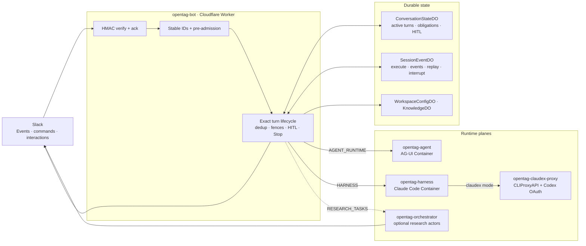
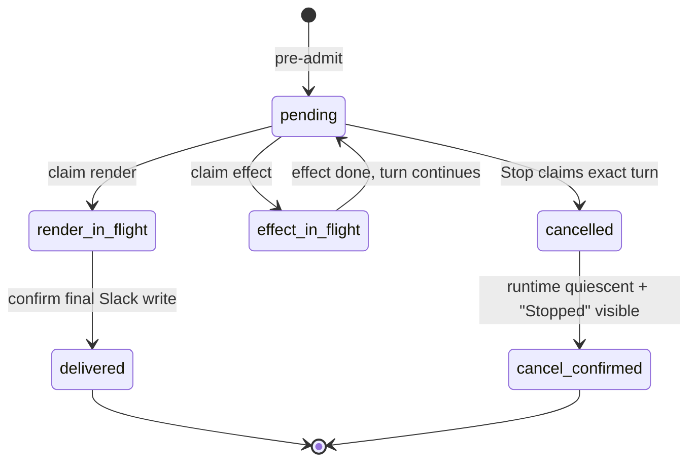
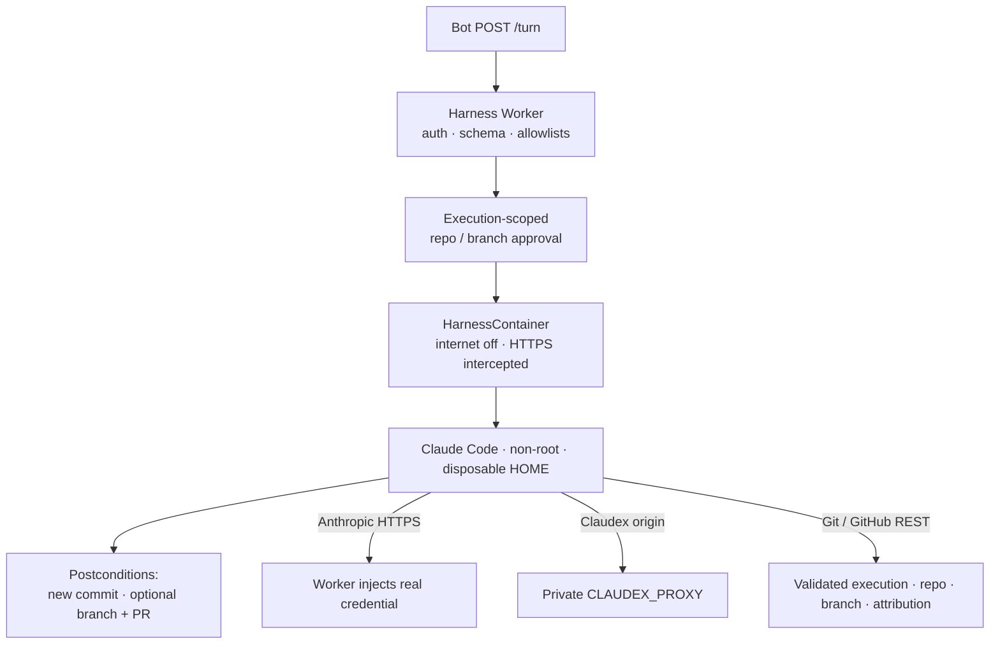

# OpenTag

**Self-hosted Claude-in-Slack on Cloudflare.**

OpenTag is an open-source Slack agent you run yourself. A workspace gets
conversational turns, human-approved tool writes, optional deep research, and
optional repository coding — with runtime and state on Cloudflare Workers,
Durable Objects, and Containers. Slack is the product surface; everything else
stays behind the bot.

Runs on **Cloudflare** (Workers, Durable Objects, Containers). The Slack bot
engine uses CopilotKit’s [`@copilotkit/channels`](https://github.com/CopilotKit/CopilotKit/tree/main/packages/channels)
package among other pieces — TanStack AI for the triage runtime, Claude Code
for repository turns, and MCP for tools like Linear and Notion. No Socket Mode.
No Railway bot. Events API only.

> **Canonical docs:** [PRODUCT.md](./PRODUCT.md) ·
> [ARCHITECTURE.md](./ARCHITECTURE.md) · [DECISIONS.md](./DECISIONS.md) ·
> [setup.md](./setup.md) · [docs/](./docs/README.md)

---

## What you get

| Experience | Behavior |
| --- | --- |
| Mentions, thread replies, `/agent`, DMs | Same exact turn lifecycle: admit → run → fence → deliver |
| Incremental Slack rendering | Status, titles, streamed Markdown, Block Kit cards |
| Durable thread continuity | Survives Worker isolate hops; sticky model/harness per thread |
| Never-silent outcomes | Live answer, recovered answer, explicit error, or confirmed Stop |
| Human-in-the-loop | Create/Cancel and remote-git approval survive cross-isolate clicks |
| Linear create-from-Slack | Structured confirm card; assignee defaults to Slack profile email |
| Deep research | Optional task plane; results return to the originating thread |
| Repository coding | Claude Code in an isolated Container with Worker-enforced egress and git postconditions |

▶️ **[Watch the demo](https://github.com/user-attachments/assets/a74fa1cb-add0-463e-a23c-aa09b95d5135)** (~50s) — generative UI in a Slack thread plus an Approve gate before writing out.

---

## Architecture at a glance

OpenTag is three planes behind one Slack ingress Worker:

1. **Conversation** — AG-UI triage runtime (`opentag-agent`) for ordinary agent turns and MCP tools.
2. **Coding** — Claude Code harness (`opentag-harness`) with native Anthropic or Claudex/Codex models.
3. **Research** — optional orchestrator/researcher/verifier Durable Objects; never Slack ingress.



Solid edges are production bindings. Dashed edges are optional. Deploy coding
targets before callers: **Claudex proxy → harness → bot**.

| Unit | Package / config | Role |
| --- | --- | --- |
| **`opentag-bot`** | `edge/wrangler.bot.toml` | Sole Slack HTTP owner |
| **`opentag-agent`** | `edge/workers/agent-runtime/` | Conversation AG-UI Container |
| **`opentag-harness`** | `edge/workers/sandbox/` + `containers/harness/` | Coding sandbox |
| **`opentag-claudex-proxy`** | `edge/workers/claudex-proxy/` | Private GPT backend for Claude Code |
| **`opentag-orchestrator`** | `edge/wrangler.research.toml` | Optional research task plane |

Full topology, sequence diagrams, and state machines:
[ARCHITECTURE.md](./ARCHITECTURE.md).

---

## Core concepts

These are the ideas that distinguish the current system from a simple
“Slack → LLM → reply” bot. Reading them once makes the rest of the codebase
legible.

### One Slack owner

Slack Events, slash commands, and interactions terminate only on
**`opentag-bot`**. Research and harness Workers reject `/slack/*`. There is no
Socket Mode path and no laptop process required in production.

The bot reaches the agent through the **`AGENT_RUNTIME` service binding** plus
an `AGENT_URL` path. Same-zone `workers.dev` fetch fails with Cloudflare error
1042 — service bindings are mandatory in production.

### Stable identities and pre-admission

Every production turn derives purpose-tagged SHA-256 IDs from Slack identity:

- `ot1e_…` — execution ID
- `ot1m_…` — forwarded message ID

Ingress **pre-admits** the active turn and an initial render obligation
*before* the first profile, config, task, or model await. That closes the race
where Stop could arrive before the turn registered itself.

Conversation scope is surface-aware:

| Slack input | Scope |
| --- | --- |
| DM (event or slash) | `DM_SCOPE` (`<channel>::dm`) |
| Thread reply / command with `thread_ts` | Root `thread_ts` |
| Top-level channel mention | The mention’s own `ts` (becomes reply-thread root) |
| Top-level channel slash command | Channel ID (Slack supplies no message `ts`) |

### Two kinds of durable truth

| Store | Answers |
| --- | --- |
| **`ConversationStateDO`** (`BOT_STATE`) | May this exact execution still render or mutate? Active-turn / effect / render fences, obligations, HITL, Stop continuation, thread memory |
| **`SessionEventDO`** (`SESSION_EVENTS`) | Was this execution admitted, interrupted, or terminal? Append-only event log for replay and recovery |

The model runtime is never the only source of delivery truth.

### Exact fences

Every Slack mutation and every non-Slack side effect must **claim** the exact
active turn before crossing its external boundary, then confirm or fail
definitively:



Duplicates (Slack redelivery) stay silent. A genuinely concurrent ask gets at
most one durable-deduped busy note per thread per minute — that note never
claims the live turn’s render token.

### Never-silent delivery

Before execution, the bot writes a **render obligation** (execution ID, event
cursor, Slack destination). `ConversationStateDO` alarms recover owed work:

1. Live execution still named by the active-turn row → defer (don’t double-post).
2. Terminal with confirmed output → clear silently.
3. Interrupted → clear without stale output.
4. Otherwise → replay events from `afterEventId`, claim the same render fence,
   post the recovered answer or an explicit error/retry card.

Obligations clear only after confirmed visibility or exact cancellation —
never merely because application code returned.

### Durable Stop

Stop (natural stop/cancel phrases; top-level channel stops must @mention the
bot) is a continuation, not a fire-and-forget:

1. Claim cancellation; cancel registered HITL choices.
2. Interrupt the exact runtime (AG-UI abort, harness process group, or research
   cancel with quiescence).
3. Claim and post the Slack “Stopped” acknowledgement.
4. Confirm visibility; clear the active turn and obligation.

Ambiguous intermediate work retries via DO alarm for up to 24 hours. Stop never
reports success ahead of the underlying work.

### Cross-isolate HITL

The Channels `awaitChoice` waiters live in isolate memory. Slack button clicks
often land on a different isolate. OpenTag embeds a stable `choiceId` in every
Create/Cancel (and remote-git) button, persists the click in `BOT_STATE`, and
races the in-memory waiter against a Durable Object poll
(`edge/src/hitl/durable-choice.ts`).

### Runtime selection is authoritative

Inline flags are stripped before the model sees the prompt:

| Flag | Effect |
| --- | --- |
| `--claude` | Claude Code harness (native Anthropic) |
| `--claudex` | Same Claude Code binary via private CLIProxyAPI/Codex |
| `--model <id>` | Sticky thread model (GPT IDs imply `claudex`) |
| `-rsn <effort>` | Reserved; fails visibly (no runtime accepts it yet) |

Sticky preferences live in DO-backed thread state. Explicit or sticky coding
selection **never** silently falls back to AG-UI. If the selected harness is
unconfigured, the turn fails visibly.

### Coding plane security

The harness is deliberately stricter than the triage Container:



- Container receives **sentinel** credentials, not real Anthropic/GitHub secrets.
- Real credentials are injected only after exact Worker policy validation.
- Remote push/PR requires durable per-turn Slack HITL bound to execution, repo,
  generated `opentag/session-*` branch, operation, expiry, and `Prompted by:`
  attribution.
- GraphQL mutations denied; package mirrors are GET/HEAD-only.
- Success requires a verified new commit/tree; approved remote success also
  requires the expected branch and an open attributed PR.
- Claudex OAuth lives only in the private proxy Container (R2-backed); the
  harness never sees it.

### Research is a task, not ingress

`/research`, `@bot research: …`, and `start_task` start an effect-fenced task
via `RESEARCH_TASKS`. Orchestrator / Researcher / Verifier DOs run fibers and
deliver back to the originating Slack thread. Cancellation requires
`{cancelled:true, quiescent:true}` so late results cannot revive a stopped task.

---

## Product surfaces

| Surface | Status | Notes |
| --- | --- | --- |
| Mentions & thread replies | Implemented | Events API; incremental render |
| `/agent` | Implemented | Same lifecycle as a mention |
| `/config` | Implemented | Channel prompt; preserves bundles/policy |
| `/research` | Implemented | Effect-fenced task start |
| DMs & assistant threads | Implemented | Stable `DM_SCOPE`, status, title, Stop |
| Durable HITL | Implemented | `choiceId` persistence + poll |
| Linear create | Implemented | Structured card; Slack-email assignee |
| Thread overrides | Implemented | Sticky model/harness |
| Quick actions | Implemented | Synthetic turns authored by the clicker |
| Never-silent recovery | Implemented | Obligations + SessionEventDO + DO alarms |
| Claude Code harness | Production-enabled | Native + Claudex share sandbox, Stop, egress, postconditions |
| Research actors | Optional | Internal task plane only |
| Multi-agent PM product | Deferred | Not in the public TaskRuntime API |

---

## Features by plane

### Slack UX (bot Worker)

- @mentions and thread continuity without re-mentioning
- Slash commands: `/agent`, `/config`, `/research`
- Reactions over chat spam (thanks → ❤️; long turns → hourglass)
- `react_message` tool when an emoji is better than text
- Generative UI cards: issues, lists, status, links, incidents
- Streaming conflation (Markdown concatenate; tasks newest-wins; one live plan)
- Bounded Block Kit (50 blocks, 3k chars/section, ~800 ms update cadence)

### Conversation runtime (`opentag-agent`)

- TanStack AI + OpenAI adapter (`runtime.ts` / `lib/triage-agent.ts`)
- Linear and Notion MCP when credentials are present
- Thread transcript, requester timezone, and Slack profile email injected every turn
- Local `pnpm runtime` on `:8200` is **dev-only** (iterate without rebuilding the Container)

### Client tools (access-bundle gated)

| Tool | Purpose |
| --- | --- |
| `lookup_slack_user` | Resolve people |
| `read_thread` | Fetch thread history |
| `confirm_write` | HITL approve-before-write |
| `issue_card` / `issue_list` | Linear-style issue UI |
| `page_list` | Notion-style lists |
| `show_status` / `show_links` / `show_incident` | Ops cards |
| `memory_search` / `memory_write` | Channel knowledge |
| `start_task` / `research_progress` | Deep research |
| `react_message` | Emoji reaction |

Chart/diagram image tools are not available on the Workers bot (no Playwright
in the isolate).

### Coding (`opentag-harness`)

- `--claude` / `--claudex` / `gpt-*` model selection
- Per-session Container, disposable HOME, process-group cancellation
- Worker-enforced outbound interception and remote-git HITL
- Mechanical commit / branch / PR postconditions before `done`

### Research (optional)

- Orchestrator / Researcher / Verifier Durable Objects
- Adapter-backed domain in `lib/research/` (DO / memory / Postgres)
- See [docs/research-actors.md](./docs/research-actors.md)

### Config & tenancy

- Per-channel system prompts (`/config`)
- Access bundles: tool allowlists + secret refs + MCP endpoint refs
- Workspace keying by Slack `teamId` with channel overrides

---

## Quick start

### Production shape

Deploy Containers + Workers. No laptop runtime or tunnel is required for Slack
once Request URLs point at `opentag-bot`. Full walkthrough: [setup.md](./setup.md).

Requires **Workers Paid** (Cloudflare Containers).

```bash
# 1. Conversation runtime
cd edge/workers/agent-runtime && npm ci
npx wrangler secret put OPENAI_API_KEY
# optional: LINEAR_API_KEY, LINEAR_TEAM_KEY (display name, e.g. Berendo), NOTION_*
npm run deploy

# 2. Coding plane (if you keep the shipped bindings) — targets before callers
cd ../claudex-proxy && npm ci && npm run deploy
cd ../sandbox && npm ci && npm run deploy

# 3. Bot
cd ../..
npx wrangler secret put SLACK_BOT_TOKEN --config wrangler.bot.toml
npx wrangler secret put SLACK_SIGNING_SECRET --config wrangler.bot.toml
printf '%s' 'https://opentag-agent.<account>.workers.dev/api/copilotkit/agent/triage/run' \
  | npx wrangler secret put AGENT_URL --config wrangler.bot.toml
npm run deploy:bot
```

### Slack app

1. [Create an app from a manifest](https://api.slack.com/apps?new_app=1) → paste
   [`slack-app-manifest.yaml`](./slack-app-manifest.yaml).
2. Install → copy **Bot User OAuth Token** and **Signing Secret**.
3. Point Request URLs at the bot Worker (not Socket Mode):
   - `https://<worker>/slack/events`
   - `https://<worker>/slack/commands`
   - `https://<worker>/slack/interactions`
4. After scope changes, **reinstall** and refresh `SLACK_BOT_TOKEN`. The token
   must include `users:read.email` for Linear assignee-from-Slack.

### Local iterate (dev)

```bash
# Agent brain (optional when iterating on prompts)
cp .env.example .env          # OPENAI_API_KEY, optional LINEAR_*, NOTION_*
pnpm install && pnpm runtime  # http://127.0.0.1:8200

# Bot Worker
cd edge
cp .dev.vars.example .dev.vars
npm ci && npm run dev         # usually :8787
```

Smoke without live Slack credentials:

```bash
# AG-UI turn (needs funded OPENAI_API_KEY)
curl -sN -X POST http://127.0.0.1:8200/api/copilotkit/agent/triage/run \
  -H 'Content-Type: application/json' -H 'Accept: text/event-stream' \
  -d '{"threadId":"t1","runId":"r1","messages":[{"id":"m1","role":"user","content":"ping"}],"tools":[],"context":[]}'

# Bot health (DO/SQLite spine)
curl -s http://127.0.0.1:8787/health
```

A full Slack round-trip needs real `SLACK_BOT_TOKEN` + `SLACK_SIGNING_SECRET`
and a tunnel (or a deployed Worker) for Request URLs.

---

## Repository layout

```text
opentag/
├── PRODUCT.md                 # Authoritative product contract
├── ARCHITECTURE.md            # Topology, lifecycles, state machines
├── DECISIONS.md               # Locked technical invariants
├── setup.md                   # Slack / Cloudflare / harness setup
├── AGENTS.md                  # Instructions for coding agents
├── slack-app-manifest.yaml    # Events API app (no Socket Mode)
├── runtime.ts                 # Node AG-UI entry (local + Container)
├── lib/triage-agent.ts        # Shared triage agent factory
├── lib/research/              # Research domain (adapters, fibers, OCC)
├── containers/
│   ├── harness/               # Claude Code sandbox image
│   └── claudex-proxy/         # CLIProxyAPI + Codex OAuth image
├── edge/                      # Cloudflare product surface
│   ├── wrangler.bot.toml      # Production opentag-bot
│   ├── wrangler.toml          # Local / legacy-dev bot
│   ├── wrangler.research.toml # Optional research Worker
│   ├── src/                   # Bot spine
│   │   ├── worker.ts          # Slack HTTP entry
│   │   ├── slack/             # Adapter, lifecycle, Stop, rendering
│   │   ├── store/             # ConversationStateDO, SessionEventDO
│   │   ├── hitl/              # Durable choiceId polling
│   │   ├── tools/             # Client tools + cards
│   │   ├── harness/           # Coding client + approval
│   │   └── commands/          # /agent, /config, /research
│   ├── workers/
│   │   ├── agent-runtime/     # opentag-agent Container
│   │   ├── sandbox/           # opentag-harness Worker
│   │   ├── claudex-proxy/     # Private Claudex backend
│   │   └── orchestrator/      # Research actors
│   └── vendor/                # Vendored Workers-safe Channels package
└── docs/                      # Operations, extending, Centaur port ledger
```

Root `pnpm start` / `pnpm dev` are **not** the Slack bot — they exit with a
pointer to `cd edge && npm run dev`.

---

## Validate

Exact CI sequence for the bot spine:

```bash
cd edge
npm ci
npm run typecheck
npm test                 # unit (lifecycle, fences, HITL, memory, …)
npm run test:e2e         # StateStore on workerd
```

Harness / Claudex packages:

```bash
cd edge/workers/sandbox && npm ci && npm run typecheck
cd ../claudex-proxy && npm ci && npm run typecheck
```

Optional root runtime/research tests: `pnpm test`.

Operations, deploy order, metrics, and troubleshooting:
[docs/operations.md](./docs/operations.md).

---

## Environment (high level)

| Variable | Where | Purpose |
| --- | --- | --- |
| `SLACK_BOT_TOKEN` | bot | Web API (`users:read.email` for Linear assignee) |
| `SLACK_SIGNING_SECRET` | bot | Events / commands HMAC |
| `AGENT_URL` | bot | AG-UI triage path |
| `AGENT_RUNTIME` | bot binding | Service binding to `opentag-agent` |
| `OPENAI_API_KEY` | agent | Triage model |
| `LINEAR_API_KEY` / `LINEAR_TEAM_KEY` | agent | Linear MCP (team = **display name**) |
| `NOTION_*` | agent | Optional Notion MCP |
| `ADMIN_SECRET` / `INTERNAL_SECRET` | bot (+ research) | Admin routes / research forward |
| `HARNESS` / `HARNESS_AUTH_TOKEN` | bot ↔ harness | Coding plane auth |
| `ANTHROPIC_API_KEY` / `GITHUB_TOKEN` | harness | Injected at egress only — never in the process env as live secrets |
| `HARNESS_ALLOWED_REPO_HOSTS` / `_ORGS` | harness | Canonical remote allowlists |
| `CLAUDEX_PROXY` / `CLIPROXY_*` | harness ↔ proxy | Private Claudex route and OAuth keys |

Full tables: [`.env.example`](./.env.example),
[`edge/.dev.vars.example`](./edge/.dev.vars.example), [setup.md](./setup.md).

---

## Hard invariants

1. Slack terminates only on `opentag-bot`; no Socket Mode.
2. Bot, session, obligation, Stop, and research keys must agree.
3. Pre-admit before the first asynchronous lookup.
4. Never clear a render obligation merely because code returned.
5. Slack renders and non-Slack effects claim the exact active-turn fence.
6. Stop never claims success before runtime/task quiescence and a visible ack.
7. Remote git is never granted by prompts or environment variables alone.
8. Coding intent cannot silently fall back to AG-UI.
9. Research cancellation is complete only after quiescence.
10. Deployment is an explicit operator action; coding targets deploy before callers.

Locked rationale: [DECISIONS.md](./DECISIONS.md) (§§11–16 especially).

---

## Centaur relationship

OpenTag adopted Centaur’s Slack streaming conflation, status/title UX, Stop
parser, render-obligation discipline, session/event log, sticky overrides,
quick-action pattern, and requester-attribution guidance — then
**reimplemented** them on Cloudflare Durable Objects and Workers.

It did **not** port Centaur’s Kubernetes control plane, Postgres/ParadeDB,
`iron-proxy`, Rails console, or multi-agent PM product. OpenTag adds stronger
Cloudflare-specific controls: exact active-turn and effect fences, pre-admission,
durable Stop continuation, research quiescence, Worker-enforced harness egress,
and mechanical coding postconditions.

Ledger: [docs/centaur-port.md](./docs/centaur-port.md).

---

## Make it yours

| Goal | Start here |
| --- | --- |
| Change agent behavior / MCP | [`lib/triage-agent.ts`](./lib/triage-agent.ts) → redeploy `opentag-agent` |
| Slack tools, cards, commands | [`edge/src/`](./edge/src/) |
| Access control / prompts | [`edge/src/config/`](./edge/src/config/), `/config` |
| New lifecycle or surface | [docs/extending.md](./docs/extending.md) |
| Research fibers | [`lib/research/`](./lib/research/), [`edge/workers/orchestrator/`](./edge/workers/orchestrator/) |
| Coding sandbox policy | [`edge/workers/sandbox/`](./edge/workers/sandbox/), [`containers/harness/`](./containers/harness/) |

---

## Documentation map

| Doc | Contents |
| --- | --- |
| [PRODUCT.md](./PRODUCT.md) | North star, surfaces, reliability & security contracts |
| [ARCHITECTURE.md](./ARCHITECTURE.md) | Topology, sequences, fences, recovery, harness, research |
| [DECISIONS.md](./DECISIONS.md) | Locked technical decisions |
| [setup.md](./setup.md) | Slack app, secrets, local and production setup |
| [docs/operations.md](./docs/operations.md) | Validate, deploy order, observe, diagnose |
| [docs/extending.md](./docs/extending.md) | Safe extension recipes |
| [docs/centaur-port.md](./docs/centaur-port.md) | What was ported, adapted, or omitted |
| [docs/research-actors.md](./docs/research-actors.md) | Research actor contracts |
| [edge/README.md](./edge/README.md) | Testable CF target, vendor channels, local E2E |
| [AGENTS.md](./AGENTS.md) | Cloud / coding-agent instructions |
| [docs/README.md](./docs/README.md) | Full doc index + precedence |

When documents disagree: **PRODUCT → ARCHITECTURE → DECISIONS → operations →
source/tests**.

---

## License

MIT — see [LICENSE](./LICENSE).
