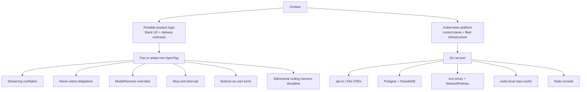

# Centaur to OpenTag core-spine port ledger

Status: **A1-A5 core spine landed; remaining subfeatures are listed below**
Updated: **2026-07-14**

This status is not a claim that every planned subfeature is complete.
Production harness enablement is an operator deployment step, and analytics
bindings remain optional. Inline and staged attachment tiers, delayed-upload
repair, prior-thread restoration, authenticated R2 resolution at the harness
frontend, the signed session viewer, durable quick-action admission, exact
AG-UI interruption, and artifact/research cards are source-complete when their
documented bindings are configured.

OpenTag did not migrate Centaur's Kubernetes platform. It extracted the Slack
UX and reliability lessons that made Centaur feel dependable, then rebuilt the
stateful pieces with Cloudflare-native primitives.

The original decision analysis remains in
[ARCHITECTURE-ANALYSIS.md](../ARCHITECTURE-ANALYSIS.md). This document records
what actually landed and where it lives now.

## Decision in one diagram

The result is not “Centaur on Cloudflare.” It is OpenTag using Centaur's proven
contracts while keeping OpenTag's smaller Slack-first product and Cloudflare
operating model.

## Port status

| Centaur pattern | OpenTag implementation | Treatment | Current status |
| --- | --- | --- | --- |
| `conflate.ts` high-frequency stream collapse | `edge/src/slack/conflate.ts`, `chunk-types.ts` | Near-verbatim TypeScript port | Implemented and tested |
| Incremental Slack rendering | `cloudflare-slack-adapter.ts`, `stream-render.ts` | Adapted to CopilotKit Channels and `chat.update` | Live path streams; bounded updates |
| Assistant status and title | `web-api.ts`, `agent-turn.ts`, lifecycle | Direct Slack API pattern | Implemented with exact render fence |
| Render obligations and crash recovery | `ConversationStateDO`, `RenderObligationEngine` | Rebuilt with SQLite + DO alarms | Implemented; no startup scan |
| Session append/execute/replay/interrupt contract | `SessionEventDO` | Rebuilt from contract, not copied from `api-rs` | Implemented with exact tombstones |
| Message/execution idempotency | `wire-id.ts`, pre-admission, SessionEventDO | Adapted and strengthened | Stable SHA-256 purpose-tagged IDs |
| Stop command | `stop-command.ts` | Near-verbatim parser port | Integrated with exact cancellation lifecycle |
| Runtime interrupt | `stop-routing.ts`, harness `/interrupt`, research cancel | New Cloudflare control path | Implemented with quiescence confirmation |
| Sticky model/harness flags | `overrides.ts`, `thread-overrides.ts` | Ported with unsupported providers removed | Sticky Claude model/harness; reasoning flags rejected |
| Per-channel model/harness defaults | `WorkspaceConfigDO`, `thread-overrides.ts`, `/config runtime` | Adapted to Durable Objects | Implemented with explicit > sticky > channel > deployment provenance |
| Redacted permission inspection | `permissions/*`, `show_permissions`, admin endpoint, harness CLI | Adapted without Rails/iron-proxy | Implemented as informational snapshots; authorization remains elsewhere |
| Rich-payload bot mentions | `trusted-trigger.ts`, `rich-display-text.ts`, pre-admission | Stricter authorization adaptation | Disabled by default; exact actor + exact nested mention; non-human safe-tool ceiling |
| Harness restart transcript re-feed | `agent-turn.ts`, harness client | Adapted | Last 24k characters passed to harness |
| Quick cards | `quick-card.ts`, research Slack delivery | Generalized from Quick-site cards | Artifact actions plus final-research Retry/Dig deeper/Export |
| Buttons become user-authored turns | `quick-actions.ts` | Adapted to OpenTag ingress | Implemented; inherits dedup and policy |
| Requester attribution | `request-context.ts`, `buildRequesterContextBlock()` | Adapted | Exact `Prompted by:` line enforced for PRs |
| Sandbox behavior prompt | `containers/harness/SYSTEM_PROMPT.md` | Selected sections copied/adapted | Active in harness image |
| Clone-per-session branch workflow | `harness-server.ts` | Rebuilt for CF Container storage | Implemented on `opentag/session-*` |
| Harness event normalization | `harness-server.ts`, `harness/client.ts` | New pinned NDJSON contract | Implemented; event persisted before success |
| Attachment transport | `download-files.ts`, harness frontend + server | Inline plus durable R2 tier | 8 MiB inline; staged through 32 MiB; size/digest verified |
| Tool-host bridge | `tool-host.ts` | TypeScript port of small Python bridge pattern | Optional, image-ready |
| Delivery metrics taxonomy | Structured logs throughout lifecycle | Pattern port | Implemented minimum counters |

## What was ported nearly verbatim

### Conflation

Centaur's conflation algorithm is runtime-neutral. OpenTag changed the type
import and retained the behavior:

- Markdown deltas concatenate.
- Task updates merge by task ID, newest value wins.
- Only the newest plan update is retained.
- The producer can run quickly while Slack consumes at its allowed pace.

OpenTag also added explicit renderer limits in `stream-render.ts` and placed
every production Slack mutation behind an exact active-turn render fence.

### Override parsing

The parsing and flag-stripping approach came directly from Centaur. OpenTag
trimmed Amp and provider flags because those runtimes do not exist here.

Key behavioral decisions retained:

- Flags are removed before thread memory, titles, transcripts, or models see
  the user text.
- Model and harness choices are sticky to a thread.
- Every `-rsn` reasoning value is visibly rejected because OpenTag has no
  Codex runtime. Disconnected Claude/model choices also fail visibly and are
  not saved as sticky preferences.
- A flags-only Claude model/harness message saves the preference and returns a
  confirmation without invoking a model. A reasoning/provider flag returns a
  visible rejection and saves nothing.

### Stop phrase recognition

The natural-language stop parser was directly portable. The surrounding
control plane was not: OpenTag added pre-admission, exact execution IDs,
SessionEventDO interrupt tombstones, active-turn cancellation states, harness
process-group termination, research quiescence, and a fenced Slack acknowledgement.

### System-prompt disciplines

The harness prompt adopts Centaur's strongest behavior contracts:

- lead with the answer and avoid chatbot filler;
- answer status questions before changing direction;
- use `uv` for Python;
- attribute PRs to the verified requester context;
- treat the container as ephemeral;
- do not self-post the final chat response;
- switch output medium when the user rejects the format;
- verify the user-visible artifact before claiming completion.

OpenTag omitted Centaur-only tools, internal-data claims, deployment systems,
Slack file tooling, and libraries not installed in the image.

## What was adapted to Cloudflare

### Postgres render obligations became DO alarms

Centaur stores obligations in Postgres, maintains an index, leases recovery,
and scans on pod startup. OpenTag stores obligations in the conversation
Durable Object and schedules its existing alarm.

| Centaur | OpenTag |
| --- | --- |
| Postgres obligation row | DO SQLite `render_obligations` row |
| Global index of recoverable threads | `earliestDeadline()` inside the owning DO |
| Pod startup scan | Durable Object alarm |
| Time-limited external lease | Exact render token in the active-turn row |
| Process/pod coordination | Single-threaded DO transaction boundaries |

The current implementation goes beyond the original plan. One alarm also
continues partially completed Stop workflows and expiry sweeps, and every
recovery post uses the same render claim/confirm protocol as live delivery.

### `api-rs` became a narrow SessionEventDO

OpenTag borrowed the useful session contract only:

- idempotent session creation;
- exact execution admission;
- forwarded-message deduplication;
- append-only event rows;
- replay from an event cursor;
- exact interrupt tombstones.

It did not port sandbox scheduling, ETL, auth tenancy, workflow engines, warm
pools, or K8s lifecycle management. `SessionEventDO` is a delivery truth source,
not a new general control plane.

### Quick actions re-enter normal ingress

The core Centaur idea survived: a button is not a privileged side channel. The
click is translated to a synthetic message authored by the clicking Slack user.

OpenTag added:

- deterministic click event IDs;
- defensive payload parsing and size caps;
- the same pre-admission path as messages and slash commands;
- requester re-resolution through Slack;
- the same tool policy, active-turn, render, and Stop fences.

Final research delivery uses the same mechanism for Retry, Dig deeper, and
Export. The durable research obligation supplies a stable task reference; the
click's Slack message/action timestamps form its stable ingress identity.

### Coding harness became one CF Container per session

Centaur assumes K8s sandboxes, repo mounts, sidecars, and a Rust harness server.
OpenTag instead uses:

- a Container-backed Durable Object named by session;
- clone/reuse under `/work/<sessionId>`;
- a dedicated `opentag/session-<prefix>` branch;
- a Node harness server speaking NDJSON;
- an authenticated frontend that resolves staged R2 attachments, verifies
  declared size and SHA-256, and forwards a bounded inline envelope;
- an execution-specific disposable `HOME`;
- a non-root Ubuntu image with Claude Code and core developer tools;
- direct postcondition checks after Claude exits.

The outer Worker, not the model prompt, enforces repository and credential
policy.

## What OpenTag built beyond the original port plan

The A1–A5 spec described the broad destination. Adversarial review added a
more rigorous lifecycle than the initial Centaur comparison anticipated.

### Pre-admission

The active turn is durably registered before any asynchronous profile, config,
or task lookup. A Stop that arrives immediately can therefore identify and
cancel the exact turn.

### Transactional render and effect fences

OpenTag does not merely deduplicate entire messages. Every Slack mutation and
non-Slack production effect must claim a token on the exact active turn.
Confirmation or definitive failure updates the state atomically. This closes
answer-after-Stop and tool-after-Stop races.

### Durable Stop continuation

If cancellation control succeeds but the Slack acknowledgement fails, the DO
alarm retries the remaining workflow. It never restarts the original turn and
never falsely reports a stop before the underlying effect is controlled.

### Exact research cancellation

Research storage adapters now define cancellation as an atomic operation that
cancels the task/session and suppresses queued outbox, delivery, and alarm work.
External search results are re-checked before they can mutate a cancelled task.

### Zero-trust harness outbound policy

The initial architecture analysis said Cloudflare could not reproduce
Centaur's enforced proxy boundary. The current Containers API now supports the
specific HTTP/HTTPS boundary OpenTag needs:

- internet off by default;
- HTTPS interception;
- host allowlists;
- Worker-side outbound handlers;
- sentinel credentials in the process;
- exact repo/branch/method/request-body authorization;
- early revocation on terminal, interrupt, disconnect, or error.

This still does not recreate arbitrary-protocol Kubernetes NetworkPolicies,
but it is an enforced boundary for the implemented coding workflow.

### Mechanical success postconditions

Claude's own success claim is held until OpenTag verifies:

- the session branch is still checked out;
- a new commit and tree change exist;
- an approved remote branch was pushed when required;
- the approved PR exists and contains requester attribution;
- disposable execution state has been removed.

## What was intentionally not ported

| Centaur component | Why it stayed in Centaur |
| --- | --- |
| `api-rs` Rust/K8s control plane | OpenTag needs the session contract, not fleet orchestration |
| Sandbox CRDs and controllers | CF Containers are addressed through Durable Objects |
| ParadeDB/Postgres platform | DO SQLite satisfies OpenTag's session/delivery state |
| Warm-pool and capacity manager | Team-scale OpenTag accepts container cold starts |
| Node-local repo cache and hostPath mounts | No Cloudflare equivalent; clone/reuse per session |
| Rails console | Replaced by a signed, read-only SessionEventDO JSON viewer |
| Full `iron-proxy` protocol coverage | No arbitrary TCP/UDP NetworkPolicy equivalent |
| Amp/Codex/multi-provider harness matrix | Claude Code is the first supported coding harness |
| Centaur observability stack | OpenTag uses structured Worker logs today |
| Centaur tool catalog | Tool-host surface exists, but tools are added intentionally |
| Multi-agent PM/implement/verify fleet | Still out of the public OpenTag task contract |

## Capability comparison

| Capability | Centaur source | OpenTag equivalent | Important difference |
| --- | --- | --- | --- |
| Slack streaming | Slackbot v2 renderer | Channels renderer + conflation | OpenTag adds exact per-update fences |
| Never-silent recovery | Postgres + leases + startup scan | DO SQLite + alarms | No startup sweep or external lease |
| Session events | `api-rs` | SessionEventDO | Narrower, Slack-delivery focused |
| Stop | Session API interrupt | Exact multi-plane cancellation | Includes research and process quiescence |
| Model flags | Multi-harness session config | Sticky DO state | Only Claude Code is a real alternate harness |
| Quick actions | Site-specific buttons | Generic synthetic turns | Artifact cards require `QUICK_BASE_DOMAIN`; research cards are final-delivery actions |
| Repo access | Mounted cache | Clone/reuse per session | Higher cold-start cost, simpler ops |
| Credentials | `iron-proxy` sidecar | Container outbound handlers | HTTP/HTTPS scope only |
| Coding success | Harness result | Git/PR postconditions | OpenTag verifies commit and attribution |
| Console | Rails app | Signed SessionEventDO viewer | Read-only JSON, not an operations console |

## Known limits and next expansions

- The bot-to-harness service binding is not enabled by default; deployment and
  secrets are operator actions. The harness `BLOBS` binding must name the same
  bucket used by the bot's staged attachment writer.
- Clone-per-session can be slow for large repositories. R2-backed snapshots or
  shallow-cache refresh are possible future optimizations.
- The harness streams NDJSON into the event log, but Slack currently posts the
  accumulated harness answer as one final fenced message. `onText` is the hook
  for future live coding output.
- AG-UI text uses the Channels incremental renderer; the bespoke conflation
  helper remains the adapter `stream()` path. Richer harness task/plan events
  are not yet emitted.
- Set `SESSION_VIEWER_BASE_URL` with `ADMIN_SECRET` to append a signed,
  expiring first-turn event link. The endpoint is read-only and no-store.
- The current outbound policy is deliberately GitHub-specific. Other git hosts
  need their own parser, allowlist, branch proof, and API authorization logic.

## Source documents

- [ARCHITECTURE.md](../ARCHITECTURE.md): current system
- [ARCHITECTURE-ANALYSIS.md](../ARCHITECTURE-ANALYSIS.md): original A-vs-B decision
- [SPEC.md](../SPEC.md): original phased design
- [GOAL.md](../GOAL.md): implementation orchestration brief
- [implementation-notes.md](../implementation-notes.md): phase history and review fixes
