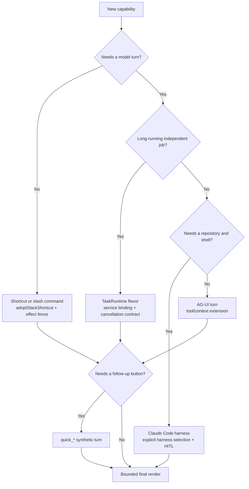

# Extending OpenTag safely

Status: **current contributor guide**
Updated: **2026-07-13**

OpenTag's extension points are intentionally narrow. A new feature should enter
through the normal Slack lifecycle, store durable state behind an adapter or
Durable Object, and reuse the existing render/effect fences. Bypassing those
paths usually creates duplicate execution, answer-after-Stop, or silent-failure
bugs.

Read [ARCHITECTURE.md](../ARCHITECTURE.md) first. Locked decisions live in
[DECISIONS.md](../DECISIONS.md).

## Choose the right extension point



## Non-negotiable invariants

Before changing code, keep these rules visible:

1. Slack ingress remains Events API only and terminates on `opentag-bot`.
2. Derive a stable execution identity from Slack input; never use a random ID
   for production redelivery.
3. Pre-admit before the first asynchronous lookup.
4. Every Slack post/update/status/title uses the exact render fence.
5. Every external non-Slack mutation uses an effect fence.
6. Stop must target the same `slackObligationThreadKey()` as execution,
   obligation, session, and research routing.
7. Persist terminal session state before claiming success.
8. Never clear an obligation merely because application code returned; clear
   only after the exact final surface is confirmed.
9. Do not add remote-git capability through prompts or environment variables.
   Extend the Worker-side policy and tests.
10. Respect Slack size limits and form-urlencoded Web API encoding.

Identity rules are not interchangeable: DMs use `DM_SCOPE`; a thread uses its
root timestamp; a top-level mention uses its own message timestamp because it
becomes the reply-thread root; and a top-level slash command uses channel scope
because Slack provides no message timestamp. Update pre-admission and adapter
derivation together, with a parity test, whenever a new ingress shape is added.

The sole raw Slack-post exception is the existing concurrent-turn busy note.
It is not model output, is guarded by a durable per-thread TTL dedup claim, and
does not touch the live execution's render token. Do not copy that exception
for normal answers, errors, status, titles, cards, or shortcuts.

## Add a Slack shortcut

Use a shortcut when the request can be handled without a model, such as a
reaction, memory write, or task kickoff.

1. Add detection in `edge/src/bot-engine.ts` or a command in
   `edge/src/commands/index.ts`.
2. Call `adoptSlackShortcut()` immediately. This adopts the pre-admitted row
   before config/profile/task awaits.
3. Re-check `shortcutStillPending()` after asynchronous enrichment.
4. Wrap external effects with `runShortcutEffect()`.
5. If the effect creates a cancellable resource, return an
   `ActiveTurnEffectResource` and provide `cancelIfStopped`.
6. Finish with `postFinalShortcut()` or `finishSilentShortcut()`.

Do not call `chat.postMessage` directly from a shortcut. The helper owns final
render claiming, terminal confirmation, and obligation cleanup.

### Example shape

```ts
const adopted = await adoptSlackShortcut(env, adapter, thread);
if (!(await shortcutStillPending(adopted))) return;

const effect = await runShortcutEffect(
  adopted,
  "my_effect",
  () => externalMutation(),
  {
    resource: (value) => ({
      kind: "research_task",
      teamId,
      taskId: value.id,
      threadKey,
    }),
    cancelIfStopped: (resource) => cancelCreatedResource(resource),
  },
);

if (effect.status === "suppressed") return;
await postFinalShortcut(thread, "Done.");
```

If the resource is not a research task, extend `ActiveTurnEffectResource` with a
new discriminated type and teach Stop how to cancel it. Do not overload the
research fields.

## Add a slash command

1. Add the command to `edgeCommands` in `edge/src/commands/index.ts`.
2. Add it to `slack-app-manifest.yaml`.
3. Preserve the stable Slack `trigger_id`; the HTTP route rejects commands
   without a stable identity.
4. Use `copyRequestContext()` and `adoptSlackShortcut()` before work.
5. For model-backed commands, call `runSlackTurnLifecycle()` rather than
   `thread.runAgent()` directly.
6. For DMs, keep `DM_SCOPE`; do not invent a slash-specific thread key.
7. Reinstall the Slack app after manifest scope or command changes.

`/agent` is the reference model-backed command. `/research` is the reference
effect-fenced task command. `/config` is the reference durable mutation.

## Add an AG-UI tool

1. Define the tool in `edge/src/tools/index.ts`.
2. Add its name to the appropriate access bundle in `edge/src/config/`.
3. Read the current turn's `RequestContext`; do not derive identity from global
   mutable state.
4. For read-only tools, return bounded data suitable for Slack rendering.
5. For mutations, use `confirm_write` or a dedicated durable HITL choice and
   cross an active-turn effect fence before the external call.
6. Add policy enforcement to `guardToolsByBundle()` tests.
7. Add a tool-execution-fence test that races Stop against the call.

Tool availability is deny-by-default at the access-bundle layer. A tool in the
codebase is not automatically available to every channel.

## Add a card

Cards live in `edge/src/components/cards.ts` and return CopilotKit UI nodes.

- Keep the rendered Block Kit message under 50 blocks.
- Bound every user-controlled label, field, and action value.
- Use `newHitlChoiceId()` for decisions that must survive isolate changes.
- Include the stable `choiceId` in every Create/Cancel action value.
- Do not rely on the framework's in-memory `awaitChoice` map alone.
- Add component tests plus a real interaction-persistence test.

For an external write, the card should summarize the exact scope being
approved. `RemoteGitApprovalCard` is the reference for repository and requester
scope; `confirm_write` is the reference for Linear fields.

## Add a quick action

Quick actions are for follow-up intent, not privileged direct mutations.

1. Add a kind to `QuickActionKind` in `quick-card.ts`.
2. Add prompt synthesis in `buildQuickActionPrompt()`.
3. Keep the `quick_*` action ID prefix so `worker.ts` routes it before generic
   interaction handling.
4. Parse the value defensively and enforce the existing size caps.
5. Ensure the synthetic turn uses the clicking user, clicked message, channel,
   thread root, and deterministic action timestamp identity.
6. Let the normal lifecycle and tool policy decide whether the resulting action
   is allowed.

Never put a deletion, deploy, or write directly in the quick-action HTTP
handler. The click should ask the agent to perform it through the usual policy
and HITL paths.

## Add a task type

Research is currently the only public `TaskRuntime` flavor. A new task requires
more than adding a string union member.

1. Extend `TaskType`, request/result types, and `startTask()` in
   `edge/src/tasks/runtime.ts`.
2. Create or select a service-bound Worker. The bot should not expose that
   Worker's internals publicly.
3. Define an adapter-backed storage contract for start, progress, delivery, and
   exact cancellation.
4. Make start an effect-fenced operation and return an exact resource handle.
5. Require cancellation to prove both cancellation and quiescence. Ambiguous
   transport/status/body results must throw.
6. Suppress pending outbox and delivery work atomically with cancellation.
7. Re-check active status after every external await that could complete after
   cancellation.
8. Deliver to Slack through a claim/confirm protocol, not an untracked post.
9. Add route, adapter, cancellation-race, alarm, and delivery tests.

If the new task cannot be stopped safely, document that before exposing it to
the Slack Stop lifecycle.

## Add a model or harness selector

Parsing lives in `edge/src/slack/overrides.ts`; persistence lives in
`edge/src/store/thread-overrides.ts`.

- Add aliases only for runtimes that actually exist.
- Strip flags before titles, memory, transcript construction, and model input.
- Do not advertise reasoning selection until a deployed runtime accepts and
  enforces it. Today every `-rsn` value is stripped, visibly rejected, and
  never persisted.
- A harness change may require a session restart and transcript re-feed.
- A recorded preference must not be presented as active when the target
  runtime cannot honor it.
- A coding request must not fall back to AG-UI after the authoritative harness
  fails.

`claudecode` and `claudex` are provider modes of the same Claude Code harness,
not separate tool runtimes. Add another translated provider mode only when it
can preserve the same CLI, turn contract, interrupt behavior, egress boundary,
and terminal postconditions. To add a genuinely different harness, introduce a
typed runtime adapter rather than branching throughout `agent-turn.ts`; each
adapter must implement exact execute/interrupt/event-terminal semantics.

Channel defaults are stored in `WorkspaceConfigDO` as `runtimeDefaults` and
resolved independently per field:

1. explicit message flag;
2. sticky thread choice;
3. channel default;
4. deployment/runtime default.

Using a channel default must never write `thread:overrides:*`. Configuration
uses `/config runtime show`, `/config runtime set --harness claude-code
[--model <id-or-alias>]`, `/config runtime set --harness claudex
[--model gpt-<id>]`, and `/config runtime clear`. Only exact
`runtime show|set|clear` prefixes enter this parser; all other `/config` text
continues to mean a system prompt.

## Add permission-aware behavior

`PermissionSnapshotV1` is a bounded, redacted explanation of the exact turn,
not an authorization input. Authorization remains in access-bundle resolution,
active-turn/effect fences, the automation ceiling, harness approval, and egress
policy. `show_permissions` is a reserved read-only meta tool, authenticated
operators can inspect `GET /admin/permissions?teamId=...&channelId=...`, and a
Claude harness turn can run `opentag permissions`.

Never add secret values, raw environment values, request headers, URL
credentials/query/fragment, or raw Slack payloads to the snapshot. New tools
are denied to automation until explicitly added to `AUTOMATION_SAFE_TOOLS`.

## Add a trusted automation trigger

Trusted rich-payload Slack triggers are a narrow fallback for approved bot/app
alerts whose exact OpenTag mention exists only in Block Kit or attachments.
They use a `slack_automation` actor, never a human compatibility identity.
Automation cannot Stop, write memory, start research, react, approve remote git,
create a PR, or emit `Prompted by:` attribution. Preserve pure classification
before durable pre-admission and never add a Slack lookup ahead of it.

## Add a harness event

The pinned container protocol currently has:

```text
output { text }
output { tool, summary }
error  { message }
done   { ok, summary }
```

To add a kind:

1. Extend `NdjsonEvent` and mapping in `harness-server.ts`.
2. Extend the outer client's parser in `edge/src/harness/client.ts`.
3. Decide what persists in `SessionEventDO` and how recovery reconstructs it.
4. Decide how Slack renders or conflates it.
5. Preserve `done` as the only terminal kind and always last.
6. Persist the event before exposing it to Slack or a success caller.
7. Add malformed, duplicate, partial-line, disconnect, interrupt, and missing-
   terminal tests on both sides of the wire.

The existing `onText` callback is the safe hook for future live harness text.
Do not stream to Slack without the active-turn render fence.

## Add a repository host or GitHub operation

This is a security-sensitive change. Updating `allowedHosts` is not enough.

For a new git host or operation, implement and test:

- canonical URL parsing with credentials, ports, query, and fragment rejected;
- explicit organization/repository allowlists;
- exact execution binding removal before forwarding;
- read versus write method/path/body validation;
- generated branch proof for pushes;
- repository proof for API calls;
- requester attribution proof for PR-like operations;
- credential replacement, never preservation of a caller-supplied credential;
- early approval revocation on Stop, terminal, error, disconnect, and timeout;
- fail-closed behavior when request bodies are too large or unparseable.

Do not enable GraphQL mutations until there is a reliable way to bind opaque
node IDs to the approved repository.

## Add an outbound package/source host

1. Add the hostname to the compile-time `HARNESS_ALLOWED_HOSTS` list in
   `edge/workers/sandbox/src/container.ts`.
2. Decide whether the host belongs in a specialized handler or the generic
   source-download handler.
3. Default to `GET`/`HEAD` only.
4. Add positive tests for required fetches and negative tests for writes,
   redirects, credential headers, and lookalike domains.
5. Rebuild and redeploy the harness Worker only after explicit approval.

Package scripts can execute repository-controlled code. A read-only mirror
allowlist does not make package installation trustworthy; it only limits its
network destinations.

## Extend durable state

Use the shared StateStore when the operation is generic KV/list/lock/dedup. Use
typed ConversationStateDO RPC when transitions must be atomic across active
turns, obligations, choices, and effects.

When adding schema:

1. Update `edge/src/store/schema.ts` and increment its schema version.
2. Make migration idempotent.
3. Keep Cloudflare DO migrations in both local and production Wrangler configs
   when a new class is introduced.
4. Add node:sqlite engine tests for transactional behavior.
5. Add workerd tests for RPC serialization and persistence.
6. Test stale execution IDs against newer rows.

Avoid read-modify-write sequences split across multiple DO RPCs when a Stop or
render can interleave. Put the compare-and-set in the engine.

## Add configuration or a secret

1. Add the binding/type to `edge/src/env.ts` or the owning Worker's env type.
2. Document whether it is a Wrangler var, secret, service binding, DO binding,
   R2 binding, or local `.dev.vars` value.
3. Update `.dev.vars.example`, `setup.md`, and `docs/operations.md` without
   adding a real value.
4. Prefer service bindings for same-zone Worker calls; public `workers.dev`
   fetch can return Cloudflare 1042.
5. Do not put real secrets in container image variables. The harness must keep
   sentinel values and inject credentials in outbound handlers.

## Testing expectations

Run the smallest targeted test while developing, then the full affected tier.

```bash
cd edge
npm run typecheck
npm test
npm run test:e2e

cd workers/sandbox
npm run typecheck

cd ../../..
pnpm run check-types
pnpm test
```

For lifecycle changes, tests should cover at least:

- Slack redelivery with the same stable identity;
- two concurrent threads in one channel;
- Stop before admission completes;
- Stop during HITL;
- Stop during a render;
- Stop during a non-Slack side effect;
- ambiguous transport failure;
- Worker/container restart or alarm replay;
- a stale execution acting on a newer thread row;
- terminal persistence failure;
- exact output visible once, never twice.

For harness changes, also run Docker build/smoke validation when the CLI is
available. CI's `edge-ci` workflow runs Node 22 `npm ci`, typecheck, unit tests,
and the StateStore workerd suite.

## Documentation checklist for extensions

Update the docs that own the changed contract:

| Change | Documentation |
| --- | --- |
| New product capability | `README.md`, `PRODUCT.md` |
| New component or data flow | `ARCHITECTURE.md` |
| New invariant/security decision | `DECISIONS.md` |
| New var, secret, or deploy step | `setup.md`, `docs/operations.md` |
| New edge command/tool | `edge/README.md`, `AGENTS.md` if it creates a pitfall |
| New research behavior | `docs/research-actors.md`, `docs/evaluation.md` |
| New test/smoke flow | `e2e/README.md` |
| Centaur-derived behavior | `docs/centaur-port.md`, `implementation-notes.md` |

## Common unsafe shortcuts

Do not:

- call `thread.runAgent()` from a production route outside
  `runSlackTurnLifecycle()`;
- post directly to Slack after a model or external effect without a render
  claim;
- create a random production execution ID;
- clear obligations in `finally`;
- acknowledge HITL before durable persistence;
- make a button perform privileged work directly;
- store critical state only in an isolate map;
- treat a failed HTTP response as proof that a remote mutation did not happen;
- expose real harness credentials inside the process;
- add a host without method/path/body authorization;
- claim a coding task succeeded without a new commit;
- claim Stop succeeded without quiescence and a visible acknowledgement.
