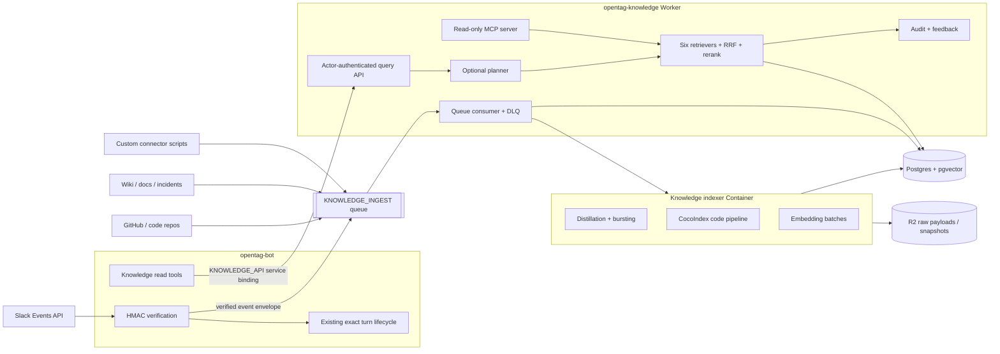

# OpenTag Knowledge Base — Implementation Specification

Status: **PROPOSED design/rollout; source-side foundation and Slack retrieval partially live**

## Reconciliation status — 2026-08-01

This remains a detailed design and rollout specification, not a claim that
all listed ingestion, retrieval, project, connector, or production canary
work is complete. The current OpenTag implementation has KnowledgeDO,
queue/ledger contracts, actor-bound authorization, bounded raw query templates,
and a live Slack retrieval path. The deployed environment reports knowledge
reconciliation as unconfigured, and fresh indexing is eventually consistent.

The platform rollout also now locks one shared Worker fleet with strict
per-team Durable Object isolation and Worker Secrets for deployment/bootstrap
configuration. Worker Secrets are not a substitute for per-tenant provider
custody. Drive, Linear, external MCP, broad ingestion, backup/restore, and
production source activation remain gated by the stop conditions in this spec.
See [../current-state.md](./current-state.md) for evidence and
[.../goal-outputs/multi-repo-parent-sync-architecture-backfill/CURRENT-STATE-RECONCILIATION.md](../goal-outputs/multi-repo-parent-sync-architecture-backfill/CURRENT-STATE-RECONCILIATION.md)
for the backfill status map.


Date: **2026-07-17**

Input design: **“How We Built Our Knowledge Base,” 2026-07-15**

Owners: OpenTag bot, agent-runtime, and new knowledge service maintainers

> This document specifies a new product area. It does not describe current
> behavior. Current implementation truth remains [PRODUCT.md](./PRODUCT.md),
> [ARCHITECTURE.md](./ARCHITECTURE.md), and [DECISIONS.md](./DECISIONS.md).
> The archived [SPEC.md](./archive/SPEC.md) remains the historical Centaur UX
> port spec.

## 1. Executive decision

Build a separate `opentag-knowledge` service that turns Slack, code, documents,
pull requests, incidents, and custom sources into one authorization-aware
retrieval corpus. Keep `opentag-bot` as the only Slack Request URL and keep the
existing Events API transport. The bot will enqueue verified Slack events and
query the knowledge service through a Cloudflare service binding.

This spec intentionally chooses external PostgreSQL through Cloudflare
Hyperdrive so it can preserve the requested one-table, pgvector,
3,072-dimension HNSW design. That changes the current
[PRODUCT.md](./PRODUCT.md) promise that runtime and state remain on
Cloudflare. Implementation cannot begin against production data until
product/operator review explicitly approves that contract change. If
Cloudflare-only state remains a hard requirement, storage and vector dimensions
must be redesigned and re-evaluated before KB-1; that is not a drop-in
implementation detail.

The knowledge service will provide:

1. connector configuration and incremental ingestion;
2. raw-source preservation plus normalized, queryable artifacts;
3. OpenAI `text-embedding-3-large` embeddings at 3,072 dimensions;
4. Postgres full-text, exact-token, IDF, recency, and pgvector HNSW retrieval;
5. reciprocal rank fusion with `k = 60`, source deduplication, diversity caps,
   model reranking, and post-rank context expansion;
6. projects and user-default query scopes;
7. retrieval-time authorization, auditing, and source deletion;
8. stable read-only tools for OpenTag, MCP clients, automations, and future UIs;
9. evidence packets with source URLs and citation metadata, never generated
   answers without evidence.

This is not an expansion of `KnowledgeDO`. That Durable Object is a small
workspace-partitioned note store using substring matching. It cannot provide
cross-source indexing, vector search, source-level authorization, connector
cursors, global corpus statistics, or ranking at the required scale.

## 2. Goals and success criteria

### 2.1 Product goals

- Let an employee ask “where is X?”, “who knows Y?”, or “what is Z?” in Slack
  and receive a synthesized answer with inspectable citations.
- Meet information where it already lives. A source owner configures a
  connector; employees do not need to move conversations or documents.
- Give agents and automations the same evidence tools as human users without
  granting broader access.
- Make new connectors predictable: every connector emits the same normalized
  record contract and becomes queryable through the same retrieval API.
- Keep source freshness, authorization, deletions, and query behavior
  observable and testable.

### 2.2 Capacity and quality targets

These are launch gates, not claims about current performance.

| Measure | Target |
| --- | --- |
| Query volume | 15,000 questions/day with 10x burst headroom |
| Retrieval latency | p95 <= 2.0 s without planner/reranker; p95 <= 5.0 s with both |
| Slack freshness | p95 <= 2 minutes for tracked-channel message changes |
| Code freshness | p95 <= 10 minutes after a configured repository webhook |
| Scheduled-source freshness | Within the source’s declared interval plus 5 minutes |
| Citation validity | >= 99.5% of rendered citations resolve to the cited authorized source |
| Retrieval quality | >= 85% answerable-query Recall@10 on the launch evaluation set |
| Exact-token quality | >= 95% Recall@5 for held-out errors, flags, hosts, and symbols |
| Authorization leakage | Zero unauthorized content in tool results, reranker input, logs, or answers |
| Deletion behavior | Query suppression immediately after tombstone; physical purge <= 24 hours |

### 2.3 Non-goals for the first production release

- Replacing Slack with a knowledge web UI.
- Making Socket Mode a second Slack transport.
- Indexing all workspace DMs or multiparty DMs.
- Granting access because a source appears in a project.
- Allowing an LLM to choose or widen authorization filters.
- Building a general enterprise identity provider or group-sync product.
- Making the optional Claude Code harness a required query dependency.
- Hiding all retrieval primitives behind a single “answer” MCP method.
- Claiming 40 GB repository support before a representative load test passes.

## 3. Current-state gap

| Concern | Current OpenTag | Required state |
| --- | --- | --- |
| Knowledge storage | `KnowledgeDO` SQLite, partitioned by Slack team | Shared Postgres corpus with source/project/ACL records |
| Ingestion | Explicit `memory_write` only | Continuous connectors, cursors, retries, backfills, deletes |
| Search | `lower(...) LIKE '%query%'` | Six parallel lists, RRF, reranking, expansion |
| Embeddings | None | Versioned 3,072-dimensional embeddings |
| Slack data | Current thread read on demand | Tracked-channel thread indexing and reingestion |
| Code | Optional harness checkout | Incremental code corpus plus exact code search |
| Scope | Team and current channel | Projects, default project, explicit source scope |
| Authorization | Channel tool bundles | Source ACLs plus actor-aware retrieval and audit |
| Citations | Tool-dependent prose | Stable evidence IDs and canonical source links |
| MCP | Linear/Notion clients in agent runtime | First-party knowledge MCP with stable read tools |
| Expertise | None | Evidence-backed `who_knows`, scoped to visible sources |
| Evaluation | Research evals only | Retrieval, ACL, freshness, citation, and ranking evals |

## 4. Locked architecture



### 4.1 Deployment units

| Unit | Responsibility | Must not own |
| --- | --- | --- |
| `opentag-bot` | Slack verification, acknowledgement, turn lifecycle, tool execution, Slack rendering | Connector sync, embedding, reranking, corpus storage |
| `opentag-agent` | Final conversational synthesis from tools/evidence | Source authorization or corpus writes |
| `opentag-knowledge` | Query API, MCP, queue consumption, retrieval, ACL enforcement, audit | Slack Request URLs or final Slack rendering |
| knowledge indexer Container | Long-running connector transforms, LLM distillation, CocoIndex, embeddings | User-facing authorization decisions |
| Postgres | Corpus, config, cursors, ACLs, ranks, audits | Secrets or raw OAuth tokens |
| R2 | Oversized raw payloads, repository snapshots, immutable ingestion evidence | Query authorization policy |

The bot and knowledge Worker communicate through a service binding named
`KNOWLEDGE_API`. Public same-zone `workers.dev` fetch is not the production
path. The knowledge Worker connects to Postgres through a `KNOWLEDGE_DB`
Hyperdrive binding. `pg` must be at least the version supported by current
Hyperdrive documentation when implementation begins.

### 4.2 Why Postgres instead of D1, DO SQLite, or Vectorize

The design needs one transactionally consistent place for source rows,
full-text indexes, exact tokens, connector cursors, ACL joins, project joins,
audit rows, and vector candidates. Postgres with pgvector provides that common
query and migration boundary. Durable Objects remain the right owner for
per-thread turn state; they are not the corpus database.

Vectorize may be evaluated later, but it is not the launch store. Splitting
vectors and authorization metadata across two systems would make deletion,
source deduplication, filtered recall, and audit reconstruction harder.

### 4.3 Transport decisions

- Slack remains Events API over the existing signed HTTP endpoint.
- Only verified event callbacks can enter `KNOWLEDGE_INGEST`.
- Slack acknowledgement never waits for thread fetch, distillation, or storage.
- Queue messages are at-least-once; database writes are idempotent.
- A dead-letter queue is mandatory. Exhausted messages must not disappear.
- Scheduled connectors enqueue bounded sync jobs rather than doing work in a
  cron request.
- Large code/document runs execute in the indexer Container and checkpoint to
  Postgres/R2.

## 5. Repository change map

The paths below are the intended ownership boundaries. Exact filenames may
change during implementation only if the replacement preserves the same
contract and is recorded in this spec.

```text
knowledge/
  README.md
  pyproject.toml
  config/
    sources.schema.json
    projects.schema.json
    sources/*.yaml
    projects/*.yaml
  migrations/
    001_extensions.sql
    002_catalog.sql
    003_embeddings.sql
    004_acl.sql
    005_ingestion.sql
    006_audit.sql
  indexer/
    Dockerfile
    app.py
    contracts.py
    distill.py
    burst.py
    embed.py
    idf.py
    connectors/
      base.py
      slack.py
      github.py
      cocoindex_code.py
      document.py
      custom.py
  evals/
    fixtures/
    retrieval.py
    authorization.py
    citations.py
    freshness.py

edge/workers/knowledge/
  package.json
  wrangler.toml
  src/
    index.ts
    env.ts
    actor-token.ts
    db.ts
    queue.ts
    catalog.ts
    acl.ts
    retrieval/
      lexical.ts
      exact.ts
      vector.ts
      recency.ts
      rrf.ts
      rerank.ts
      expand.ts
    api.ts
    mcp.ts
    audit.ts
    health.ts

edge/src/knowledge/
  client.ts
  actor-token.ts
  slack-capture.ts
  tool-contracts.ts
  project-command.ts

edge/test/knowledge-*.test.ts
edge/workers/knowledge/test/*.test.ts
```

Existing files requiring changes:

| Path | Change |
| --- | --- |
| `edge/src/env.ts` | Add `KNOWLEDGE_API`, `KNOWLEDGE_INGEST`, and actor-token configuration |
| `edge/src/worker.ts` | Tap verified Slack events; add project/onboarding command routes; keep existing turn path unchanged |
| `edge/src/tools/index.ts` | Add read tools and migrate `memory_search`/`memory_write` behavior |
| `edge/src/config/access-bundle.ts` | Add knowledge tool names and query-policy fields |
| `edge/src/permissions/contract.ts` | Include project/source-scope summaries; define automation-safe knowledge reads |
| `edge/src/permissions/snapshot.ts` | Serialize bounded knowledge scope without content or secret leakage |
| `edge/src/slack/web-api.ts` | Add paginated thread/member/channel reads needed by ingestion client |
| `edge/src/health.ts` | Probe required knowledge bindings only after cutover is enabled |
| `edge/wrangler.bot.toml` | Add queue producer and `KNOWLEDGE_API` service binding |
| `slack-app-manifest.yaml` | Add `reactions:read`, reaction and membership events, and the `/knowledge` command; reinstall and refresh the token |
| `lib/triage-agent.ts` | Add knowledge tool-use and citation instructions; do not give the model ACL fields it can modify |
| `edge/workers/agent-runtime/src/env.ts` | Forward only knowledge-related model configuration actually owned by the agent runtime |
| `PRODUCT.md` | Mark knowledge product surface only after its launch gates pass |
| `ARCHITECTURE.md` | Add implemented corpus topology only after code lands |
| `docs/operations.md` | Add migration, backfill, DLQ, reindex, secret, and health runbooks |
| `docs/extending.md` | Add connector and retrieval-tool extension contracts |
| `.github/workflows/edge-ci.yml` | Validate knowledge Worker TypeScript, SQL, Python, connector configs, and eval smoke tests |

## 6. Canonical data contract

All queryable artifacts land in `knowledge_embeddings`. Supporting tables are
allowed, but a retriever must not require source-specific result schemas.

### 6.1 Required extensions

```sql
CREATE EXTENSION IF NOT EXISTS vector;   -- require pgvector >= 0.8
CREATE EXTENSION IF NOT EXISTS pg_trgm;
CREATE EXTENSION IF NOT EXISTS unaccent;
```

The production database must support HNSW over a 3,072-dimensional value.
Because pgvector HNSW indexes support `vector` only through 2,000 dimensions
and `halfvec` through 4,000 dimensions, store the full-precision value as
`vector(3072)` and build the ANN index on an expression cast to
`halfvec(3072)`. Re-score the fused candidate set against the full vector
before model reranking.

```sql
CREATE TABLE knowledge_embeddings (
  id uuid PRIMARY KEY,
  team_id text NOT NULL,
  source_id uuid NOT NULL REFERENCES knowledge_sources(id),
  canonical_id text NOT NULL,
  external_id text NOT NULL,
  artifact_kind text NOT NULL,
  parent_external_id text,
  ordinal integer,
  title text NOT NULL,
  raw_text text NOT NULL,
  normalized_text text NOT NULL,
  source_url text NOT NULL,
  source_created_at timestamptz,
  source_updated_at timestamptz NOT NULL,
  ingested_at timestamptz NOT NULL DEFAULT now(),
  content_hash text NOT NULL,
  distillation_version text,
  embedding_model text NOT NULL,
  embedding_dimensions integer NOT NULL CHECK (embedding_dimensions = 3072),
  embedding vector(3072) NOT NULL,
  identifier_tokens text[] NOT NULL DEFAULT '{}',
  metadata jsonb NOT NULL DEFAULT '{}',
  search_tsv tsvector GENERATED ALWAYS AS (
    setweight(to_tsvector('simple', coalesce(title, '')), 'A') ||
    setweight(to_tsvector('simple', coalesce(normalized_text, '')), 'B') ||
    setweight(to_tsvector('simple', coalesce(raw_text, '')), 'C')
  ) STORED,
  deleted_at timestamptz,
  UNIQUE (team_id, source_id, external_id, artifact_kind, content_hash)
);

CREATE INDEX knowledge_hnsw_cosine
  ON knowledge_embeddings
  USING hnsw ((embedding::halfvec(3072)) halfvec_cosine_ops);

CREATE INDEX knowledge_fts
  ON knowledge_embeddings USING gin (search_tsv);

CREATE INDEX knowledge_identifiers
  ON knowledge_embeddings USING gin (identifier_tokens);

CREATE INDEX knowledge_scope
  ON knowledge_embeddings (team_id, source_id, artifact_kind, source_updated_at DESC)
  WHERE deleted_at IS NULL;

CREATE UNIQUE INDEX knowledge_one_live_version
  ON knowledge_embeddings (team_id, source_id, external_id, artifact_kind)
  WHERE deleted_at IS NULL;
```

Production migrations must use non-blocking/concurrent index operations where
the database supports them. Initial bulk load should complete before the HNSW
index is built.

### 6.2 Artifact kinds

The initial enum is:

- `slack_thread` — one normalized artifact per complete Slack thread;
- `slack_burst` — one qualifying consecutive-author burst;
- `wiki_section` — one heading-aware section;
- `code_file` — coarse file summary;
- `code_chunk` — syntax-aware class/function/block chunk;
- `pull_request` — PR title, description, state, review outcome, and changed paths;
- `incident` — incident summary, timeline excerpt, resolution, systems;
- `manual_note` — migrated `KnowledgeDO` entry or approved user-written note;
- `custom` — connector-defined document conforming to the base schema.

Artifact-specific metadata must be namespaced under `metadata`. Fields used for
authorization, tenancy, deletion, canonical identity, source URL, timestamps,
or vector compatibility must be first-class columns and cannot live only in
JSON.

### 6.3 Supporting tables

At minimum, migrations create:

- `knowledge_sources`: connector type, configuration reference, visibility,
  freshness target, age-decay half-life, status, and last successful sync;
- `knowledge_projects` and `knowledge_project_sources`: named search scopes;
- `knowledge_user_defaults`: one default project per `(team_id, actor_id)`;
- `knowledge_source_acl`: source/channel principal grants and snapshot times;
- `knowledge_connector_cursors`: opaque per-source watermarks;
- `knowledge_ingest_events`: stable idempotency key, state, attempts, errors;
- `knowledge_distillation_runs`: prompt/model/version/hash/cost/error metadata;
- `knowledge_term_statistics`: corpus document counts and token document
  frequency for IDF;
- `knowledge_expertise`: derived person/topic/source evidence with opt-out;
- `knowledge_queries`: actor, scope, timings, selected tools, result IDs, no
  full private content;
- `knowledge_feedback`: query/evidence/result usefulness signals;
- `knowledge_tombstones`: source/external IDs that must be suppressed before
  asynchronous physical deletion.

### 6.4 Connector output contract

Every connector emits `SourceDocumentV1`:

```typescript
type SourceDocumentV1 = {
  version: 1;
  teamId: string;
  sourceId: string;
  externalId: string;
  canonicalId: string;
  kind: "slack_thread" | "wiki_section" | "code_file" |
    "code_chunk" | "pull_request" | "incident" | "manual_note" | "custom";
  title: string;
  rawText: string;
  normalizedText?: string;
  sourceUrl: string;
  sourceCreatedAt?: string;
  sourceUpdatedAt: string;
  authors: Array<{ sourceUserId: string; displayName?: string }>;
  parentExternalId?: string;
  ordinal?: number;
  metadata: Record<string, unknown>;
  acl: SourceAclV1;
  deleted?: boolean;
};
```

Connectors do not write SQL directly. They return validated documents to the
ingestion service, which owns idempotency, tombstones, transaction boundaries,
embedding versions, and audit fields. CocoIndex may manage its own incremental
state, but final rows still pass the same validation and ownership boundary.

## 7. Identity, authorization, and auditing

Authorization is a retrieval primitive, not a prompt instruction.

### 7.1 Actor identity

The bot mints a short-lived `KnowledgeActorTokenV1` for each tool call. It is
HMAC-signed with a secret shared only by bot and knowledge Worker and contains:

```typescript
type KnowledgeActorTokenV1 = {
  version: 1;
  issuer: "opentag-bot";
  audience: "opentag-knowledge";
  teamId: string;
  actorKind: "slack_user" | "slack_automation" | "operator";
  actorId: string;
  executionId?: string;
  issuedAt: number;
  expiresAt: number; // <= issuedAt + 5 minutes
  nonce: string;
};
```

The token never contains grants supplied by the model. The knowledge Worker
resolves projects and ACLs from its database. Direct MCP clients use an
equivalent user-bound token or an operator-issued read token; anonymous and
workspace-wide bearer access is forbidden.

### 7.2 Authorization rules

1. `team_id` is mandatory in every catalog and search query.
2. A project narrows sources. It never grants access to a source.
3. Private Slack results require current membership in that channel.
4. Public Slack results require workspace identity and a source configured as
   workspace-visible; Slack Connect channels default to restricted.
5. Code, wiki, incident, and custom sources use explicit user/group grants from
   connector configuration or their upstream ACL sync.
6. Automation actors can query only sources explicitly marked
   `automation_readable`; they cannot inherit a human requester’s access.
7. Deleted, disabled, ACL-stale-private, or tombstoned sources fail closed.
8. Candidate SQL, context expansion, reranker input, tool output, citations,
   and audit previews all use the same authorized row set.

Slack private membership snapshots are reconciled from Slack membership events
and periodic `conversations.members` reads. A private source whose membership
snapshot exceeds its configured maximum age is excluded until refresh succeeds.
This trades temporary omission for non-disclosure. A final authorization check
runs before evidence leaves the knowledge Worker.

### 7.3 Postgres defense in depth

- Every query carries explicit `team_id`, `source_id`, and permitted-principal
  parameters; do not depend on pooled session variables.
- Add Postgres RLS policies after the explicit-query path is tested, using a
  transaction-local actor context only as a second barrier.
- Hyperdrive query caching must be disabled for actor-scoped search queries
  unless the complete actor/scope parameter set is part of the cache key and a
  test proves no cross-actor reuse.
- Reranker prompts receive opaque evidence IDs, question text, and already
  authorized snippets only.
- Logs may contain stable IDs and bounded error descriptions, never raw private
  source bodies, embeddings, OAuth tokens, or complete model prompts.

### 7.4 Audit contract

Each query audit records actor, team, selected/default project, requested
source filters, planner selections, retriever timings, candidate/result IDs,
reranker version, and terminal status. It does not store the final answer by
default. Operators can reconstruct which source rows were eligible without
exposing their bodies in the audit table.

## 8. Ingestion pipelines

### 8.1 Common lifecycle

```text
discover/fetch -> validate -> persist raw evidence -> normalize/distill
-> extract identifiers -> update IDF stats -> embed -> transactional upsert
-> tombstone superseded rows -> emit freshness metrics
```

Every stage is idempotent by `(team_id, source_id, external_id, content_hash,
pipeline_version)`. Retrying an event must not create another live artifact.
An updated source creates a new content version and tombstones the superseded
version in the same transaction that makes the new version visible.

### 8.2 Slack ingestion

OpenTag will not adopt Socket Mode. The current `/slack/events` route already
receives `message.channels`, `message.groups`, `message.im`, and
`message.mpim`; only configured public/private channel sources are eligible for
knowledge ingestion. DMs and MPIMs are excluded by default and cannot be
enabled through an LLM or ordinary channel command.

Add `reaction_added`, `reaction_removed`, `member_joined_channel`, and
`member_left_channel` bot event subscriptions. Add `reactions:read` to the app
manifest. Reaction events reingest the affected thread; membership events
invalidate the channel ACL snapshot immediately. Retain periodic membership
reconciliation because event delivery is at-least-once and not a complete
authorization ledger.

For an eligible verified event:

1. enqueue a bounded envelope containing stable Slack `event_id`, team,
   channel, message timestamp, root thread timestamp, subtype, and event time;
2. acknowledge Slack through the existing path without waiting for the queue;
3. deduplicate by stable event ID in `knowledge_ingest_events`;
4. fetch the complete thread with the parent and all replies;
5. normalize edits, deletions, authors, reactions, code blocks, attachments,
   timestamps, and canonical Slack URL;
6. upsert one raw thread snapshot and run distillation on the full thread;
7. replace the `slack_thread` artifact and all bursts for that thread
   transactionally;
8. refresh channel ACL/membership state when the event indicates a membership
   change or the snapshot is stale.

Edits, deletes, reaction changes, and new replies all reingest the whole thread.
The bot must not index its own generated answers unless a source explicitly
opts in; default behavior excludes all OpenTag-authored messages from knowledge
artifacts while retaining human replies around them.

### 8.3 Slack distillation

The distiller receives the complete authorized thread and returns structured
JSON validated with a strict schema:

```json
{
  "question": "Why does restore stall after manifest load?",
  "summary": "Large restores stop before cache warmup.",
  "resolution": "Set CKPT_PREFETCH=4 for the NFS mount.",
  "systems": ["checkpoint restore", "NFS"],
  "code_refs": ["CKPT_PREFETCH"],
  "open_questions": [],
  "confidence": 0.91
}
```

The embedded document is a deterministic rendering of these fields. The raw
transcript remains full-text searchable but is not embedded as the thread-level
vector. The model, prompt version, input hash, output hash, token counts, and
validation outcome are recorded. Invalid or low-confidence output remains
lexically searchable and is retried; it is not silently promoted as a
high-confidence resolution.

### 8.4 Bursting

A burst is a consecutive run of human messages by one author within a thread.
Prepend the distilled thread topic before embedding a qualifying burst.

A burst qualifies when its weighted score crosses a versioned threshold. The
initial feature set is:

- maximum token IDF >= 4.0;
- combined normalized content length >= 200 characters;
- reaction count/social signal;
- penalties for acknowledgements, bot text, quoted duplicates, and boilerplate.

Do not hard-code a rule requiring all positive signals. Store each feature and
the final decision so thresholds can be evaluated offline. Recompute bursts
when the thread, reactions, IDF snapshot, or scoring version changes.

### 8.5 Code repositories

Use CocoIndex in the indexer Container for syntax-aware, incremental code
embedding. Each configured repository declares:

- canonical clone URL and default branch;
- credential reference, never a raw credential;
- allow/deny path patterns;
- maximum file size and binary/generated/vendor exclusions;
- webhook and reconciliation schedule;
- source ACL and project memberships;
- embedding/chunking version.

The connector shallow-fetches the target commit, verifies the remote and
commit, then lets CocoIndex split from classes/files to functions/blocks using
Tree-sitter-aware boundaries. It emits both coarse `code_file` and fine
`code_chunk` artifacts. CocoIndex synchronization state lives in Postgres so
unchanged chunks reuse embeddings and removed chunks are tombstoned.

`search_code` has two modes:

- indexed lexical/semantic search, always available for a healthy source;
- exact live `ripgrep` against a verified checkout at the indexed commit.

If the exact checkout is unavailable, the tool returns an explicit
`exact_search_unavailable` status and the indexed commit SHA. It must not label
semantic or database lexical results as live ripgrep output.

Repository snapshots larger than the Container cold-start budget require an
R2 mirror/cache design and a representative performance test before the source
is enabled. “Supports 40 GB” is not an acceptance claim until that test passes.

### 8.6 Documents, incidents, and custom sources

- Document connectors split on semantic headings and retain parent/neighbor
  ordinals for later context expansion.
- Incident connectors preserve timeline order, impacted systems, resolution,
  and status timestamps.
- Pull request connectors preserve repository, number, state, merged SHA,
  changed paths, and canonical URL.
- Custom connectors are Python modules implementing the versioned connector
  protocol. They run in the indexer Container with only declared secret refs.
- Connector configuration is validated in CI. A config PR can grant a source
  access only through explicit ACL fields and cannot embed secrets.
- Disabling a source immediately tombstones its rows; deleting a source queues
  physical removal from Postgres, R2, connector state, and derived expertise.

## 9. Retrieval and ranking

### 9.1 Query input

```typescript
type KnowledgeQueryV1 = {
  query: string;
  projectId?: string;
  sourceIds?: string[];
  sourceKinds?: string[];
  limit?: number;          // max 20 evidence rows before synthesis
  includeNeighbors?: boolean;
  mode?: "planned" | "hybrid" | "lexical" | "semantic";
};
```

Actor identity is taken only from the signed request, never this body. The
service resolves an omitted project from `knowledge_user_defaults`, falling
back to the workspace’s explicit default. If no default exists, the service
returns `project_selection_required` with visible project names only.

### 9.2 Planning

`mode = planned` runs one bounded structured-output model call over:

- the question;
- active project ID and description;
- available authorized source kinds and freshness summaries;
- compact tool descriptions.

The planner can select only from:

- `search` — unified hybrid retrieval;
- `search_slack` — Slack thread/burst retrieval;
- `search_code` — indexed code plus optional exact ripgrep;
- `recent_prs` — recent relevant PR records;
- `who_knows` — derived expertise backed by visible evidence;
- `subsystem_index` — per-file/subsystem summaries.

It cannot provide SQL, principals, ACLs, credentials, arbitrary URLs, or a
larger project scope. Planner failure falls back to `search`; it never fails
open on authorization.

### 9.3 Six parallel candidate lists

The executor fans selected retrievers out in parallel. Unified `search` emits
up to six independently ranked lists:

1. `lexical_fts`: Postgres full-text rank over title, normalized, and raw text;
2. `exact_identifier`: exact errors, flags, hosts, symbols, and rare tokens;
3. `semantic_primary`: ANN over thread, wiki, incident, PR, manual, and custom
   primary artifacts;
4. `semantic_burst`: ANN over qualifying Slack bursts;
5. `semantic_code`: ANN over code file/chunk artifacts;
6. `recency`: a coarse full-text match over the sanitized query, ordered by
   source freshness and source-specific age decay instead of lexical score.

Missing artifact kinds produce an empty list, not an error. Each retriever
returns stable artifact IDs, raw score, rank, retriever name, source timestamp,
and a bounded authorized snippet.

For ANN queries:

- create a 3,072-dimensional query embedding with the same model/version as
  the indexed partition;
- set `hnsw.iterative_scan = strict_order` (or a measured equivalent) because
  project and ACL filters are applied with the ANN query;
- over-fetch candidates and measure approximate-vs-exact recall;
- rank ANN candidates on the `halfvec` HNSW expression, then re-score the
  candidate pool with the full `vector(3072)` value;
- never compare embeddings from incompatible model/dimension versions.

### 9.4 IDF and age decay

The corpus statistics job maintains document frequency per normalized token,
workspace, source kind, and statistics version. Initial IDF is:

```text
idf(token) = ln((document_count + 1) / (document_frequency(token) + 1)) + 1
```

Tokens are extracted conservatively so error strings and code identifiers are
preserved. Stop words and punctuation-only values do not become rare-token
signals.

Age decay is source-configurable:

```text
decay(age) = exp(-ln(2) * age / half_life)
```

Slack and incidents default to a shorter half-life than code and canonical
documents. Age is a tie-break/ranking signal, not an authorization or deletion
mechanism.

### 9.5 Reciprocal rank fusion

Use weighted RRF with smoothing constant 60:

```text
rrf(document) = sum(weight(list) / (60 + rank_in_list))
```

Defaults are weight `1.0`; source/list weights may change only through a
versioned evaluated configuration. After fusion:

1. group chunks by canonical source;
2. retain the best artifact and at most two code chunks per file;
3. enforce source/project diversity caps;
4. re-score vector candidates with full-precision vectors;
5. keep the top 20 candidates for model reranking.

### 9.6 Model reranking

The reranker receives the original question and 20 already-authorized,
bounded candidates. It returns a score from 0 to 10 and a short reason in a
strict schema. Keep the top 10. Candidate IDs are opaque, and reranker output
cannot add or alter evidence text, URLs, source IDs, or ACLs.

The reranker model is configured by `KNOWLEDGE_RERANK_MODEL` and pinned through
an evaluation version. Do not reuse the conversational model implicitly.
Reranker failure returns the deterministic RRF order with
`rerank_status: "unavailable"`.

### 9.7 Context expansion

Only after final ranking:

- Slack matches expand to the complete stored thread artifact, bounded by a
  content limit;
- wiki matches add up to two neighboring sections;
- code chunks add signature/import/file-summary context without returning an
  entire large file;
- PR/incident matches add bounded state/timeline context.

Expanded rows are re-authorized. Expansion cannot pull content from a different
source or a row tombstoned after ranking.

### 9.8 Evidence and citation contract

```typescript
type KnowledgeEvidenceV1 = {
  version: 1;
  evidenceId: string;
  sourceId: string;
  artifactId: string;
  kind: string;
  title: string;
  snippet: string;
  context?: string;
  sourceUrl: string;
  sourceUpdatedAt: string;
  authors?: Array<{ id: string; displayName?: string }>;
  scores: {
    rrf?: number;
    rerank?: number;
    retrievers: Array<{ name: string; rank: number; score?: number }>;
  };
  citation: { label: string; url: string };
};
```

The agent must cite only returned evidence URLs. If evidence is insufficient,
it says so and names unavailable/stale sources. A model-generated URL is never
a valid citation.

## 10. Tool and API surfaces

### 10.1 Bot tools

Add these read-only edge tools, all calling `KNOWLEDGE_API` with the exact actor
token:

| Tool | Behavior |
| --- | --- |
| `knowledge_query` | Planned tool fan-out and ranked evidence packet |
| `knowledge_search` | Unified hybrid search without planner synthesis |
| `search_slack` | Slack thread/burst evidence only |
| `search_code` | Code evidence plus exact-search status |
| `recent_prs` | Recent PR evidence within scope |
| `who_knows` | People with demonstrated, visible evidence |
| `subsystem_index` | File/subsystem summaries |

`knowledge_query` is the default tool for internal “where/who/what/how”
questions. Direct tools are available when the user explicitly narrows the
source or when an agent needs another evidence pass.

`who_knows` must return evidence counts, source kinds, freshness, and citations.
It cannot infer expertise from private sources the requester cannot read, and
it supports an operator-managed opt-out.

### 10.2 MCP

Expose a Streamable HTTP MCP server from `opentag-knowledge`. MCP exposes the
direct retrieval primitives, not `knowledge_query` and not final synthesis.
Tools are read-only, narrow, structured, bounded, and stable:

- `search`
- `search_slack`
- `search_code`
- `recent_prs`
- `who_knows`
- `subsystem_index`
- `list_projects`
- `get_source_status`

MCP tools avoid LLM calls by default. `search` uses lexical/vector retrieval and
RRF; model reranking requires an explicit bounded option and returns its status.
The MCP client is the orchestration engine.

### 10.3 Internal/admin HTTP API

Minimum routes:

| Route | Auth | Purpose |
| --- | --- | --- |
| `POST /v1/query` | actor token | planned evidence query |
| `POST /v1/search` | actor token | direct hybrid search |
| `POST /v1/tools/:name` | actor token | direct retrieval primitive |
| `GET /v1/projects` | actor token | visible project catalog |
| `PUT /v1/users/me/default-project` | actor token | select default project |
| `POST /internal/ingest` | service auth | validated connector output |
| `POST /internal/slack/reingest` | service auth | enqueue thread refresh |
| `POST /admin/sources/reconcile` | admin auth | config reconciliation |
| `POST /admin/backfills` | admin auth | create bounded backfill |
| `POST /admin/tombstones/sweep` | admin auth | physical deletion sweep |
| `GET /admin/queries/:id` | admin auth | redacted audit diagnosis |
| `GET /health` | none, no secrets | dependency readiness |
| `POST /mcp` | user/operator token | MCP transport |

Admin mutation routes do not count as user model tools and are never exposed to
the AG-UI model.

### 10.4 Existing memory tools

Migration behavior:

1. export every `KnowledgeDO` note as `manual_note` with original team/channel,
   timestamps, and a generated canonical ID;
2. compare counts and content hashes;
3. shadow `memory_search` against both stores and record differences without
   exposing duplicate results;
4. cut `memory_search` over to `knowledge_search` scoped to current channel plus
   workspace-visible manual notes;
5. route `memory_write` through the knowledge API while preserving the existing
   exact-turn effect fence and `allowMemoryWrite` policy;
6. keep `KnowledgeDO` read-only for one rollback window;
7. remove the binding and DO migration only in a later major deployment after
   rollback data has been retained externally.

There is no indefinite dual-write mode.

## 11. Projects and onboarding

A project is a named bundle of source references. The same source may appear in
multiple projects without duplication. Project membership controls visibility
of the project name/configuration; source ACLs still control result visibility.

Add `/knowledge` commands:

```text
/knowledge projects
/knowledge project set <slug>
/knowledge sources
/knowledge status
```

The first internal knowledge question from a user without a default project
returns a project-selection card. Selection is written as that Slack user,
audited, and does not alter channel config. Operators may configure one
workspace fallback project.

Source and project configuration live in reviewed YAML. Example:

```yaml
version: 1
id: compiler-slack
type: slack
team_id: T123
channel_id: C123
visibility: slack_members
freshness: 2m
age_decay_half_life: 90d
automation_readable: false
projects: [compiler]
```

CI rejects unknown fields, plaintext credential patterns, duplicate IDs,
unknown projects, invalid source URLs, empty ACLs, and unsupported schedules.

## 12. Model and prompt contracts

Use separate configured roles:

| Role | Configuration | Output |
| --- | --- | --- |
| Embedding | `KNOWLEDGE_EMBEDDING_MODEL=text-embedding-3-large` | Exactly 3,072 floats |
| Slack distillation | `KNOWLEDGE_DISTILL_MODEL` | Strict thread artifact JSON |
| Planner | `KNOWLEDGE_PLANNER_MODEL` | Strict selected-tool JSON |
| Reranker | `KNOWLEDGE_RERANK_MODEL` | Candidate ID, 0–10 score, reason |
| Final synthesis | Existing `opentag-agent` model | Answer with returned citations |

Prompts are versioned files, not string literals scattered through handlers.
Every changed prompt/model combination runs the retrieval evaluation suite
before deployment. Model failures preserve lexical/vector availability; they
do not produce uncited fallback answers.

## 13. Observability and operations

### 13.1 Health checks

`opentag-knowledge /health` reports readiness without source names or secrets:

- Postgres/Hyperdrive connection;
- required schema version and pgvector version;
- queue producer/consumer configuration;
- DLQ configuration;
- R2 binding when raw storage is enabled;
- embedding/distill/rerank configuration presence;
- newest successful connector heartbeat by source kind;
- tombstone backlog and oldest age;
- ACL snapshot freshness summary.

The bot reports knowledge readiness as optional during shadow mode and required
only after cutover. A knowledge outage must not break Stop, Slack ingress,
ordinary non-knowledge turns, or existing delivery recovery.

### 13.2 Metrics

Emit at least:

- `knowledge_ingest_received`, `deduplicated`, `retried`, `dead_lettered`;
- `knowledge_source_lag_seconds` by kind, not private source name;
- `knowledge_distill_valid`, `invalid`, `low_confidence`;
- `knowledge_embedding_count`, `tokens`, `failures`;
- `knowledge_query_started`, `completed`, `failed`, `unauthorized`;
- latency per planner/retriever/RRF/rerank/expand stage;
- candidate/result counts per list and kind;
- `knowledge_acl_stale_excluded` and final-auth rejections;
- citation resolution failures;
- exact-vs-HNSW recall samples;
- index size, dead tuples, vacuum/reindex duration;
- tombstone and DLQ depth.

### 13.3 Required runbooks

Document exact procedures for:

- provisioning Postgres extensions and Hyperdrive;
- applying/rolling back schema migrations;
- rotating actor, Slack, GitHub, document, and OpenAI secrets;
- adding/disabling/deleting a source;
- Slack and code backfills;
- replaying or quarantining DLQ messages;
- rebuilding IDF statistics;
- building/reindexing HNSW without blocking ingestion;
- validating private-channel revocation;
- migrating and rolling back `KnowledgeDO`;
- diagnosing stale citations and missing results;
- restoring Postgres/R2 and verifying deletion tombstones;
- deploying each unit in dependency order.

No Worker, Container, queue, Hyperdrive configuration, or database migration is
deployed by this specification. Deployment always requires explicit operator
approval under the repository rules.

## 14. Evaluation plan

Build a versioned evaluation corpus with synthetic ACL-safe fixtures and a
separately controlled internal gold set. It must cover:

- literal errors, flags, hostnames, and code symbols;
- paraphrases with no shared query tokens;
- short filler messages that are false semantic neighbors;
- old and new contradictory Slack resolutions;
- answers buried in long-thread bursts;
- wiki context split across neighboring sections;
- duplicated code chunks and file diversity;
- source edit, delete, disable, and ACL revocation;
- users with different private-channel membership asking the same question;
- projects sharing a source without duplicating records;
- unavailable planner, reranker, embeddings, Slack, Postgres, and exact grep;
- prompt/model/embedding version migration;
- malicious source text attempting prompt injection or citation fabrication.

Launch requires a signed evaluation report containing Recall@5/10, MRR,
NDCG@10, citation validity, exact-token recall, HNSW-vs-exact recall,
authorization matrix results, p50/p95 latency, ingestion freshness, and cost per
1,000 ingested/query tokens. No single aggregate score can mask an ACL failure.

## 15. Implementation work packages

Every package below has one verifiable deliverable, explicit dependencies, and
acceptance criteria. Packages may be split into PRs but not declared complete
from partial criteria.

### KB-0 — Contracts and local development topology

**Deliverable:** Shared TypeScript/Python contracts, connector/project JSON
schemas, local Postgres+pgvector setup, and a no-network fixture corpus.

**Dependencies:** None.

**Acceptance criteria:**

- TS and Python validate the same `SourceDocumentV1`, actor token, query, and
  evidence fixtures.
- Invalid dimensions, unknown fields, empty tenancy, unsafe URLs, and missing
  ACLs fail closed.
- Local setup creates pgvector and runs one 3,072-dimension insert/query.
- CI validates YAML and SQL without production credentials.

### KB-1 — Database catalog, corpus schema, and migrations

**Deliverable:** Versioned migrations for extensions, catalog, projects,
embeddings, ACLs, cursors, IDF, tombstones, expertise, audit, and feedback.

**Dependencies:** KB-0.

**Acceptance criteria:**

- Migrations apply from empty and roll forward from every supported schema
  version.
- The `halfvec(3072)` HNSW expression index is used by an `EXPLAIN` fixture.
- Filtered ANN uses iterative scans and meets the fixture exact-recall floor.
- Tombstoned rows are absent from every retriever and context expansion.
- Tenant/project/source indexes have query-plan tests.

### KB-2 — Knowledge Worker foundation and actor authorization

**Deliverable:** `opentag-knowledge` Worker with Hyperdrive, service auth,
actor-token verification, catalog API, redacted health, and query audit shell.

**Dependencies:** KB-0, KB-1.

**Acceptance criteria:**

- Expired, wrong-audience, replayed, malformed, and bad-signature actor tokens
  are rejected.
- Team and actor identity cannot be overridden in request JSON.
- Cross-team and cross-user authorization tests return no metadata or content.
- Actor-scoped queries prove no unsafe Hyperdrive cache reuse.
- Health distinguishes optional configuration from hard dependency failure.

### KB-3 — Queue ingestion spine and DLQ

**Deliverable:** Producer/consumer contracts, idempotent ingestion ledger,
bounded retries, dead-letter handling, R2 raw evidence, and tombstone workflow.

**Dependencies:** KB-1, KB-2.

**Acceptance criteria:**

- Duplicate and reordered messages create one live artifact version.
- Partial batch failure acknowledges successful messages and retries only failed
  messages where the queue API permits it.
- Exhausted messages enter a configured DLQ and are observable.
- Disable/delete suppresses results before physical cleanup.
- Replay is safe and documented.

### KB-4 — Slack capture, thread sync, and ACL sync

**Deliverable:** Verified-event tap in `opentag-bot`, Slack thread connector,
membership reconciliation, edit/delete/reaction handling, and bounded backfill.

**Dependencies:** KB-2, KB-3.

**Acceptance criteria:**

- Slack is acknowledged on the existing latency path regardless of indexing
  outcome.
- Unsigned events, DMs, MPIMs, untracked channels, and bot-only messages do not
  enter the production corpus by default.
- A reply/edit/delete/reaction refresh replaces the whole thread artifact.
- Private membership removal suppresses results within the configured maximum
  ACL age; refresh failure fails closed.
- Existing Slack bot turn, Stop, dedup, and recovery tests remain green.

### KB-5 — Distillation, bursting, embeddings, and IDF

**Deliverable:** Versioned thread distiller, burst scorer, identifier extractor,
IDF job, embedding batching, and transactional artifact replacement.

**Dependencies:** KB-1, KB-3, KB-4.

**Acceptance criteria:**

- Distillation schema rejects prose, missing required fields, and wrong types.
- Raw threads are FTS-queryable but are not used as the primary embedded thread
  document.
- Held-out long-thread answers become retrievable through qualifying bursts.
- Filler acknowledgements stay below threshold in the evaluation fixture.
- Every stored vector has the pinned model, version, and 3,072 dimensions.
- Reprocessing unchanged content performs no new embedding call.

### KB-6 — Six-list retrieval, RRF, reranking, and context expansion

**Deliverable:** All six retrievers, parallel executor, weighted RRF `k=60`,
dedup/diversity, full-vector rescore, optional reranker, expansion, evidence API.

**Dependencies:** KB-1, KB-2, KB-5.

**Acceptance criteria:**

- List rankings and fused order are deterministic for fixed fixtures.
- Exact errors/flags meet the Recall@5 gate and paraphrases meet Recall@10.
- One file/source cannot crowd out the configured diversity cap.
- Reranker sees only authorized candidates and cannot mutate evidence fields.
- Reranker failure returns valid RRF evidence with explicit status.
- Expansion adds expected neighbors and repeats authorization before return.

### KB-7 — Planner and OpenTag bot tools

**Deliverable:** Planned query endpoint, `KNOWLEDGE_API` bot client, seven
knowledge tools, access-bundle policies, permission summary, and citation prompt.

**Dependencies:** KB-2, KB-6.

**Acceptance criteria:**

- Planner emits only allowlisted tools and bounded arguments.
- Independent tool calls execute in parallel.
- Planner failure falls back to unified search; ACL failure does not.
- Tool calls carry the exact Slack actor and execution identity.
- Final answers cite only evidence URLs and name unavailable sources.
- Automation tests prove only `automation_readable` sources are returned.
- Stop and exact-turn fences remain unchanged for read calls and memory writes.

### KB-8 — Projects and Slack onboarding

**Deliverable:** Project/source catalog reconciliation, user defaults,
`/knowledge` commands, and project-selection card.

**Dependencies:** KB-2, KB-7.

**Acceptance criteria:**

- A user has at most one default project per workspace.
- Shared sources are stored once and can appear in multiple projects.
- Selecting a project does not grant source access.
- No-default behavior is deterministic and does not search everything.
- Commands are signed, audited, and do not expose restricted project/source
  names.

### KB-9 — First-party MCP server

**Deliverable:** Authenticated Streamable HTTP MCP server with the eight direct
read tools and stable schemas.

**Dependencies:** KB-2, KB-6, KB-8.

**Acceptance criteria:**

- Anonymous, expired, and cross-team calls fail closed.
- Default MCP search path makes no planner or synthesis LLM call.
- Tool schemas are snapshot-tested and responses are bounded.
- An external MCP client can list projects, search, and open returned citations.
- MCP never exposes admin mutations, connector secrets, raw ACL rows, or SQL.

### KB-10 — Code, PR, and subsystem indexing

**Deliverable:** GitHub/repository connector, CocoIndex Container pipeline,
webhook/reconciliation flow, exact ripgrep status, PR records, subsystem index.

**Dependencies:** KB-3, KB-5, KB-6.

**Acceptance criteria:**

- A one-file commit reprocesses only changed/dependent chunks.
- Removed/renamed files disappear through tombstones.
- Path allow/deny rules apply before content reaches models or storage.
- Results include repository and commit SHA.
- Exact search never runs against an unverified or mismatched checkout.
- Large-repository test records clone/snapshot, index, incremental, and query
  timings before enabling that size class.

### KB-11 — Document, incident, and custom connectors

**Deliverable:** One production document connector, one incident/PR-style
connector, and the reviewed custom connector SDK/template.

**Dependencies:** KB-0, KB-3, KB-5, KB-6.

**Acceptance criteria:**

- Incremental cursor, edit, delete, ACL, neighbor, and retry behavior is tested
  for each production connector.
- Custom connector cannot access undeclared secrets.
- Connector output is rejected unless it passes the common contract.
- Source disable/delete completes tombstone and physical cleanup paths.

### KB-12 — KnowledgeDO migration and production cutover

**Deliverable:** Verified `manual_note` backfill, shadow-query report, feature
flagged bot cutover, rollback window, and eventual legacy binding removal plan.

**Dependencies:** KB-3, KB-6, KB-7, KB-8.

**Acceptance criteria:**

- Backfill count and content hashes reconcile with `KnowledgeDO`.
- Shadow report explains material result differences.
- Production can switch reads back without losing post-cutover writes during
  the rollback window.
- No indefinite dual write remains.
- Legacy removal is a separate approved deployment after rollback expiry.

### KB-13 — Load, security, evaluation, and operations gate

**Deliverable:** Launch evaluation report, threat model, load test, failure
drills, runbooks, dashboards, and explicit go/no-go checklist.

**Dependencies:** KB-4 through KB-12.

**Acceptance criteria:**

- All Section 2 capacity/quality gates pass or have an explicit approved waiver.
- Authorization matrix and prompt-injection tests have zero leakage.
- Postgres, Slack, queue, R2, embedding, planner, reranker, and Container failure
  drills produce documented bounded behavior.
- DLQ replay, HNSW reindex, tombstone purge, restore, and secret rotation are
  exercised in a non-production environment.
- The exact edge CI sequence remains green.
- A fresh adversarial review finds no unresolved critical/high finding.
- Deployment remains a separate explicit operator action.

## 16. Delivery order and rollout gates

```text
Foundation: KB-0 -> KB-1 -> KB-2 -> KB-3
Slack MVP: KB-4 -> KB-5 -> KB-6 -> KB-7 -> KB-8
Clients/sources: KB-9, KB-10, KB-11
Cutover: KB-12
Launch: KB-13
```

Roll out in these modes:

1. **Local fixtures:** no private source credentials.
2. **Internal dev source:** one synthetic/public channel and one small repo.
3. **Shadow ingestion:** index selected sources; no user tool results.
4. **Shadow query:** compare against `KnowledgeDO` and manual searches; no answer
   changes.
5. **Allowlisted users/projects:** knowledge tools enabled behind config.
6. **Workspace rollout:** source owners opt in; default project onboarding.
7. **Legacy rollback window:** `KnowledgeDO` read-only fallback retained.
8. **Legacy removal:** separate migration and deployment approval.

Every mode has a kill switch that disables query results without disabling
Slack ingress, Stop, or ordinary OpenTag turns.

## 17. Open decisions requiring operator/product approval

These choices materially affect privacy, cost, or deployment and cannot be
silently inferred during implementation:

1. Postgres provider, region, backup, encryption, and retention policy.
2. Whether OpenAI API data controls meet the organization’s internal-data
   requirements for Slack, code, and documents.
3. Which Slack public/private channels may be tracked; DMs remain excluded.
4. Which upstream identity/group systems authorize non-Slack sources.
5. First production document and incident connectors.
6. Embedding, distillation, planner, and reranker budgets/models beyond the
   locked embedding dimension/model.
7. Raw source retention duration and legal-hold/deletion requirements.
8. Expertise opt-out and display policy.
9. Whether external MCP access is user tokens, SSO/OAuth, or operator-only at
   initial launch.
10. The representative large-repository size gate and R2 snapshot strategy.

Until these are decided, implementation may build interfaces and local
fixtures but must not ingest production private data.

## 18. External technical constraints verified for this spec

- Cloudflare Hyperdrive supports Postgres and the Node `pg` driver from Workers
  using `nodejs_compat`:
  <https://developers.cloudflare.com/hyperdrive/examples/connect-to-postgres/>
- Cloudflare Queues supports batching, retries, and dead-letter queues:
  <https://developers.cloudflare.com/queues/configuration/batching-retries/> and
  <https://developers.cloudflare.com/queues/configuration/dead-letter-queues/>
- OpenAI documents 3,072 as the default dimension for
  `text-embedding-3-large`:
  <https://developers.openai.com/api/docs/guides/embeddings>
- pgvector HNSW supports `vector` up to 2,000 dimensions, `halfvec` up to 4,000,
  expression half-precision indexes, filtered iterative scans from 0.8.0, and
  hybrid FTS/RRF patterns:
  <https://github.com/pgvector/pgvector>
- Slack Events API can deliver the existing message event families over HTTP,
  and `conversations.members` provides paginated conversation membership:
  <https://api.slack.com/apis/connections/events-api> and
  <https://api.slack.com/methods/conversations.members>
- CocoIndex’s current codebase pipeline uses syntax-aware splitting and
  incremental recomputation/upserts:
  <https://cocoindex.io/docs/examples/index-codebase/>

Versions and numeric platform limits must be rechecked immediately before each
implementation package that depends on them.
