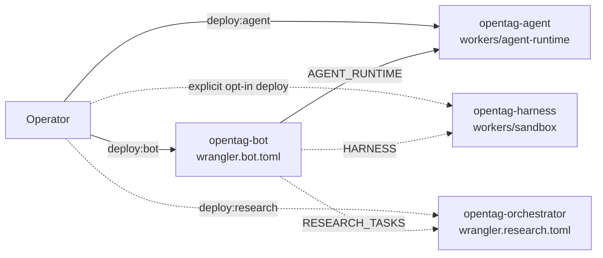
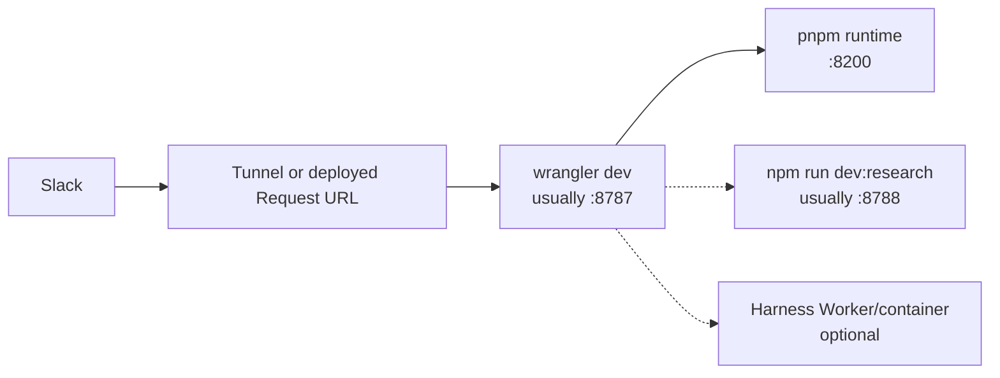

# OpenTag operations guide

Status: **current runbook**
Updated: **2026-07-13**

This guide covers local validation, deployment units, configuration, health
checks, logs, and failure diagnosis. Setup from scratch starts in
[setup.md](../setup.md); system design is in
[ARCHITECTURE.md](../ARCHITECTURE.md).

## Deployment map



The bot and AG-UI agent are the normal production pair. Research is optional.
The Claude Code harness is packaged and tested but remains opt-in; the bot's
service binding is commented in both bot Wrangler configs until an operator
deploys and connects it.

## Local prerequisites

- Node.js 22 for parity with GitHub Actions
- npm for `edge/` and harness packages
- pnpm for the root runtime/research tests
- Wrangler authentication for deploy or remote tailing
- Docker for harness-image build/smoke validation
- Workers Paid for Cloudflare Containers
- TinyGo and `wasm-opt` only when rebuilding the optional WASM dispatcher

## Install and validate

### Bot spine, exact CI sequence

```bash
cd edge
npm ci
npm run typecheck
npm test
npm run test:e2e
```

This is the sequence in `.github/workflows/edge-ci.yml`. It uses only
`edge/package-lock.json`, so dependencies required by files included in
`edge/tsconfig.json` must be declared at the edge package level. The harness
container types therefore pin `@cloudflare/containers` directly in `edge`.

### Harness Worker package

```bash
cd edge/workers/sandbox
npm ci
npm run typecheck
```

The edge test suite already covers the router, egress policy, wire contract,
harness server, tool host, and client. Build the image when Docker is available:

```bash
docker build --platform linux/amd64 \
  -f containers/harness/Dockerfile \
  -t opentag-harness:local .
```

The harness pins an `amd64` Ubuntu package and Cloudflare's deployment image
target is `linux/amd64`. Apple Silicon Docker otherwise selects `arm64` and
fails at `dpkg` before project code runs.

### Root runtime and research

```bash
pnpm install
pnpm run check-types
pnpm test
```

## Local development topology



Start the default conversational path:

```bash
# terminal 1, repository root
pnpm runtime

# terminal 2
cd edge
cp .dev.vars.example .dev.vars
npm run dev
```

Root `pnpm start` and `pnpm dev` intentionally exit with a pointer to the edge
Worker. They are not alternate Slack bots.

For signed local probes:

```bash
cd edge
./scripts/e2e-local.sh
./scripts/e2e-smoke-local.sh
```

## Configuration ownership

| Name | Kind | Owner | Purpose |
| --- | --- | --- | --- |
| `SLACK_BOT_TOKEN` | Secret | Bot | Slack Web API |
| `SLACK_SIGNING_SECRET` | Secret | Bot | Slack HMAC verification |
| `AGENT_URL` | Secret/string | Bot | AG-UI request URL/path |
| `AGENT_RUNTIME` | Service binding | Bot | Same-zone call to `opentag-agent` |
| `AGENT_AUTH_HEADER` | Secret | Bot + agent | Optional AG-UI authentication |
| `ADMIN_SECRET` | Secret | Bot | `/admin/*`, `/debug/*`, `/tasks/start` |
| `INTERNAL_SECRET` | Secret | Bot + research | Internal research authentication |
| `RESEARCH_TASKS` | Service binding | Bot | `opentag-orchestrator` |
| `HARNESS` | Service binding | Bot | Optional `opentag-harness` call |
| `HARNESS_URL` | Var/secret string | Bot | Harness base URL and path fallback |
| `HARNESS_AUTH_TOKEN` | Secret | Bot + harness | `/turn` and `/interrupt` bearer |
| `HARNESS_REPO_URL` | Var | Bot | Default repository for coding turns |
| `HARNESS_ALLOWED_REPO_HOSTS` | Var | Harness | Allowed git hosts, default `github.com` |
| `HARNESS_ALLOWED_REPO_ORGS` | Var | Harness | Required non-empty organization allowlist |
| `ANTHROPIC_API_KEY` or `CLAUDE_CODE_OAUTH_TOKEN` | Secret | Harness Worker | Injected at outbound boundary |
| `GITHUB_TOKEN` | Secret | Harness Worker | Private clone and approved remote writes |
| `OPENTAG_TOOL_BIN` | Var | Harness | Optional tool-host executable |
| `OPENAI_API_KEY` | Secret | Agent | Default AG-UI model |
| `LINEAR_API_KEY` | Secret | Agent | Linear MCP |
| `LINEAR_TEAM_KEY` | Secret/var | Agent | Linear team display name or ID |
| `NOTION_TOKEN`, `NOTION_MCP_AUTH_TOKEN` | Secret | Agent | Optional Notion sidecar |

Same-zone Worker calls should use service bindings. `AGENT_URL` and
`HARNESS_URL` still supply a request URL/path, but public `workers.dev` fetches
between Workers in the same zone can fail with Cloudflare 1042.

## Deploy the AG-UI agent

```bash
cd edge/workers/agent-runtime
npm ci
npx wrangler secret put OPENAI_API_KEY
npx wrangler secret put LINEAR_API_KEY
npx wrangler secret put LINEAR_TEAM_KEY
# optional: AGENT_MODEL, NOTION_TOKEN, NOTION_MCP_AUTH_TOKEN, AGENT_AUTH_HEADER
npm run deploy
```

Keep `TriageContainer.envVars` as a class field. A getter is shadowed by the
Containers base class and silently drops runtime secrets.

## Deploy the bot

```bash
cd edge
npx wrangler secret put SLACK_BOT_TOKEN --config wrangler.bot.toml
npx wrangler secret put SLACK_SIGNING_SECRET --config wrangler.bot.toml
npx wrangler secret put AGENT_URL --config wrangler.bot.toml
npx wrangler secret put ADMIN_SECRET --config wrangler.bot.toml
npx wrangler secret put INTERNAL_SECRET --config wrangler.bot.toml
npm run deploy:bot
```

Slack Request URLs must point to the deployed bot Worker:

- `/slack/events`
- `/slack/commands`
- `/slack/interactions`

After a Slack scope change, reinstall the app and refresh the bot token secret.
The Linear requester-assignee flow requires `users:read.email` on the installed
token, not only in the manifest.

## Deploy and connect the harness

This is an explicit operator action. Complete all steps before uncommenting the
bot binding.

1. Set a non-empty organization allowlist in
   `edge/workers/sandbox/wrangler.toml` or its deployment environment.
2. Configure harness Worker secrets:

```bash
cd edge/workers/sandbox
npx wrangler secret put HARNESS_AUTH_TOKEN
npx wrangler secret put ANTHROPIC_API_KEY
npx wrangler secret put GITHUB_TOKEN
npm run deploy
```

`CLAUDE_CODE_OAUTH_TOKEN` can replace `ANTHROPIC_API_KEY` where appropriate.

1. Add the `HARNESS` service binding to `edge/wrangler.bot.toml`:

```toml
[[services]]
binding = "HARNESS"
service = "opentag-harness"
```

1. Set matching bot configuration:

```bash
cd ../..
npx wrangler secret put HARNESS_AUTH_TOKEN --config wrangler.bot.toml
# configure HARNESS_REPO_URL as a non-secret var or deployment-specific value
npm run deploy:bot
```

1. Verify `/health`, a read-only harness turn, Stop during a live turn, a local
   commit-only coding turn, then a separately approved push/PR turn.

Do not place real Anthropic or GitHub tokens in the container image or bot turn
body. The container receives sentinels; outbound handlers replace them.

## Deploy research

```bash
cd edge
npm run deploy:research
```

This command rebuilds the optional WASM dispatcher first. The research Worker
must share `INTERNAL_SECRET` with the bot and have delivery/model secrets needed
by its configured adapters.

The research Worker is not a Slack Request URL. Its `/slack/*` routes return
`410 slack_demoted` intentionally.

## Health checks

| Surface | Request | Expected |
| --- | --- | --- |
| Bot | `GET /health` | `ok`, product, StateStore, bot engine |
| Agent | Agent Worker health route | Worker/Container reachable |
| Harness Worker | `GET /health` | `{ok:true, worker:"opentag-harness"}` |
| Harness container | Internal `GET /health` | Claude Code version |
| Research | `GET /health` | `role:"research-task"`, `slack:"demoted"` |

The bot's `/debug/store` is admin-authenticated and exercises KV, list, lock,
and dedup. Do not expose admin secrets in shell history or logs.

## Structured lifecycle metrics

The current system emits JSON log lines rather than a Prometheus exporter.
Useful metric names include:

| Metric | Meaning |
| --- | --- |
| `turn_started` | Exact turn admitted and entering execution |
| `turn_completed` | Runtime completed normally |
| `turn_failed` | Lifecycle raised before confirmed completion |
| `turn_duplicate` | Stable execution already handled |
| `turn_duplicate_pre_admission` | Slack redelivery rejected before enrichment |
| `turn_concurrent_rejected` | Another execution owns the thread/session |
| `busy-note:<threadKey>` | Durable dedup namespace for bounded concurrent-turn feedback |
| `turn_interrupted` | Exact turn was stopped |
| `turn_interrupted_pre_execution` | Stop won before runtime work |
| `fallback_sent` | Alarm recovery made an answer visible |
| `error_visible` | Explicit error/retry surface reached Slack |
| `obligation_deferred` | Recovery found live or ambiguous execution |
| `obligation_silent_clear` | Terminal/interrupt state required no new post |
| `obligation_stale_execution` | Session `executing` marker outlived its exact active-turn row; crash recovery proceeds |
| `stop_command_received` | Stop parser accepted the Slack message |
| `harness_fallback` | Non-coding harness failure fell back to AG-UI |

Filter by `threadKey` and `executionId` to reconstruct a turn. The same exact
execution ID should appear across pre-admission, SessionEventDO, harness, Stop,
and final render logs.

For a concurrent rejection, confirm the request is genuinely distinct. Stable
redeliveries intentionally stay silent; a distinct ask should produce no more
than one busy note per thread per minute.

## Failure diagnosis

### Slack event acknowledged but no answer

1. Find `turn_started`, `turn_failed`, or `turn_interrupted` for the execution.
2. Check `SESSION_EVENTS` state: live execution, terminal done, or interrupt
   tombstone.
3. Check whether a render obligation remains and when its alarm is due.
4. Look for `obligation_deferred`, `fallback_sent`, or `error_visible`.
5. `obligation_stale_execution` means the runtime owner stopped refreshing its
   active-turn row; the alarm intentionally treats the session marker as a
   crash orphan instead of deferring forever.
6. Verify the final Slack render was confirmed, not merely attempted.

Do not delete the obligation as a first response. It is the recovery mechanism.

If a live AG-UI render was visible but replay has no output, look for
`session output mirror failed`. Mirroring is best-effort; the obligation must
still produce an explicit retry/error surface rather than remain silent.

### Stop says nothing or appears stuck

1. Confirm the message qualifies: threaded or DM stop, or a top-level channel
   stop that mentions the bot.
2. Confirm execution and Stop derived the same thread key.
3. Inspect the active-turn status: `cancelled`, `cancel_controlled`,
   `cancel_ack_in_flight`, or `cancel_confirmed`.
4. If a research effect exists, verify cancellation returned both `cancelled`
   and `quiescent`.
5. If a harness effect exists, inspect `/interrupt` and process-group cleanup.
6. Leave the row for the alarm continuation if the Slack acknowledgement was
   ambiguous.

### HITL button appears dead

- Use a card created by current code; older cards may not contain `choiceId`.
- Confirm `/slack/interactions` reaches `opentag-bot`.
- Inspect the HTTP status. A `503` means durable persistence failed and Slack
  should retry; a false `200` would be a bug.
- Verify `hitl-id:<choiceId>` and cancellation tombstones in `BOT_STATE`.

### Agent returns Cloudflare 1042

The bot is fetching a same-zone Worker publicly. Configure `AGENT_RUNTIME` (or
`HARNESS`) service binding and retain the URL only for the request path.

### Linear assignee email is missing

- Reinstall the Slack app after adding `users:read.email`.
- Refresh `SLACK_BOT_TOKEN` locally and in Cloudflare.
- Verify the installed token's `x-oauth-scopes` header.
- Keep Slack Web API bodies form-urlencoded; JSON `users.info` can omit/fail the
  profile lookup.

### Harness rejects repository

- Use canonical `https://host/org/repo` or `.git` URL with no credentials,
  port, query, or fragment.
- Confirm the host and lowercase org are allowlisted.
- Confirm `codingTask` includes a repository.
- Confirm IDs match the `ot1e_` / `ot1m_` wire formats.

### Harness cannot push or create a PR

- Confirm the Slack remote-git approval completed durably for the exact turn.
- Confirm `GITHUB_TOKEN` is a harness Worker secret.
- Push only `opentag/session-<session-prefix>`.
- Use repository-scoped REST for PR creation, not GraphQL.
- Include the exact standalone requester attribution line.
- A successful Claude exit is insufficient; inspect the postcondition error.

### Harness turn ends without `done`

The outer client writes explicit `error` and failed `done` events so the event
log does not remain live forever. Investigate container transport, process exit,
timeout, or event-mapping errors using the preserved failure kind.

### CI passes locally but clean CI fails

Reproduce from `edge/` using `npm ci` under Node 22. Do not rely on a nested
`workers/sandbox/node_modules`; edge TypeScript includes `workers/**/*.ts` and
must declare their compile-time packages in `edge/package.json`.

## Rollback and safety

- Bot, agent, harness, and research deploy independently.
- Disconnecting the `HARNESS` binding returns the bot to AG-UI-only operation;
  sticky harness preferences remain recorded but cannot activate the coding
  runtime.
- Do not delete DO migrations from a deployed config.
- Do not force-push a recovery commit over concurrent Bugbot or automation
  changes.
- Do not deploy from an unclean tree without reviewing the exact package and
  config being shipped.
- Keep remote git, Slack messages to real channels, and Cloudflare deploys
  behind explicit user/operator approval.

## Post-deploy smoke checklist

- [ ] Bot `/health` returns expected bindings/product metadata.
- [ ] Mention receives a streaming answer and status clears.
- [ ] Thread follow-up works without a new mention.
- [ ] `/agent` uses the same lifecycle and never double-posts its ack.
- [ ] `--model`/`--claude` flags are stripped and saved correctly.
- [ ] `stop` during AG-UI suppresses later output.
- [ ] Create/Cancel HITL works across isolates.
- [ ] Linear create defaults to requester profile email.
- [ ] Quick Retry creates a synthetic turn as the clicking user.
- [ ] Research start delivers to the same thread; Stop cancels it quiescently.
- [ ] Harness read-only turn reaches only allowlisted hosts.
- [ ] Harness Stop revokes git approval and terminates descendants.
- [ ] Approved coding turn creates a new commit and attributed PR.
- [ ] Unapproved coding turn cannot push or create a PR.
- [ ] Alarm recovery produces one visible terminal outcome, never two.
