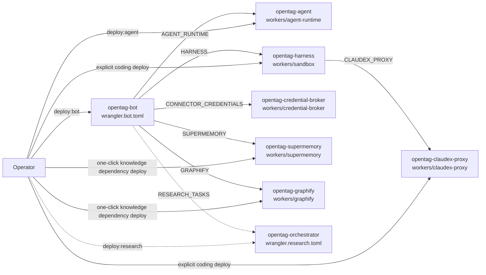
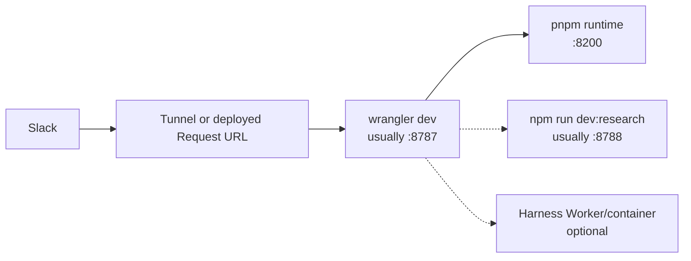

# OpenTag operations guide

Status: **current runbook**
Updated: **2026-08-05 14:52 PDT**

This guide covers local validation, deployment units, configuration, health
checks, logs, and failure diagnosis. Setup from scratch starts in
[setup.md](./setup.md); system design is in
[ARCHITECTURE.md](./ARCHITECTURE.md).
Local Graphify stdio usage is documented in
[graphify-local-mcp.md](./graphify-local-mcp.md).

The dated production evidence for the current release is in
[current-state.md](./current-state.md). This runbook separates deployed
configuration from provider readiness: a binding or health flag is not proof
that an authenticated external broker, relay, OAuth callback, billing worker,
or deletion effect has completed.

## 2026-08-05 recovery and rollout checkpoint

Docker Desktop has been repaired and is available for local image builds. The
Supermemory R2 pair is provisioned as Worker Secrets and the deployed
Supermemory singleton passes the tigrisfs/FUSE staging mount, read/write probe,
and provider search readiness. `GET /ready?profile=knowledge` returns HTTP 200
with no blockers and the active-instance rollout check passes.

The strict `healthy` instance count is not equivalent to the running/queryable
state in this checkpoint: Cloudflare reports `healthy=0` for the Supermemory
and Graphify singleton applications while their instances are `running` and
the bot's authenticated dependency probes return true. Track both signals;
do not suppress the discrepancy by weakening a release gate without recording
why the control-plane aggregate is not authoritative for these services.

The current harness image was rebuilt and rolled out with seven healthy
instances. A direct deployment from the intentionally dirty checkout proves
runtime health but does not prove clean source provenance. The deployed agent
also passed a direct DeepSeek AG-UI canary. The provenance gate requires a
clean source snapshot or an explicitly recorded dirty-source attestation
before production claims are made.

The bot is currently deployed at version
`617b73ca-2114-4723-a819-2086100fa10e`. Operator Slack searches now record a
body-free query-convergence receipt when a returned citation matches an
indexed ledger row and its document/generation fence. The current tenant
readback is 55 indexed rows with zero searchable queryability receipts; the
R2-backed search path is reachable but has no compliant recent canary hits.
Replaying or rebuilding authoritative Slack descriptors is required before
claiming provider parity.

The Slack app has not been reinstalled. The actual OpenTag bot canary is
visible in `#general` but produced no reply, and the current Worker tail
showed no `/slack/events` invocation. If a Slack canary returns
`SANDBOX_BACKEND=local requires a running Docker daemon`, treat that as stale
Slack app routing to the legacy QM/local path, not as evidence about the
Cloudflare harness. The operator must unlock the Mac, update/reinstall the
manifest, and read back the installed request URL, scopes, and event
subscriptions before retrying live Slack tests.

Buzz wake tests must use an event from a server-bound pilot channel. A valid
event from an unbound channel should return HTTP 400
`buzz_wake_unbound_channel`; that is a tenant-isolation proof, not a successful
admission. A successful pilot receipt must include canonical fetch, signature
verification, server-resolved tenant, authoritative dedupe, runtime admission,
and reply publication.

## Live Slack readback — 2026-08-02 22:08 PDT

The source manifest regression passes 2 tests and asserts the required Slack
history/read, reaction, profile, team, and channel-join scopes. Authenticated
membership readback confirms the bot in `#general`, `#new-channel`, `#social`,
and `#skills`. A human explicit canary returned
`OPENTAG_MILESTONE_EXPLICIT_OK`; a bot-message event canary returned
`OPENTAG_MESSAGE_EVENT_TAIL_OK` with an `indexed` queue outcome; and a
reaction lifecycle canary showed the working `eyes` reaction, returned
`OPENTAG_REACTION_LIFECYCLE_OK`, and had no reaction after terminal cleanup.

These are live Slack surface receipts, not complete-history or derived-index
queryability receipts. The strict rollout check still reports zero healthy
query instances for Supermemory and Graphify. The deployed harness image is
`sha256:2d9a0a10d718265b7ea331ba2de3b8fd309cb33cbdf6175d92036fc681004880`,
while the local source manifest is dirty at
`sha256:8b003407364eb9c96499e71294f7d421b5028f365d92bcea63fe6d7f1aaf6baa`;
Docker/FUSE and clean source-to-image verification remain open.

## Final local and strict live gate rerun — 2026-08-02 22:14 PDT

The final local edge unit suite passes 145 files / 1,379 tests; bot Worker
e2e passes 8 files / 69 tests; typecheck and `git diff --check` pass.
Graphify Worker e2e passes 5 tests, Graphify policy passes 10 tests,
deploy-config validation passes, the Slack manifest test passes 2 tests, shell
syntax passes, and downloaded Supermemory/tigrisfs artifact verification
passes.

The strict read-only rollout check passes all static, R2, deployment,
secret-name, pin, and artifact assertions. It fails exactly two live health
gates: Supermemory and Graphify each report
`instance_state=running; active=1; healthy=0; failed=0`. No deployment,
restart, Queue mutation, credential change, or provider action was attempted.

## Audit reconciliation — 2026-08-02 21:16 PDT

The current read-only state is knowledge-ready (`/ready?profile=knowledge`
HTTP 200) but not full-ready (HTTP 503: credential-broker reachability,
platform-effecter reachability, and OAuth). The tenant ledger is 84 rows: 55
indexed, 2 pending, and 27 permanent failures; tenant outbox and DLQ are
empty. Queue `indexed` means that the provider document poll reached `done`;
it does not prove a searchable citation. The exact fresh marker still returns
zero authenticated citations, and the local adapter regression now covers
`add -> documents.get(done) -> search` as two separate receipts.

Supermemory version 18 and Graphify query version 6 each report one active
instance but zero assigned/healthy query instances, so the strict rollout
check remains blocked. Buzz source tests pass, but live signed admission is
blocked at relay HTTP 526. No provider effect adapter or default custody
Secrets Store mapping is configured; the Linear fixture is not on the
broker/effect-ledger path. Harness version 4 has seven healthy instances, but
the dirty local source manifest does not map to its deployed image; Docker is
unavailable. No additional deployment or external mutation was performed in
this checkpoint.

## Local source reconciliation — 2026-08-02 21:56 PDT

The current Supermemory source uses the approved pinned tigrisfs Container
mount. `R2_ACCOUNT_ID` and `R2_BUCKET_NAME` are non-secret Worker variables;
`R2_ACCESS_KEY_ID` and `R2_SECRET_ACCESS_KEY` are Worker Secrets mapped only
into Container `envVars` as `AWS_ACCESS_KEY_ID` and
`AWS_SECRET_ACCESS_KEY`. The Supermemory child process receives none of the
storage or facade credentials. The entrypoint writes the R2-ready sentinel
only after mount and unprivileged read/write checks; the Worker does not call
the Sandbox SDK bucket mount methods.

The ledger now exposes a body-free queryability receipt separate from
provider-poll `indexed` completion. Fresh local validation passes 145 edge unit
files / 1,376 tests, 8 bot Worker e2e files / 69 tests, Graphify e2e (5
tests), Graphify policy (10 tests), focused Supermemory/checker tests,
typecheck, deploy-config validation, source-pinned rollout preflight, shell
syntax, diff checks, and live artifact download/checksum/member verification.
Docker/FUSE, deployment, provider search convergence, Buzz admission, provider
effects, and harness source-to-image provenance remain open.

## Final read-only gate sweep — 2026-08-02 20:59 PDT (historical snapshot)

Bot health is HTTP 200 and the harness Container info endpoint reports version
4 with seven healthy instances. The deployed harness image is
`sha256:2d9a0a10d718265b7ea331ba2de3b8fd309cb33cbdf6175d92036fc681004880`,
but the dirty local source manifest differs, so provenance is not closed.
The empty Buzz probe returns HTTP 400 `buzz_wake_unexpected_fields`; this is
schema reachability only. The latest tenant status is 83 rows (55 indexed, 2
pending, 26 permanent failures), with empty outbox and tenant-local DLQ.
The exact fresh unmentioned marker still has zero authenticated citations
despite a queue `indexed` outcome. Strict rollout still fails both query
Container health aggregates. No deployment or external mutation occurred.

The affected local Slack/knowledge source slice passes 8 files and 95 tests;
typecheck and staged/unstaged diff checks pass. This does not change the
deployment gate for the local routing, inclusion-fence, or readiness repairs.
The follow-up queue/normalization/Web API rerun passed 3 files and 70 tests,
including the bot-message Events API indexing contract.
The full edge unit suite then passed 145 files / 1,372 tests and the bot Worker
e2e suite passed 8 files / 67 tests; typecheck and diff checks also passed.
The focused failure/recovery slice passes 9 files / 140 tests; live recovery
and restart gates remain separate.
Deploy-config validation, Graphify e2e (5 tests), Graphify policy (10 tests),
and static rollout checks also pass; live query-container health remains open.
The 21:13 PDT strict read-only rerun passed every static/resource/deployment
check and failed only the two query-container health aggregates.

## Fresh operator readback — 2026-08-02 20:41 PDT

The latest knowledge readiness probe is HTTP 200, but full readiness is not:
credential broker, platform effecter, and OAuth checks remain blocked. Tenant
status is 80 rows (53 indexed, 2 pending, 25 permanent), with an empty
outbox and tenant-local DLQ summary zero. The separate operator DLQ endpoint
has 100 pending records. Treat those as different durable scopes and do not
replay or dispose operator records without an explicit action.

The deployed Slack control wrote marker 1785725283.368069, left the
unmentioned retrieval request 1785725304.390959 silent, and returned
OPENTAG_SUPERMEMORY_SEARCH_OK for explicit retrieval 1785725373.889899 at
1785725391.260059. The installed bot token returns missing_scope for
reactions.get, users.profile.get, and apps.manifest.export. Four visible
public channels are confirmed; private, MPIM, workspace-wide, and
complete-history coverage are not.

The strict knowledge rollout check still fails only the aggregate health
checks for Supermemory and Graphify: active=1, assigned=0, healthy=0,
failed=0. The local successful-2xx readiness correction is not deployed.
The current local harness source is dirty and cannot be matched to the
deployed image digest until a clean build is available. Buzz remains blocked
at the Worker-to-relay HTTP 526 boundary.

## Local indexing inclusion fence — 2026-08-02 20:16 PDT

For every non-delete Slack observation, the queue job now includes the exact
message timestamp that must be present in the fetched canonical thread. The
worker records `observed_message_missing` as retryable and does not write the
thread to KnowledgeDO's derived-body record or Supermemory until that exact
message is present. This protects bot posts, edits, reactions, and human
messages from a transient stale `conversations.replies` response. It is a
local source contract only until the bot is redeployed and the live canary
proves the receipt path.

Validated locally with 144 unit test files / 1,370 tests, 67 bot Worker tests,
5 Graphify Worker tests, typecheck, artifact verification, and read-only live
rollout checks. Docker/FUSE restart evidence remains unavailable.

The local Supermemory port gate has a bootstrap-only exception for the
Cloudflare supervisor: `GET /health` returns `200` before the Worker-owned R2
mount so the lifecycle hook can run, while non-health traffic returns `503`.
Once R2 is mounted, health remains `503` until the provider-ready sentinel is
written after `/v3/openapi` returns a successful `2xx`; a reachable `4xx`/`5xx`
application remains degraded. Only then is the application proxied. This
repair is tested locally and is not deployed.

## Prior operator checkpoint — 2026-08-02 19:45 PDT

The upgraded Supermemory Worker/Container path is live at version 18 with the
Worker-owned `STATE_BUCKET` mount and disposable local model-cache overlay.
Authenticated knowledge readiness is HTTP 200 and provider tail readback shows
document write/poll plus `/v4/search` HTTP 200. This is service reachability,
not complete ledger convergence.

The latest tenant status readback is 77 ledger rows: 32 `indexed`, 19
`leased`, 2 `pending`, and 24 `permanent_failure`; outbox and DLQ counts are
zero. Thirty old `local_add` failures were reopened with correction reference
`supermemory-v18-r2-model-cache-repair-da95429a`, and the recovery endpoint
reported 30 reopened, 0 blocked, and 0 failed. The latest reconciliation
scanned 77 rows, enqueued 19, and skipped 58. Do not declare the knowledge
rollout complete while the leased rows remain unresolved.

Bot version `764a18ea-bda9-4209-bdbc-0b9cc81a6cba` records Buzz receive
failure phase `relay_http` with status 526 for the known wake. Re-provisioning
the canonical relay origin did not change the response. Local direct relay
checks reach the endpoint and return 401/403 authorization responses, so no
valid Buzz admission receipt exists yet.

The same deployment contains the ambiguous-add recovery repair and expired
poll-window renewal. Live Queue tail evidence shows three rows reaching
`indexed` and `recorded_success` after the repair; earlier tail evidence shows
four additional recorded successes. Read the tenant status endpoint after the
drain before claiming all reopened rows converged.

The current local harness provenance is dirty
(`sha256:8b003407364eb9c96499e71294f7d421b5028f365d92bcea63fe6d7f1aaf6baa`),
and Docker is unavailable. The deployed image/source mapping remains an open
release gate. Do not pause/resume the knowledge Queue as part of this
checkpoint; that requires a separate explicit operator decision.

Authenticated `/ready?profile=knowledge` is HTTP 200 with all knowledge and
code-graph checks true. The upgraded Supermemory Container is running version
18, and provider tail readback shows successful document write/poll responses
and `/v4/search` HTTP 200 after the local model-cache overlay. This closes the
immediate provider reachability incident, not the migration or durability
gates: restart/remount persistence, update/delete/tombstone behavior, parity,
latency, and recovery of old ledger failures remain open.

The telemetry-enabled live bot deployment is
`764a18ea-bda9-4209-bdbc-0b9cc81a6cba`. Its reconciliation schedule is every
five minutes and `KNOWLEDGE_SLACK_ACL_MAX_AGE_MS` is 600000, so the scheduled
ACL refresh cadence now has headroom over the authorization freshness bound.
The live [cadence canary](https://berendo.slack.com/archives/C0BA1MKPRE3/p1785719827818089)
returned `OPENTAG_KNOWLEDGE_CADENCE_OK`.

The live retrieval canary exposed one deployment gap: the deployed bot did not
answer the unmentioned action request at
[`1785725304.390959`](https://berendo.slack.com/archives/C0BA1MKPRE3/p1785725304390959),
while the explicit-mention control at
[`1785725373.889899`](https://berendo.slack.com/archives/C0BA1MKPRE3/p1785725373889899)
returned `OPENTAG_SUPERMEMORY_SEARCH_OK`. The current local source contains
retrieval rule `t1.12` and its route/pre-admission tests pass; deploy and rerun
this canary only after the explicit production-deployment gate is approved.

The latest read-only validation pass completed 1,368 unit tests, 67 bot Worker
tests, 5 Graphify Worker tests, typecheck, Graphify policy tests, deploy-config
validation, Supermemory artifact verification, static/live knowledge preflight,
Graphify pin verification, shell syntax, and both staged and unstaged diff
checks. Docker is unavailable, so image rebuild, FUSE remount, and restart
persistence remain unverified.

The fresh human Supermemory canary wrote a unique marker and retrieved it with
an explicit bot mention, returning `Searching Slack` and
`OPENTAG_SUPERMEMORY_SEARCH_OK`; no reaction remained on the parent. An
untagged equivalent was silent on the deployed version. The local routing fix
recognizes search/lookup/query action language, but deployment remains gated.

Use `npm run check:knowledge-rollout -- --live --require-healthy-instances` for
the strict Container gate. It currently fails for both query Containers because
their Cloudflare state is `running`, not `healthy`; the local `/health`
port-gate repair is tested but not deployed.

The current tenant status is 77 ledger rows (32 indexed, 19 leased, 2 pending,
24 permanent failures), with no pending outbox/DLQ work and no completed
history inventory or backfill. Thirty old local-add rows were reopened with an
operator correction reference; keep the leased rows open until each has a
provider receipt or a durable expiry/retry outcome.

The installed Slack token still lacks the source-declared `reactions:read`
and `users.profile:read` scopes. The bot is confirmed in four visible public
channels, but `all_delivered` remains an installed-bot delivery policy rather
than a workspace export. Reinstall/read back the Slack app before claiming
reaction/profile/lifecycle coverage. The known Buzz wake reaches the relay
HTTP phase and receives HTTP 526; valid signed admission is still required.

## Deployment map


```mermaid
flowchart LR
    Operator["Operator"]
    Bot["opentag-bot<br/>wrangler.bot.toml"]
    Agent["opentag-agent<br/>workers/agent-runtime"]
    Harness["opentag-harness<br/>workers/sandbox"]
    Claudex["opentag-claudex-proxy<br/>workers/claudex-proxy"]
    Broker["opentag-credential-broker<br/>workers/credential-broker"]
    Supermemory["opentag-supermemory<br/>workers/supermemory"]
    Graphify["opentag-graphify<br/>workers/graphify"]
    Research["opentag-orchestrator<br/>wrangler.research.toml"]

    Operator -->|"deploy:bot"| Bot
    Operator -->|"deploy:agent"| Agent
    Operator -->|"explicit coding deploy"| Claudex
    Operator -->|"explicit coding deploy"| Harness
    Operator -->|"one-click knowledge dependency deploy"| Supermemory
    Operator -->|"one-click knowledge dependency deploy"| Graphify
    Operator -.->|"deploy:research"| Research

    Bot -->|"AGENT_RUNTIME"| Agent
    Bot -->|"HARNESS"| Harness
    Bot -->|"CONNECTOR_CREDENTIALS"| Broker
    Bot -->|"SUPERMEMORY"| Supermemory
    Bot -->|"GRAPHIFY"| Graphify
    Harness -->|"CLAUDEX_PROXY"| Claudex
    Bot -.->|"RESEARCH_TASKS"| Research
```

The bot, AG-UI agent, coding harness, Supermemory facade, and Graphify facade
are deployed in the current production configuration. Research remains
optional. The coding plane runs Claude Code
(native Anthropic and Claudex/CLIProxyAPI) plus the native Nanocodex CLI in the
same sandbox. Active service bindings require target-before-caller deploy order:
Claudex proxy, harness, bot. The Supermemory and Graphify services are
deployed privately, but Supermemory is assigned and unhealthy because its
embedding model cache performs an EIO rename on the R2/FUSE mount; Graphify is
unassigned and unhealthy. Provider storage/parity receipts and a successful
derived-index read/write are still required before treating them as ready.
Nanocodex needs
harness Worker secret `OPENAI_API_KEY` (no Claudex proxy dependency).

## Local prerequisites

- Node.js 22 for parity with GitHub Actions
- npm for `edge/` and harness packages
- pnpm for the root runtime/research tests
- Wrangler authentication for deploy or remote tailing
- Docker for harness-image build/smoke validation
- Workers Paid for Cloudflare Containers
- TinyGo and `wasm-opt` only when rebuilding the optional WASM dispatcher

## Install and validate

### Bot spine, exact CI sequence

```bash
cd edge
npm ci
npm run typecheck
npm test
npm run test:e2e
npm run test:e2e:graphify
npm run test:graphify-policy
npm run check:knowledge-rollout
```

This is the sequence in `.github/workflows/edge-ci.yml`. It uses only
`edge/package-lock.json`, so dependencies required by files included in
`edge/tsconfig.json` must be declared at the edge package level. The harness
container types therefore pin `@cloudflare/containers` directly in `edge`.

### Harness Worker package

```bash
cd edge/workers/sandbox
npm ci
npm run typecheck
```

The edge test suite already covers the router, egress policy, wire contract,
harness server, tool host, and client. Build the image when Docker is available:

```bash
docker build --platform linux/amd64 \
  -f containers/harness/Dockerfile \
  -t opentag-harness:local .
```

Before a release, inspect the deterministic source manifest:

```bash
node scripts/harness-provenance.mjs
```

The one-click deploy script computes the same manifest and writes an ephemeral
Wrangler config with `image_vars` for the harness build. The image embeds the
source revision, source tree, content digest, and working-tree state in OCI
labels and runtime variables. The Worker `GET /health` response includes its
Cloudflare version metadata; an authenticated `GET /health/container` returns
the container's embedded provenance. A clean working tree is required for a
release-quality mapping; a dirty manifest is explicit evidence, not a release
attestation.

The harness pins an `amd64` Ubuntu package and Cloudflare's deployment image
target is `linux/amd64`. Apple Silicon Docker otherwise selects `arm64` and
fails at `dpkg` before project code runs.

### Claudex proxy package

```bash
cd edge/workers/claudex-proxy
npm ci
npm run typecheck
```

Its Container image is also `linux/amd64`. The Worker is private
(`workers_dev = false`) and is reached from the harness only through the
`CLAUDEX_PROXY` service binding.

### Cloudflare knowledge services

The knowledge services are separate deploy units and remain disabled until
their named staging gates pass:

```bash
cd edge/workers/supermemory
npm ci
npm run typecheck
cd ../graphify
npm ci
npm run typecheck
npm run test:policy
cd ../..
npx wrangler deploy --config workers/supermemory/wrangler.toml --dry-run --containers-rollout=none
npx wrangler deploy --config workers/graphify/wrangler.toml --dry-run --containers-rollout=none
```

The dry-runs validate bindings and Container declarations without building or
deploying images. Real deployment requires explicit approval, dedicated R2
bucket creation, scoped tokens, and the FUSE/R2, parity, CAS, and ACL gates in
the knowledge-base specification.

The standalone knowledge-service deploy scripts are fail-closed on placeholder
R2 account IDs and invalid Graphify catalogs. A non-dry service deployment also
requires `OPENTAG_KNOWLEDGE_DEPLOY_APPROVED=true` after the staging approval;
the flag is not needed for dry-runs.

#### Provider startup diagnosis

Use the authenticated bot readiness route and Cloudflare Container state
together:

```bash
set -a; source edge/.dev.vars; set +a
curl -H "Authorization: Bearer $ADMIN_SECRET" \
  'https://opentag-bot.williamlopezc.workers.dev/ready?profile=knowledge'
npx wrangler containers info <application-id> --json
npx wrangler containers instances <application-id> --json
```

Treat `active/running` without `healthy` and `assigned` capacity as a
provisioning/port-readiness failure. Do not infer that the application is
ready from the Worker upload, image digest, R2 object, or a configured secret.
For the current Supermemory trace, the request enters the Sandbox SDK
`containerFetch` path and is canceled before `onStart`, the R2 mount, the
port-gate release, or the application health probe. The next valid receipt is
an assigned healthy instance followed by an authenticated provider `/health`,
R2 persistence/remount, and a fresh add/poll/search/delete test. Keep the
readiness gate fail-closed while that receipt is absent.

### Root runtime and research

```bash
pnpm install
pnpm run check-types
pnpm test
```

## Local development topology


```mermaid
flowchart LR
    Slack["Slack"] --> Tunnel["Tunnel or deployed Request URL"]
    Tunnel --> Bot["wrangler dev<br/>usually :8787"]
    Bot --> Agent["pnpm runtime<br/>:8200"]
    Bot -.-> Research["npm run dev:research<br/>usually :8788"]
    Bot -.-> Harness["Harness Worker/container<br/>optional"]
```

Start the default conversational path:

```bash
# terminal 1, repository root
pnpm runtime

# terminal 2
cd edge
cp .dev.vars.example .dev.vars
npm run dev
```

Root `pnpm start` and `pnpm dev` intentionally exit with a pointer to the edge
Worker. They are not alternate Slack bots.

For signed local probes:

```bash
cd edge
./scripts/e2e-local.sh
./scripts/e2e-smoke-local.sh
```

## Configuration ownership

| Name | Kind | Owner | Purpose |
| --- | --- | --- | --- |
| `SLACK_BOT_TOKEN` | Secret | Bot | Slack Web API |
| `SLACK_SIGNING_SECRET` | Secret | Bot | Slack HMAC verification |
| `SLACK_BOT_USER_ID` | Var | Bot | Exact installed bot user ID required by trusted rich-payload mentions |
| `SLACK_TRUSTED_TRIGGER_ACTORS` | Var | Bot | Exact `bot:B...` / `app:A...` allowlist; unset disables the feature |
| `AGENT_URL` | Secret/string | Bot | AG-UI request URL/path |
| `AGENT_RUNTIME` | Service binding | Bot | Same-zone call to `opentag-agent` |
| `AGENT_AUTH_HEADER` | Secret | Bot + agent | Optional AG-UI authentication |
| `SUPERMEMORY` | Service binding | Bot | Private `opentag-supermemory` facade |
| `SUPERMEMORY_SERVICE_AUTH_TOKEN` | Secret | Bot + Supermemory facade | Bot-to-facade authentication; not a Supermemory server key |
| `SUPERMEMORY_CONSUMER_MODE` | Var | Bot | Optional defense-in-depth handler fence; `paused` retries batches and can exhaust the configured retry/DLQ budget, so prolonged freezes must use Queue delivery pause |
| `SUPERMEMORY_INDEX_GENERATION` | Var | Bot | Immutable server-owned identity of the isolated Supermemory state store; required when the service binding is active |
| `SUPERMEMORY_MIGRATION_MODE` | Explicit migration var | Bot | Enables the retained legacy URL/key fallback only during read-only parity burn-in |
| `SUPERMEMORY_URL`, `SUPERMEMORY_API_KEY` | Legacy migration-only | Bot | Railway/read-only compatibility path; ignored unless migration mode is exactly `true` |
| `STATE_BUCKET` | R2 binding | Supermemory facade | Dedicated `opentag-supermemory-state` binding used for the `api-key` bootstrap; the singleton Container mounts the same bucket through tigrisfs |
| `R2_ACCOUNT_ID`, `R2_BUCKET_NAME` | Var | Supermemory Worker/Container | Non-secret R2 endpoint and bucket identifiers passed only to the Container mount command |
| `R2_ACCESS_KEY_ID`, `R2_SECRET_ACCESS_KEY` | Secrets | Supermemory Worker/Container | R2 S3 credentials mapped to AWS-compatible Container envVars; never sent to the bot or Supermemory child |
| `OPENAI_API_KEY` | Secret | Supermemory Container | Existing extraction/model boundary; not exposed to the bot |
| `OPENAI_BASE_URL` and documented provider/embedding vars | Var/Secret | Supermemory Container | Optional self-hosted provider, embedding, performance, and telemetry configuration; forwarded only to the Container |
| `GRAPHIFY` | Service binding | Bot | Private `opentag-graphify` facade |
| `GRAPHIFY_SERVICE_AUTH_TOKEN` | Secret | Bot + Graphify facade | Bot-to-facade authentication |
| `ARTIFACTS` | R2 binding | Graphify facade + query Container | Dedicated read-only `opentag-code-graphs` binding mounted by the Worker |
| `GRAPHIFY_ALLOWED_REPO_ORGS` | Var | Graphify facade + builder | Server-owned tracked GitHub organization allowlist |
| `GRAPHIFY_REPOSITORY_CATALOG` | Var | Graphify facade | Server-owned JSON map of tracked `repoId` to GitHub source/ref; registration never accepts caller URLs or filesystem paths |
| `GRAPHIFY_ADMIN_TOKEN` | Secret | Graphify facade | Scheduled/manual registry and rebuild administration |
| `GRAPHIFY_CONTAINER_AUTH_TOKEN` | Secret | Graphify facade + Containers | Worker-to-Container authentication |
| `GRAPHIFY_COMMIT` | Var | Graphify facade | Exact Graphify source pin |
| `GITHUB_TOKEN` | Secret | Graphify builder | Private tracked-repository clone only |
| `ADMIN_SECRET` | Secret | Bot | `/admin/*`, `/debug/*`, `/tasks/start` |
| `SESSION_VIEWER_BASE_URL` | Var | Bot | Public bot origin for signed, expiring session links |
| `QUICK_BASE_DOMAIN` | Var | Bot | Artifact host suffix eligible for final action cards |
| `DEFERRED_INGRESS` | Durable Object binding | Bot | Stable quick-click and delayed-file jobs, owned before Slack acknowledgement |
| `BOT_SELF` | Service binding | Bot | Authenticated alarm replay into `opentag-bot` |
| `SLACK_RATE_LIMIT` | Durable Object binding | Bot | Cross-isolate per-channel Slack dispatch reservations |
| `BLOBS` | R2 binding | Bot + harness + research | Durable staged attachments and research blobs; bot/harness must name the same bucket |
| `DELIVERY_METRICS` | Analytics Engine binding | Bot | Confirmed `streamed`, `answer_visible`, and `failed_size_limit` outcomes |
| `INTERNAL_SECRET` | Secret | Bot + research | Internal research authentication |
| `RESEARCH_TASKS` | Service binding | Bot | `opentag-orchestrator` |
| `HARNESS` | Service binding | Bot | Production `opentag-harness` call |
| `HARNESS_URL` | Var/secret string | Bot | Harness base URL and path fallback |
| `HARNESS_AUTH_TOKEN` | Secret | Bot + harness | `/turn` and `/interrupt` bearer |
| `HARNESS_REPO_URL` | Var | Bot | Default repository for coding turns |
| `HARNESS_ALLOWED_REPO_HOSTS` | Var | Harness | Allowed git hosts, default `github.com` |
| `HARNESS_ALLOWED_REPO_ORGS` | Var | Harness | Required non-empty organization allowlist |
| `ANTHROPIC_API_KEY` or `CLAUDE_CODE_OAUTH_TOKEN` | Secret | Harness Worker | Native Claude Code credential, injected at the Anthropic boundary |
| `CLAUDEX_PROXY_URL` | Var | Harness Worker | Synthetic `https://claudex.internal` origin routed through the private service binding |
| `CLAUDEX_MODEL` | Var | Harness | Optional Claudex default, `gpt-5.6-sol` when omitted |
| `CLIPROXY_CLIENT_KEY` | Secret | Claudex proxy Worker | Internal key shared only with the trusted CLIProxyAPI container |
| `CLIPROXY_INTERNAL_KEY` | Secret | Claudex proxy Worker | Protects credential import/export between the Worker and its container |
| `GITHUB_TOKEN` | Secret | Harness Worker | Private clone and approved remote writes |
| `OPENTAG_TOOL_BIN` | Var | Harness | Optional tool-host executable |
| `OPENAI_API_KEY` | Secret | Agent | Default AG-UI model |
| `LINEAR_API_KEY` | Secret | Agent | Linear MCP |
| `LINEAR_TEAM_KEY` | Secret/var | Agent | Linear team display name or ID |
| `CONNECTOR_CREDENTIALS` | Service binding | Bot | Short-lived opaque connector credential resolution |
| `CONNECTOR_CREDENTIAL_BROKER_TOKEN` | Secret | Bot + credential broker | Internal service-binding authentication; never a provider credential |
| `PLATFORM_STATE` | Durable Object binding | Bot | Secret-free provisioning, custody, OAuth, billing, memory, and effect ledger |
| `opentag-billing-adapter` | Separate Worker | Effect runner | Authenticated, provider-independent billing meter/receipt boundary; provider binding is disabled by default |
| `/admin/platform/billing/plan` | Admin route | Bot | Versioned period/limit plan metadata; no payment mutation |
| `/admin/platform/billing/check` | Admin route | Bot | Bounded current-period usage entitlement decision |
| `OAUTH_STATE` | Durable Object binding | Bot | Hashed one-use OAuth state/nonce metadata; never provider codes or tokens |
| `OAUTH_ALLOWED_REDIRECT_ORIGINS` | Deploy var | Bot/OAuth state | Explicit comma-separated HTTPS origin allowlist; unset keeps OAuth state fail-closed |
| `OAUTH_EFFECTER` | Service binding | OAuth callback | Authenticated callback handoff destination |
| `OAUTH_EFFECTER_AUTH_TOKEN` | Secret | OAuth callback/effecter | Internal callback-to-effecter bearer; never a provider credential |
| `OAUTH_PROVIDER_ADAPTER` | Optional service binding | OAuth effecter | Provider exchange/custody boundary; absent keeps OAuth fail-closed |
| `OAUTH_PROVIDER_ADAPTER_AUTH_TOKEN` | Optional secret | OAuth effecter/provider adapter | Separate adapter bearer; never a provider credential in OpenTag |
| `IDENTITY_CUSTODY_AUTH_TOKEN` | Secret | Identity custody + effect worker | Internal identity-custody service authentication; never a private key |
| `IDENTITY_PROVIDER_ADAPTER` | Optional service binding | Identity custody | External key generation/signing/custody boundary; absent keeps identity effects fail-closed |
| `IDENTITY_PROVIDER_ADAPTER_AUTH_TOKEN` | Optional secret | Identity custody/provider adapter | Internal adapter bearer; never key material |
| `PLATFORM_EFFECTS_QUEUE` | Queue binding | Bot + effecter | Metadata-only wakeups for pending platform effects |
| `PLATFORM_EFFECTS_QUEUE_NAME` | Var | Bot | Exact platform-effect queue name; must not be a DLQ |
| `PLATFORM_EFFECTER` | Service binding | Bot | Authenticated effect execution boundary |
| `/admin/platform/memory/deletion/receipt` | Admin route | Bot | Source-scoped deletion proof; does not delete memory |
| `/admin/platform/provision/step` | Admin route | Bot | Receipt-bound provisioning step advancement |
| `ROUTER_MEASUREMENTS` | Durable Object binding | Bot | Workspace-scoped classifier shadow, outcome, and feedback records |
| `BUZZ_OPEN_TAG_SIGNER_SECRET` | Secret | Bot | NIP-OA signer for Buzz wake receive; missing or malformed values fail closed |
| `BUZZ_RELAY_HTTP_BASE_URL` | Deploy var | Bot | Allowlisted Buzz relay query origin |
| `BUZZ_OPEN_TAG_ALLOWED_RELAY_ORIGIN` | Deploy var | Bot | Independent relay-origin grant; never derived from fetch base |
| `BUZZ_CHANNEL_TENANT_MAP` | Deploy var | Bot | Server-owned channel-to-tenant directory |
| `BUZZ_OPEN_TAG_AUTH_TAG_SECRET` | Secret/var | Bot | Optional bounded Buzz auth-tag material |
| `NOTION_TOKEN`, `NOTION_MCP_AUTH_TOKEN` | Secret | Agent | Optional Notion sidecar |

Same-zone Worker calls should use service bindings. `AGENT_URL` and
`HARNESS_URL` still supply a request URL/path, but public `workers.dev` fetches
between Workers in the same zone can fail with Cloudflare 1042.

AG-UI requests carry the exact execution ID to the named runtime Container.
Stop calls `/opentag/control/interrupt` through `AGENT_RUNTIME` and only reports
success after the runtime returns matching accepted/quiescent proof. Signed
`/sessions/:token` links are read-only, expire after seven days, return
`Cache-Control: private, no-store`, and require `ADMIN_SECRET` as their HMAC
key; rotate that secret to revoke outstanding links.

## 2026-08-01 live rollout record (historical deployment baseline)

The historical production deployment used exact merged baseline `498164f` from a
clean detached checkout. The bot deployment is
`cd2ab9e0-a2d1-411e-8a5c-73add31e6ac1`; the harness deployment was
`58c47ab9-daf9-456b-b17c-73fc66e6b25d`. The image digest and feature-by-feature
result matrix are in [current-state.md](./current-state.md).

The live checks covered `/health`, flexible Slack response routing, exact Slack
markers for the normal turn, native Nanocodex, and Claudex, ordinary knowledge
retrieval, indexed knowledge search, concurrency feedback, router summary/list,
synthetic platform provisioning and effect leases, the corrected identity read
route, and the Buzz fail-closed probe. `POST /buzz/wake` returned HTTP 503
`buzz_receive_not_configured` without contacting the relay.

The Slack routing canary is [here](https://berendo.slack.com/archives/C0BA1MKPRE3/p1785630816681659).
It demonstrated an untagged problem/action request, a passive conversational
statement with no bot turn, an explicit marker, and an untagged question. The
explicit marker sent while the problem/action turn was still running received
the expected genuine-concurrency warning; after the first turn rendered
`Complete`, a later explicit marker returned exactly
`OPENTAG_ROUTING_FINAL_IDLE_OK` without a stale-turn warning. The earlier stale
thread was safely cleared with an explicit Stop
[here](https://berendo.slack.com/archives/C0BA1MKPRE3/p1785626165915119).
A separate [passive-only smoke](https://berendo.slack.com/archives/C0BA1MKPRE3/p1785629853529029)
used a fresh top-level user message and an untagged `yo`; after the prior turn
was idle, Slack showed no bot reply.

Do not report the following as live passes from this rollout: Drive or Linear
provider calls, OAuth callback, billing, deletion execution, authenticated Buzz
NIP-OA admission, a live Stop/HITL click, provider checkpoint reconnect, or a
fresh one-click installation. Those require credentials, external effecters,
and a configured adapter/custody path for the isolated provider fixture.

## 2026-08-02 reconciliation checkpoint — 10:30 PDT

`main` remains fast-forwarded to `d075431` with user-owned knowledge, ACL,
reaction, Supermemory, Graphify, and documentation changes preserved. The
current bot code deployment is `636be4c0-d8ec-4023-8af4-4157cdb6a6ac` with a
later secret-only rollout. Live `/health` is HTTP 200 and reports the pinned
model, reconciliation trigger, knowledge bindings, relay allowlist, and broker
auth as configured. The authenticated `/ready` route exists, but no operator
readiness receipt has been recorded.

Supermemory and Graphify are now deployed privately. Their Container images are
ready and `npm run check:knowledge-rollout -- --live` passes deployment,
binding, bucket, and fail-closed architecture checks. Bucket-scoped R2
credentials and provider boot values remain unavailable, so derived indexing is
not yet an operational happy path. The broker/custody internal auth mismatch is
fixed, but custody has no approved Secrets Store binding map and the effecter
has no provider adapters.

The current bot declares a 15-minute reconciliation trigger and the live team
scope. This is configuration evidence, not a cron execution receipt or a
readback of the live `all_delivered` WorkspaceConfigDO policy. The bot is
confirmed as a member of `#general` but not the other listed public channels;
installed manifest/scopes, complete history backfill, and event delivery remain
open coverage gates.

Buzz now has signer, relay, channel-map, and independent relay-allowlist
configuration. A live empty `/buzz/wake` request returns HTTP 400
`buzz_wake_unexpected_fields`, proving the configuration gate is passed. No
valid signed NIP-OA admission, authenticated relay fetch, dedupe, or
tenant-scoped callback is claimed.

The new bot-authored Slack marker was written and read back in `#general`; this
proves connector write/read only. The earlier human canary predates the current
deployment, so a real human reaction/indexing/silent-UI canary remains open.

The local backfill runner now supports `discoverAll: true`. In that mode the
server calls Slack `conversations.list` for public/private channels, IMs, and
MPIMs with archived records included, classifies only non-archived conversations
where the installed bot is a member as eligible, and stores a digest-bound inventory receipt in the tenant
KnowledgeDO before history discovery begins. A missing next cursor, API error,
pagination/record bound, zero eligible conversations, or more than the bounded
50-conversation manifest limit fails closed; it never claims that a partial
inventory is complete. Re-running the same manifest reuses the durable receipt
and does not re-enumerate Slack. This is source- and Worker-tested only until a
new bot deployment and live Slack installation readback prove the account's
actual coverage.

## Deploy the AG-UI agent

```bash
cd edge/workers/agent-runtime
npm ci
npx wrangler secret put OPENAI_API_KEY
npx wrangler secret put LINEAR_API_KEY
npx wrangler secret put LINEAR_TEAM_KEY
# optional: AGENT_MODEL, NOTION_TOKEN, NOTION_MCP_AUTH_TOKEN, AGENT_AUTH_HEADER
npm run deploy
```

Keep `TriageContainer.envVars` as a class field. A getter is shadowed by the
Containers base class and silently drops runtime secrets.

## Deploy the bot

```bash
cd edge
npx wrangler secret put SLACK_BOT_TOKEN --config wrangler.bot.toml
npx wrangler secret put SLACK_SIGNING_SECRET --config wrangler.bot.toml
npx wrangler secret put AGENT_URL --config wrangler.bot.toml
npx wrangler secret put ADMIN_SECRET --config wrangler.bot.toml
npx wrangler secret put INTERNAL_SECRET --config wrangler.bot.toml
OPENTAG_SUPERMEMORY_INDEX_GENERATION='cloudflare-r2-v1' npm run deploy:bot
```

Slack Request URLs must point to the deployed bot Worker:

- `/slack/events`
- `/slack/commands`
- `/slack/interactions`

After a Slack scope change, reinstall the app and refresh the bot token secret.
The Linear requester-assignee flow requires `users:read.email` on the installed
token, not only in the manifest.

## Platform effect handoff

### Credential broker deployment order

The credential broker can be deployed before its custody backend to publish a
fail-closed health surface, but it must not be considered connector-ready until
all three boundaries exist:

1. Deploy `workers/credential-custody/` with an approved
   `CUSTODY_AUTH_TOKEN`, Secrets Store binding map, and non-production secret
   smoke; the binding map contains only credential references, versions,
   binding names, and expiry metadata.
2. Deploy `workers/credential-broker/` with the cross-Worker
   `PLATFORM_STATE` binding and its `CUSTODY` service binding. Set the separate
   `CUSTODY_AUTH_TOKEN`; the custody Worker owns provider tokens and OAuth
   refresh material, while neither the broker nor the bot may persist them.
3. Set `CONNECTOR_CREDENTIAL_BROKER_TOKEN` as a secret on the bot and broker,
   then deploy the bot with its `CONNECTOR_CREDENTIALS` binding.

Verify `/health` reports `providerResolutionEnabled: true` only after the
custody binding is present. Until then, Drive and Linear must remain disabled
for live workspaces and resolution must return
`credential_custody_unavailable` or
`credential_custody_auth_unconfigured`.

The platform ledger does not call Slack, Google, Linear, a custody system, a
billing provider, or a memory backend. State transitions create secret-free
effect intents in the `PLATFORM_STATE` Durable Object. A separately deployed
effect worker should claim them through the internal DO/service-binding path,
perform the provider operation, and report one of:

- `POST /effect/complete` with the lease token and a bounded external receipt
  reference;
- `POST /effect/fail` with a safe error code and explicit retryability; or
- `POST /effect/cancel` when revocation or operator action supersedes it.

Claims are leased and reclaimable after expiry. Completion and failure require
the active lease, so a late worker cannot commit after a newer worker has
reclaimed the intent. The admin-only forwarding equivalents are
`/admin/platform/effect/{enqueue,get,list,claim,complete,fail,cancel}` and are
for diagnosis/bootstrap only, not a substitute for a dedicated effect worker.
Never put provider tokens, OAuth codes, prompts, query text, or deletion
payloads in effect metadata. Marketplace updates and credential/OAuth
rotations create separate intents so external revocation cannot be silently
skipped when local metadata advances.

## OAuth state deployment gate

`OAUTH_STATE` is a metadata-only Durable Object. Before any external OAuth
effecter is enabled:

1. Deploy the bot migration that creates `OAuthStateDO`.
2. Configure `OAUTH_ALLOWED_REDIRECT_ORIGINS` with exact HTTPS origins; an
   unset or malformed allowlist makes `/issue` and `/consume` fail closed.
3. Keep `/admin/platform/oauth/state/issue` and `/consume` behind the admin
   secret. They are internal seams, not provider callback URLs.
4. Verify the bot health response reports `oauthState: ok` and the runtime
   evidence shows both the state namespace and allowlist as configured.
5. Only then connect the authenticated `oauth-callback` and `oauth-effecter`
   Workers. If enabling provider exchange, configure the separate
   `OAUTH_PROVIDER_ADAPTER` binding and bearer. The adapter must implement
   `edge/src/platform/oauth-provider-contract.ts`, correlate/consume state,
   validate the exact marketplace version and scopes, exchange the code outside
   OpenTag, and return only an opaque custody receipt. Do not send an access
   token, refresh token, or client secret to the callback Worker, effecter, or
   their Durable Objects.

Marketplace entries must have a `review:` trust reference, actions, and
auth-mode-consistent scopes. OAuth grants must name the exact curated
marketplace version and matching provider/scopes. Revoking that marketplace
version revokes dependent grants through the effect ledger.

The bot publishes a wakeup after platform-state mutations to the
`opentag-platform-effects` Queue. Each body contains only the internal
`PlatformStateDO` object name. The effecter consumes the wakeup, lists bounded
pending/retryable receipts, and calls `/run` through its authenticated service
boundary. Retryable provider failures are scheduled from `availableAt`; the
queue DLQ is for repeated dispatch failures, not provider secrets. Deploy the
effecter and create/configure both queue names before enabling the bot binding.
If the queue is unavailable, use the admin-only `/admin/platform/effect/wake`
route after the queue is restored; never copy an effect payload into a queue
message.

Memory deletion is not complete when the request is accepted. An approved
external executor must submit one epoch-matching receipt per requested source
through `/admin/platform/memory/deletion/receipt`; `deleted` and `not_found`
complete a source, while `failed` makes the request terminally failed. The
Worker stores only the receipt metadata and opaque external reference. It does
not delete, inspect, or accept memory contents.

Billing plans are configured through the admin-only platform route and are
evaluated against the tenant's current UTC period. A plan revision must match
the meter event, and a `block` overage policy rejects the meter before it is
persisted or handed to the billing effecter. A plan is not a billing-provider
subscription. A billing adapter must map the intent through
`edge/src/platform/billing-provider-contract.ts`, returning only an opaque
`billing:` receipt; prices, payment methods, and provider credentials stay
outside OpenTag. Configure a separately authenticated provider adapter only
after source-of-truth, invoice, retry, and reconciliation decisions are
approved.
The provider-independent `edge/workers/memory-deletion/` boundary is an
additional fail-closed handoff. `POST /delete` carries one source key, tenant,
request/idempotency identifiers, deletion epoch, and timestamp to an explicitly
authenticated provider adapter. It has no provider binding by default. Before
activation, document the provider's source deletion, retention/legal-hold,
tenant-isolation, idempotency, and test-namespace guarantees; a Worker health
response or adapter HTTP success is not proof that the platform receipt ledger
was updated.

The provider-independent handoff is implemented by the separate
`edge/workers/billing-adapter/` Worker. Its `/meter` route accepts the fixed
`billing-adapter-contract.ts` shape and requires an internal caller token. The
optional provider service binding and its separate binding token must both be
present before it forwards a request; otherwise it returns `503` without a
provider call. The receipt must echo the intent, tenant, idempotency, event,
execution, plan ID/revision, amount-minor, and currency fields. The adapter
does not claim or complete platform effect leases, calculate prices, or store
provider credentials; the generic platform effect runner and the approved
billing authority retain those responsibilities.

Provisioning step updates must include `schemaVersion`, the provisioning
idempotency key, required step, outcome, opaque `externalReceiptRef`, and
`observedAt`. A complete step cannot be marked retryable. The platform ledger
stores the receipt and reaches `active` only after all required steps have
completed with evidence; it does not perform the external provisioning work.

The provider-independent `edge/workers/provisioning-adapter/` boundary carries
one allowlisted step to an explicitly authenticated bootstrap adapter through
`POST /provision-step`. It is not a tenant locator, Slack installer, Durable
Object creator, identity custodian, or access-bundle store by itself. Before
activation, document idempotent resource creation/rollback, tenant isolation,
OAuth and custody ownership, and a reversible test-tenant smoke; the Worker
must remain unconfigured until those decisions are approved.

## Deploy and connect the harness

This is an explicit operator action. The repository ships active production
bindings, so deploy every target before its caller.

1. Set a non-empty organization allowlist in
   `edge/workers/sandbox/wrangler.toml` or its deployment environment.
2. Verify the harness `BLOBS` R2 binding names the same bucket as the bot
   binding. Staged references fail closed if the binding, object, size, or
   digest does not match.
3. Configure harness Worker secrets. Native Claude needs one Anthropic
   credential; Claudex-only operation does not:

```bash
cd edge/workers/sandbox
npx wrangler secret put HARNESS_AUTH_TOKEN
npx wrangler secret put ANTHROPIC_API_KEY
npx wrangler secret put GITHUB_TOKEN
```

`CLAUDE_CODE_OAUTH_TOKEN` can replace `ANTHROPIC_API_KEY` for native Claude.
For Claudex, complete `cliproxyapi --codex-login` on a trusted local machine,
identify the resulting `codex-*.json` file, and upload only that JSON to the
private R2 object named by `CODEX_AUTH_OBJECT` (default
`codex-primary.json`). Never print the file contents:

```bash
cd edge/workers/claudex-proxy
npx wrangler r2 object put \
  opentag-claudex-auth/codex-primary.json \
  --file /absolute/path/to/codex-account.json \
  --remote
```

The proxy Worker loads that bounded object into its trusted Container and
persists refreshed state back to R2. Generate two distinct random values of at
least 32 characters and set them interactively:

```bash
cd edge/workers/claudex-proxy
npx wrangler secret put CLIPROXY_CLIENT_KEY
npx wrangler secret put CLIPROXY_INTERNAL_KEY
npm run deploy
```

Do not mount `~/.cli-proxy-api` or ChatGPT/Codex OAuth state into the harness
container. Claude and repository tools receive only a sentinel client token;
the Harness Worker strips it and forwards only `/v1/messages`,
`/v1/messages/count_tokens`, and `/v1/models` through `CLAUDEX_PROXY`.

Select Claudex in Slack with either form:

```text
--claudex Fix the failing tests
--claudex --model gpt-5.6-sol Review this change
```

Both modes run the same pinned Claude Code binary and preserve the same Stop,
repository, egress, git-approval, and postcondition enforcement. The macOS
`claudex` alias remains useful for direct local use, but its
`http://127.0.0.1:8317` endpoint is not reachable from a Cloudflare container.

4. Verify the already-shipped `CLAUDEX_PROXY` and `HARNESS` service bindings:

```toml
# edge/workers/sandbox/wrangler.toml
[[services]]
binding = "CLAUDEX_PROXY"
service = "opentag-claudex-proxy"

# edge/wrangler.bot.toml
[[services]]
binding = "HARNESS"
service = "opentag-harness"
```

5. Deploy the harness, then set matching bot configuration and deploy the bot:

```bash
cd edge/workers/sandbox
npm run deploy
cd ../..
npx wrangler secret put HARNESS_AUTH_TOKEN --config wrangler.bot.toml
# configure HARNESS_REPO_URL as a non-secret var or deployment-specific value
OPENTAG_SUPERMEMORY_INDEX_GENERATION='cloudflare-r2-v1' npm run deploy:bot
```

For a new installation, the same order is available through the one-command
installer. It reads secret values only from `OPENTAG_SECRET_*` environment
variables, sends them to Wrangler over stdin, never writes them to the
repository, deploys the harness first, and deploys the bot second:

```bash
cd edge
OPENTAG_SECRET_OPENAI_API_KEY='...' \
OPENTAG_SECRET_HARNESS_AUTH_TOKEN='...' \
OPENTAG_SECRET_KNOWLEDGE_ACTOR_TOKEN_SECRET='...' \
OPENTAG_SECRET_SLACK_BOT_TOKEN='...' \
OPENTAG_SECRET_SLACK_SIGNING_SECRET='...' \
OPENTAG_SECRET_AGENT_URL='...' \
OPENTAG_SECRET_ADMIN_SECRET='...' \
OPENTAG_SECRET_INTERNAL_SECRET='...' \
npm run deploy:one-click -- --skip-knowledge --require-secrets
```

The default deploy path requires values for every selected secret and fails
closed when one is missing. For a code-only rollout that retains already
configured Cloudflare secrets, use `--preserve-existing-secrets`; it performs a
read-only secret-name check and never sends or prints secret values. Use
`npm run deploy:one-click -- --no-deploy` to configure only supplied secrets,
or `--dry-run` to inspect Wrangler commands without sending values or deploying.

The `--skip-knowledge` flag is only for an installation whose
`opentag-supermemory` and `opentag-graphify` Workers already exist. The bot
configuration requires those service bindings; omitting the flag makes the
one-click installer validate and deploy the knowledge dependencies first.

For a new Cloudflare-only installation, run the [staging resource gate](./supermemory-cloudflare-migration.md#staging-resource-gate)
first and provide the service-specific secret environment variables.
Supermemory uses its Worker R2 binding for bootstrap metadata and passes the
R2 endpoint credentials only into its singleton tigrisfs Container. Graphify's
query Container remains read-only and separately bound. Neither bot binding
receives an R2 or provider credential. The default one-click path
automatically requires every configured knowledge secret, including the
Supermemory R2 access-key pair, and deploys
`opentag-supermemory` and `opentag-graphify` before the caller Workers, and
never creates buckets:

```bash
cd edge
OPENTAG_SECRET_SUPERMEMORY_SERVICE_AUTH_TOKEN='...' \
OPENTAG_SECRET_SUPERMEMORY_R2_ACCESS_KEY_ID='...' \
OPENTAG_SECRET_SUPERMEMORY_R2_SECRET_ACCESS_KEY='...' \
OPENTAG_SECRET_SUPERMEMORY_OPENAI_API_KEY='...' \
OPENTAG_SECRET_GRAPHIFY_SERVICE_AUTH_TOKEN='...' \
OPENTAG_SECRET_GRAPHIFY_ADMIN_TOKEN='...' \
OPENTAG_SECRET_GRAPHIFY_CONTAINER_AUTH_TOKEN='...' \
OPENTAG_SECRET_GRAPHIFY_GITHUB_TOKEN='...' \
OPENTAG_SUPERMEMORY_INDEX_GENERATION='cloudflare-r2-v1' \
npm run deploy:one-click
```

This still requires explicit approval and passing the binding-mount/R2,
parity, CAS, ACL, and cutover gates; `--dry-run` validates the immutable
Supermemory generation and catalog without changing Cloudflare state. Use
`--skip-knowledge --dry-run` only to inspect the harness/bot portion when the
derived Workers are already provisioned.

`NANOCODEX_NATIVE_RESPONSES=true` enables the typed native Responses adapter
for non-coding Nanocodex turns. Coding turns continue through the CLI harness
because the native adapter deliberately exposes no shell, repository, or
remote-git tools. The provider checkpoint and replay state is stored in the
per-thread `SessionEventDO`; it is not kept only in the container process.

6. Verify bot and proxy `/health`, a read-only Claudex turn, Stop during a live
   turn, a local commit-only coding turn, then a separately approved push/PR
   turn. The exact-response Slack smoke is:

```text
--claudex --model gpt-5.6-sol Reply with exactly: SLACK_CLAUDEX_OK
```

The accurate runtime description is: OpenTag launches the pinned Claude Code
CLI directly in a session-scoped, recyclable Cloudflare Container. It does not
embed the Claude Agent SDK. A session checkout may be reused; each execution
receives a fresh writable `HOME` that is quarantined and removed before the
terminal event.

Do not place real Anthropic or GitHub tokens in the container image or bot turn
body. The container receives sentinels; outbound handlers replace them.

## Deploy research

```bash
cd edge
npm run deploy:research
```

This command rebuilds the optional WASM dispatcher first. The research Worker
must share `INTERNAL_SECRET` with the bot and have delivery/model secrets needed
by its configured adapters.

The research Worker is not a Slack Request URL. Its `/slack/*` routes return
`410 slack_demoted` intentionally. A confirmed final research delivery includes
Retry, Dig deeper, and Export buttons. Those clicks return to
`opentag-bot`'s `/slack/interactions`, acquire exact durable pre-admission using
the click identity, and then enter the ordinary synthetic-turn sink.

## Health checks

| Surface | Request | Expected |
| --- | --- | --- |
| Bot liveness | `GET /health` | Bounded Durable Object liveness, product, StateStore, bot engine, trusted-rich-trigger readiness; this is not a complete release gate |
| Bot readiness | Authenticated `GET /ready` | Strict production `full` profile by default; HTTP 503 lists missing feature contracts without exposing secret values |
| Bot readiness diagnostics | Authenticated `GET /ready?profile=core\|knowledge\|full` | Explicit profile check for core Slack/agent/indexing, knowledge derived services, or the complete configured product surface; configured service bindings receive bounded `/health` probes |
| Agent | Agent Worker health route | Worker/Container reachable |
| Harness Worker | `GET /health` | `{ok:true, worker:"opentag-harness", workerVersion:{id,tag,timestamp}}` |
| Harness container | Authenticated `GET /health/container` | Claude Code, Nanocodex, and embedded source provenance |
| Claudex proxy | Internal `GET /health` through `CLAUDEX_PROXY` | `{ok:true, proxy:"ready", auth:"configured"}` |
| Research | `GET /health` | `role:"research-task"`, `slack:"demoted"` |

The bot's `/debug/store` is admin-authenticated and exercises KV, list, lock,
and dedup. Do not expose admin secrets in shell history or logs.

`/health` is intentionally a liveness signal. A deployment must use an
admin-authenticated `/ready` request as the release gate: production defaults to `full`, which requires the Slack
credentials, production agent service binding, durable indexing path, derived
knowledge services, reconciliation, Buzz wake contract, platform effect
dispatch, harness, credential broker, and OAuth state configured for this
release. `core` and `knowledge` are diagnostic scopes, not substitutes for the
production gate. The route also performs bounded non-mutating health probes for
the configured agent, derived services, harness, broker, and effecter service
bindings; Queue delivery, cron execution, Buzz admission, and external
provider effects still require the live canaries below.

## Structured lifecycle metrics

The current system emits JSON log lines rather than a Prometheus exporter.
Useful metric names include:

| Metric | Meaning |
| --- | --- |
| `turn_started` | Exact turn admitted and entering execution |
| `turn_completed` | Runtime completed normally |
| `turn_failed` | Lifecycle raised before confirmed completion |
| `turn_duplicate` | Stable execution already handled |
| `turn_duplicate_pre_admission` | Slack redelivery rejected before enrichment |
| `slack_message_routed` | Response-worthiness decision (`respond` or `observe`) plus bounded reason before turn admission |
| `turn_concurrent_rejected` | Another execution owns the thread/session |
| `busy-note:<threadKey>` | Durable dedup namespace for bounded concurrent-turn feedback |
| `turn_interrupted` | Exact turn was stopped |
| `turn_interrupted_pre_execution` | Stop won before runtime work |
| `fallback_sent` | Alarm recovery made an answer visible |
| `error_visible` | Explicit error/retry surface reached Slack |
| `obligation_deferred` | Recovery found live or ambiguous execution |
| `obligation_silent_clear` | Terminal/interrupt state required no new post |
| `obligation_stale_execution` | Session `executing` marker outlived its exact active-turn row; crash recovery proceeds |
| `stop_command_received` | Stop parser accepted the Slack message |
| `streamed` | Slack confirmed the first non-final streamed update |
| `answer_visible` | Slack confirmed the final answer render |
| `failed_size_limit` | Slack definitively rejected the final answer for size and confirmed the bounded visible error |
| `late_file_repair_timeout` | A correlated delayed upload did not reach exact thread idle within the repair window |
| `session_history_compacted` | Alarm recovery compacted events through a caller-proven replay cursor |
| `session_history_compaction_error` | Best-effort compaction failed after the visible obligation was safely served |
| `trusted_rich_mention_admitted` | Exact allowlisted rich-payload mention entered durable admission |
| `trusted_rich_mention_ignored` | Rich-trigger candidate failed closed with a bounded reason |
| `runtime_default_selected` | Runtime selection source labels for the accepted turn |
| `permission_snapshot_generated` | Redacted snapshot generation by actor kind and surface |

Filter by `threadKey` and `executionId` to reconstruct a turn. The same exact
execution ID should appear across pre-admission, SessionEventDO, harness, Stop,
and final render logs.

## Inspect effective permissions

- Agent turn: call the reserved `show_permissions` tool.
- Operator: `GET /admin/permissions?teamId=<team>&channelId=<channel>` with the
  existing admin bearer. Responses are `Cache-Control: no-store`.
- Coding harness: run `opentag permissions` during the active execution.

These surfaces are informational. They never grant a tool, secret, network
destination, git operation, or write. Automation snapshots deliberately omit
MCP endpoint and secret-reference names.

## Configure channel runtime defaults

Use `/config runtime show`, `/config runtime set --harness claudex
--model gpt-5.6-sol`, and `/config runtime clear`. Slack `/config` edits
channel context and runtime defaults only — never the trusted system prompt
overlay, policies, or access bundle. The authenticated `POST /admin/config`
surface owns `systemPromptOverlay` (with optimistic `expectedRevision`),
policies, bundle, and the same `runtimeDefaults` object and validation.
Legacy DO `/putConfig` rejects policy/bundle/overlay elevation
(`use_putAdminConfig_for_policies` / `use_putAdminConfig_for_overlay`).

### Rollback notes (P0/P1 progress + config)

- Progress UX: disable live progress by not wiring `onHarnessEvent` / omitting
  `SLACK_BOT_TOKEN` locally; final answer remains never-silent without progress.
- Overlay: omit `contractVersion: 2` / `systemPromptOverlay` to fall back to
  base-only prompts; Container and turn-contract both reject digest mismatches.
- Config authority: channel managers keep `/putChannelContext`; restore
  policies only via `/putAdminConfig`. Do not re-enable policy writes on
  `/putConfig`.
- Redaction: Worker boundary remains authoritative; Container
  `output-redaction.ts` is defense-in-depth and safe to leave enabled.

Effective precedence is explicit message flag, sticky thread
choice, channel default, then deployment default. Existing sticky threads keep
masking a changed channel default until overwritten or expired.

If a channel selects a coding harness while the harness is disconnected, the turn
fails visibly and never falls back to AG-UI. Reasoning defaults and unsupported
harnesses are rejected.

## Enable trusted rich-payload mentions

The feature is disabled unless both variables are valid:

```text
SLACK_BOT_USER_ID=U0123456789
SLACK_TRUSTED_TRIGGER_ACTORS=bot:B0123456789,app:A0123456789
```

Matching is exact against verified raw Slack IDs. A trusted actor must also
contain an exact `<@SLACK_BOT_USER_ID>` mention inside `blocks` or
`attachments`; top-level text alone does not use this fallback. Own-bot posts,
untrusted actors, malformed payloads, DMs without a rich mention, edits, and
other subtypes fail closed. No new Slack scope or reinstall is required by this
source change.

Invalid allowlist tokens are ignored and reported only as a bounded count in
the startup warning and `GET /health`. An allowlist with no valid entries, or
valid entries without a valid bot user ID, makes readiness fail with
`invalid_config` or `missing_target_id`; raw payload text and invalid tokens are
never logged.

Rollback is immediate: unset `SLACK_TRUSTED_TRIGGER_ACTORS`. Clear channel
defaults with `/config runtime clear`.

For a concurrent rejection, confirm the request is genuinely distinct. Stable
redeliveries intentionally stay silent; a distinct ask should produce no more
than one busy note per thread per minute.

### Slack routing and false active-turn warnings

The bot classifies every eligible human Slack message, but it does not answer
every message. The expected policy is:

- DMs, MPIMs, files, explicit bot mentions, and trusted triggers are eligible;
- unmentioned questions, action requests, and problem reports are eligible;
- passive conversation such as `yo` is observed in history and does not wake the
  agent;
- top-level channel messages follow the same classifier: clear asks may wake the
  bot, while conversational chatter remains silent.

If an explicit mention is delivered by both `app_mention` and threaded
`message`, the duplicate `message` should be rejected before pre-admission. A
`slack_message_routed` structured metric records `respond` or `observe` with a
bounded reason; inspect it with the event ID, channel, and thread key. Do not
delete an active row manually as the first response. A genuine distinct
concurrent ask should produce the bounded busy note; a stale warning after a
completed turn indicates a regression in duplicate admission or final-render
confirmation and should be reproduced with the focused routing/admission tests.

The deployed `/health` response now reports `modelConfigured: true` for the
configured agent model. This proves configuration presence only; run a current
human answer canary before treating model-backed delivery as live-verified.

## Failure diagnosis

### Slack event acknowledged but no answer

1. Find `turn_started`, `turn_failed`, or `turn_interrupted` for the execution.
2. Check `SESSION_EVENTS` state: live execution, terminal done, or interrupt
   tombstone.
3. Check whether a render obligation remains and when its alarm is due.
4. Look for `obligation_deferred`, `fallback_sent`, or `error_visible`.
5. `obligation_stale_execution` means the runtime owner stopped refreshing its
   active-turn row; the alarm intentionally treats the session marker as a
   crash orphan instead of deferring forever.
6. Verify the final Slack render was confirmed, not merely attempted.

Do not delete the obligation as a first response. It is the recovery mechanism.

Every request-time Slack client reserves its dispatch slot in the
`SLACK_RATE_LIMIT` Durable Object named for the channel. Production requests
are therefore spaced at one call per second across Worker isolates, and a Slack
`Retry-After` response replays the identical form body through the same durable
discipline. Render-obligation alarm recovery is a separate sequential Durable
Object owner and persists its own deferred/retry timing.

Quick clicks and delayed-file repairs are stored in `DEFERRED_INGRESS` and have
an alarm armed before Slack receives HTTP 200. The alarm calls the authenticated
`BOT_SELF` route, retries with bounded backoff, and retains an exhausted record
plus `deferred_ingress_exhausted` metric rather than silently discarding work.

If a live AG-UI render was visible but replay has no output, look for
`session_event_mirror_failed`. Session output and tool events are canonical
before delivery; an append or replay failure suppresses runtime/final delivery
and leaves the exact active turn plus obligation retryable. The obligation must
still produce an explicit retry/error surface rather than remain silent.

### Stop says nothing or appears stuck

1. Confirm the message qualifies: an explicitly bot-mentioned threaded stop,
   a DM stop, or a top-level channel stop that mentions the bot.
2. Confirm execution and Stop derived the same thread key.
3. Inspect the active-turn status: `cancelled`, `cancel_controlled`,
   `cancel_ack_in_flight`, or `cancel_confirmed`.
4. If a research effect exists, verify cancellation returned both `cancelled`
   and `quiescent`.
5. If a harness effect exists, inspect `/interrupt` and process-group cleanup.
6. Leave the row for the alarm continuation if the Slack acknowledgement was
   ambiguous.

### HITL button appears dead

- Use a card created by current code; older cards may not contain `choiceId`.
- Confirm `/slack/interactions` reaches `opentag-bot`.
- Inspect the HTTP status. A `503` means durable persistence failed and Slack
  should retry; a false `200` would be a bug.
- Verify `hitl-id:<choiceId>` and cancellation tombstones in `BOT_STATE`.

### Agent returns Cloudflare 1042

The bot is fetching a same-zone Worker publicly. Configure `AGENT_RUNTIME` (or
`HARNESS`) service binding and retain the URL only for the request path.

### Linear assignee email is missing

- Reinstall the Slack app after adding `users:read.email`.
- Refresh `SLACK_BOT_TOKEN` locally and in Cloudflare.
- Verify the installed token's `x-oauth-scopes` header.
- Keep Slack Web API bodies form-urlencoded; JSON `users.info` can omit/fail the
  profile lookup.

### Harness rejects repository

- Use canonical `https://host/org/repo` or `.git` URL with no credentials,
  port, query, or fragment.
- Confirm the host and lowercase org are allowlisted.
- Confirm `codingTask` includes a repository.
- Confirm IDs match the `ot1e_` / `ot1m_` wire formats.

### Harness rejects a staged attachment

- Confirm bot and harness `BLOBS` bindings point to the same R2 bucket.
- Check for `staged_attachment_store_unavailable`, `not_found`,
  `size_mismatch`, or `digest_mismatch`; each is a deliberate fail-closed
  boundary and the turn is not silently run without the attachment.
- The authenticated harness frontend resolves at most 32 MiB decoded across
  at most five attachments. The container keeps rejecting any staged ref that
  crosses its boundary unresolved.

### Harness cannot push or create a PR

- Confirm the Slack remote-git approval completed durably for the exact turn.
- Confirm `GITHUB_TOKEN` is a harness Worker secret.
- Push only `opentag/session-<session-prefix>`.
- Use repository-scoped REST for PR creation, not GraphQL.
- Include the exact standalone requester attribution line.
- A successful Claude exit is insufficient; inspect the postcondition error.

### Harness turn ends without `done`

The outer client writes explicit `error` and failed `done` events so the event
log does not remain live forever. Investigate container transport, process exit,
timeout, or event-mapping errors using the preserved failure kind.

### CI passes locally but clean CI fails

Reproduce from `edge/` using `npm ci` under Node 22. Do not rely on a nested
`workers/sandbox/node_modules`; edge TypeScript includes `workers/**/*.ts` and
must declare their compile-time packages in `edge/package.json`.

## Slack knowledge and code-index operations (disabled until named gates)

Supermemory and Graphify are optional derived indexes. Slack still terminates
only at `opentag-bot`; `KnowledgeDO`, the ingestion ledger, Queue/DLQ,
`ConversationStateDO`, `SessionEventDO`, `WorkspaceConfigDO`, and existing
durable fences remain authoritative. Workspace admission is server-owned in
`WorkspaceConfigDO`: `explicit` requires one exact `(teamId, projectId,
channelId)` row, while `all_delivered` materializes the configured default
project/reader/retention source on the first delivered Slack event. Only one
project may be enabled for a team and channel. Disabling a source is an
immediate authorization change and remains an opt-out under `all_delivered`.
Switching an existing team from `all_delivered` to `explicit` disables its
workspace-default rows in the same durable policy transaction after active
ingestion effects drain; switching back does not recreate those opt-outs.

Outbound Slack observation uses the same exact source admission. If a committed
bot write targets a channel without an enabled source, its durable observation
fails and retries instead of completing with zero descriptors. Under
`all_delivered`, the same server-owned resolver creates the default source
before the observation is queued. A duplicate or out-of-order descriptor under
an enabled source is an idempotent success. No caller can choose the fallback
project or widen authorization.

### Inspect durable knowledge progress

The tenant-scoped status endpoint is the operational readback for authoritative
knowledge workflow state. It requires the bot's admin credential and accepts
exactly one team ID; it does not return message bodies, search results, or
derived-index contents:

```bash
curl -sS -X POST "$OPENTAG_BOT_URL/admin/knowledge/status" \
  -H "Authorization: Bearer $ADMIN_SECRET" \
  -H "Content-Type: application/json" \
  --data '{"teamId":"T123"}'
```

For a `discoverAll: true` backfill, inspect the server-owned inventory receipt
with the exact team and manifest ID:

```bash
curl -sS -X POST "$OPENTAG_BOT_URL/admin/knowledge/backfill/inventory" \
  -H "Authorization: Bearer $ADMIN_SECRET" \
  -H "Content-Type: application/json" \
  --data '{"teamId":"T123","manifestId":"backfill-2026-08-02"}'
```

Require `status: "complete"`, a stable `inventoryDigest`, and an eligible ID
set before approving the history manifest. The receipt is visibility to the
installed bot at one checkpoint, not proof that history, threads, files, or
derived-index writes have converged.

The response contains a capture time plus tenant-scoped counts for the ledger
by status, pending and due outbox work, DLQ states, reconciliation runs,
backfill manifests, server-owned inventory receipts, message-to-thread mappings,
and active thread-fetch checkpoints. `outbox.pending`,
`outbox.due`, `dlq.pending`, or `threadFetch.active` indicate
authoritative work that still needs delivery or operator recovery. A running
reconciliation or backfill is progress, not completion; inspect its persisted
`latest` record and continue using the reconciliation or backfill runbooks.
This endpoint proves durable state visibility only. It does not prove that a
Cloudflare Queue consumer, reconciliation cron, Supermemory/Graphify service, Slack history
backfill, ACL refresh, or external provider is reachable or current. Pair it
with Queue/DLQ readback, source-specific service health, and an authorized
retrieval canary before declaring the knowledge rollout ready.

The controlled Supermemory migration sequence is documented in
[`docs/supermemory-cloudflare-migration.md`](./supermemory-cloudflare-migration.md).
For a prolonged derived-index freeze, pause delivery for the exact primary
Queue with `npx wrangler queues pause-delivery opentag-knowledge`; the Queue
continues to accept authoritative work while the consumer is stopped. Resume
only after the new service passes its staging gates with
`npx wrangler queues resume-delivery opentag-knowledge`. The handler variable
`SUPERMEMORY_CONSUMER_MODE=paused` is a bounded defense-in-depth fence, not a
replacement for the Queue control-plane pause, because repeated `retryAll`
calls can exhaust `max_retries` and route messages to the DLQ.

Source lifecycle administration is a separate fail-closed surface. Every call
requires both `ADMIN_SECRET` and a one-use Ed25519 artifact in
`X-OpenTag-Knowledge-Source-Grant`. The external artifact binds its issuer/key,
named human or service actor, exact team/project/channel, exact action, request
digest, issue/expiry time, and the expected config version for mutations.
`WorkspaceConfigDO` atomically consumes the grant, rejects replay/config drift
and active ingestion effects, performs the action, and durably stores the
actor, grant/digest, scope, versions, outcome, and time without storing the
artifact or a signing key.

The routes are deliberately distinct:

- `POST /admin/knowledge/sources/inspect` and `/list` read one exact scope;
  there is no workspace/channel wildcard list.
- `POST /admin/knowledge/sources/stage` creates only a missing disabled row at
  expected version `0`; `/update-disabled` changes only a never-enabled staged
  row.
- `POST /admin/knowledge/sources/enable-first` performs the sole first-enable
  transition, and `/disable` performs the later disable transition. Re-enable
  remains blocked until the pinned Local deletion/reindex contract is proven.
- `POST /admin/knowledge/admission-policy` sets the team-scoped `explicit` or
  `all_delivered` policy with an expected policy version; `/get` reads it.
  `all_delivered` requires a server-owned default project and reader policy.
  A rollback to `explicit` is rejected while a workspace-default source has an
  active ingestion effect, then disables those rows and preserves them as
  explicit opt-outs.

The Worker has no grant issuer, private key, or fallback authority.
`KNOWLEDGE_SOURCE_AUTH_PUBLIC_KEY`, `KNOWLEDGE_SOURCE_AUTH_ISSUER`, and
`KNOWLEDGE_SOURCE_AUTH_KEY_ID` remain unset in production until C1/S1 approves
the external authority and exact staging matrix. With any verifier field
missing, lifecycle routes return unavailable; `ADMIN_SECRET` alone never
authorizes a source.

Slack installation lifecycle is a separate transport-owned safety fence. The
verified Events API handler subscribes to workspace uninstall and bot-token
revocation, the public-channel lifecycle family, and the private-channel
`group_*` lifecycle family. WorkspaceConfigDO stores the installation
generation and channel status, deduplicates each event by `(team_id,event_id)`,
disables Slack sources and active ingestion leases on bot revocation,
archive/deletion/unsharing/close, or bot leave, and causes affected KnowledgeDO
ACL state to become stale. A user-only OAuth token revocation does not revoke
the bot installation. Unarchive/open only records the channel as active; it
does not re-enable a disabled source. After a reinstall, an operator must call
`POST /admin/slack/installation/activate` with the team ID and an opaque
activation ID. Activation is idempotent for the same activation ID and creates
a new generation; old disabled sources still require the deletion/reindex
contract before re-enablement. This lifecycle path is source-tested but not
live-proven until the installed manifest, event delivery, and derived-index
tombstone/reconciliation readback are captured.

Automatic ingestion is `DeferredIngressDO -> KnowledgeDO -> Cloudflare Queue
-> opentag-bot queue() -> private Supermemory service binding`. The Queue and DLQ
remain authoritative workflow state; Supermemory only receives derived index
operations. C1 must configure distinct exact `KNOWLEDGE_QUEUE_NAME` and
`KNOWLEDGE_DLQ_NAME` values; the primary name cannot use the `-dlq` role suffix
and the DLQ name must use it. Any Queue delivery with missing, identical,
swapped, or unknown names is retried and throws before a message body is parsed.
Missing Slack or Local runtime configuration is recorded as retryable
degradation; it must not delay Slack acknowledgement or cause a turn to call
ingestion. Slack source-level `ok:false` errors `not_in_channel`,
`channel_not_found`, and `thread_not_found` are instead recorded as durable
`permanent_failure` skips with the exact Slack error code; the Queue message is
acknowledged and reconciliation blocks the source. Transport, rate-limit, and
timeout failures remain retryable. During a turn, only the bounded
`search_slack` tool may call Local.
It returns `knowledge_unavailable` without failing the turn when Local is down,
and it returns no citation after a source disable, policy/version change,
tombstone, or ledger/revision mismatch.

Supermemory update and delete semantics for the pinned server remain a release
gate and must be proven against the Cloudflare Container/R2 mount.
Edits to an already indexed revision stop as
`unsupported_update_contract`. Slack's documented `message_deleted` event may
contain only `deleted_ts`, so the Worker resolves that exact timestamp through
the durable body-free message-to-thread map populated by complete thread
fetches. A mapped root emits `delete`, persists a source tombstone, and stops as
`unsupported_delete_contract`; a mapped reply emits `reply_delete` for the
exact deleted message and parent thread, refetches the whole thread, and uses
the edit/reconciliation path. A directly proven parent may request the same
reply refetch, but contradictory or incomplete identity never grants root
tombstone authority. If the map has no answer, the deletion remains a
retryable `knowledge_deleted_message_thread_unresolved` outcome and may later
be recovered by backfill/reconciliation; it is never guessed or silently
ignored. If canonical content changed after an indexed revision, it stops
non-searchable as `unsupported_update_contract`; it never tombstones the
parent. Operators must not simulate deletion with a second add. Disabling config removes
authorization immediately, and the
config RPC rejects later re-enable until a verified deletion/reindex contract
exists, so an old indexed revision cannot become authorized again. Retention
execution is likewise not enabled before that contract is proven.
`processing_unconfirmed` means a bounded poll timed out. Reconciliation resumes
the same durable Local document ID and never issues another add for that
revision. Only Local status `done` sets `indexed_revision`; `queued`,
`extracting`, `chunking`, `embedding`, and `indexing` are not searchable states.

An `ambiguous_add_contract` stop means Local may have accepted an add but the
Worker did not durably record the returned internal ID. Do not replay or issue
a second add: keep the source blocked until the pinned release proves a safe
get-by-custom-ID/idempotency recovery contract or an operator resolves it under
an approved synthetic procedure.

Knowledge recovery controls remain inert until their corresponding
bindings/data gates are approved. The bot config declares a five-minute
scheduled entry for the convergence engine, but the live deployment must still
read back that trigger and configure the exact scope. C1 must approve the
trigger, Queue resources, and exact comma-separated
`KNOWLEDGE_RECONCILIATION_TEAM_IDS` scope before setting
`KNOWLEDGE_RECONCILIATION_SCHEDULE_ENABLED=true`. The scheduled reconciliation
coordinator requires that explicit flag, producer binding, exact primary/DLQ
names, declared cron, and nonempty exact team scope together; partial
configuration fails closed.

The scheduled reconciliation coordinator in the global operator KnowledgeDO
durably fences one scheduler cycle, freezes the
ordered team scope and its SHA-256 digest, and preserves the active team/run ID
across isolate restart. Each team run preserves its source-key cursor and
uncommitted page. An overlapping invocation returns `busy`; an expired lease
reclaims the same run; config drift begins a fresh exact-scope cycle only after
the prior lease expires. Each invocation is bounded to 25 rows per page, eight
pages, and four teams. Partial-page failure leaves the page uncommitted and
persists exponential backoff capped at one hour. Later scheduled invocations
continue until every team run is complete, without manual continuation calls.
Structured JSON metrics are
`knowledge_reconcile_run_started`, `knowledge_reconcile_page_completed`,
`knowledge_reconcile_lag_seconds`, `knowledge_reconcile_run_error`, and
`knowledge_reconcile_run_completed`; they expose scope digest/team ordinal and
counts, not source content.

When `SLACK_BOT_TOKEN` is configured, the same scheduled pass performs a
separate bounded ACL repair for each team's enabled Slack source. It lists the
server-owned tracked channels, reads all `conversations.members` pages through
the shared Slack rate limiter, and submits the sorted member IDs to the
tenant's KnowledgeDO with the current ACL revision. The KnowledgeDO computes
the digest and commits only on an exact revision match. Membership events run
the same refresh path after invalidating the channel; a Slack or membership
failure leaves the channel stale and records
`knowledge_slack_acl_reconcile_failed` rather than reopening retrieval. The
completion metric is `knowledge_slack_acl_reconcile_completed`. This source
implementation is local/test-validated; production activation still requires
the Slack manifest readback, token scopes, Queue/cron configuration, and a live
canary.

Manual diagnostic reconciliation is one exact team at a time:
`POST /admin/knowledge/reconcile` remains a one-page control for that exact
team. The first call may omit `runId`; continuation supplies the returned
`runId`. Neither that route nor repeated operator calls are the periodic
convergence mechanism. A page commits only when each application-level
descriptor result was accepted or an authoritative ledger/config read proves
the exact duplicate, converged state, or safe supersession. Response loss is
reported as `accepted_response_lost` only when the exact durable descriptor is
proved. Active leases are skipped; expired leases, incomplete work, retryable
failures, and `processing_unconfirmed` can be requeued. Tombstones, disabled
sources, permanent failures, unsupported mutation states, and unproved
descriptor rejection do not advance silently.

The future C1 DLQ consumer is selected only when the delivery name exactly
matches the role-validated `KNOWLEDGE_DLQ_NAME`; only the exact
`KNOWLEDGE_QUEUE_NAME` can reach normal ingestion. No binding or value is
present in the current production configuration. The DLQ handler records each
actual DLQ message in the operator
KnowledgeDO before acknowledging it. DLQ inspection reads the durable records
with
`GET /admin/knowledge/dlq?cursor=<n>&limit=<1..100>`. Replay is never automatic
or bulk: after correcting the root cause, call
`POST /admin/knowledge/dlq/<recordId>/replay` with the exact expected
`sourceKey` and a bounded root-cause correction reference. Replay reloads the
exact enabled source/config and rejects drift, malformed records, wildcard
scope, and a second replay. A successful replay creates one new reconcile
descriptor through the normal KnowledgeDO outbox; it does not send directly to
Local or bypass the Queue. Replay parses the application-level descriptor
result. `replayed` is recorded only for a directly observed `accepted` result.
An exact authoritative `accepted_response_lost` proof, exact duplicate, already
converged work, or safely superseded newer descriptor is a terminal `disposed`
record with an explicit disposition. Unproved rejection or config drift
releases the replay claim for retry/operator action.

Backfill likewise has no all-workspace default.
`POST /admin/knowledge/backfill/discover` requires one team, one project, a
caller-chosen bounded `manifestId`, a non-empty exact channel list, a bounded
time range, `maximumCount`,
`maximumRatePerMinute`, `maximumErrors`, exact `releaseIds`, and a
`rollbackOwner`. There is no caller cursor field: the caller selects the stable
manifest identity before the first request, and the server creates or resumes
only that exact immutable scope. It persists each exact channel as `unvisited`,
`pending` with its own Slack cursor, or `exhausted`. Each invocation reads at
most 20 Slack pages; resumption sends the same manifest ID and exact immutable
request. Because the ID is known before the first Slack read, even a failed
first invocation can resume the persisted page state. Page candidates and
cursor advancement merge atomically behind the expected channel state, so an
isolate restart or concurrent resume cannot skip a page.

Discovery continues across channels even after the candidate count exceeds the
maximum. A manifest becomes approvable only after every exact channel/range is
exhausted and the persisted deduplicated count is within `maximumCount`.
`complete_over_budget` and `blocked_config_drift` are terminal, inert states;
an operator must start a new exact manifest. Only complete persisted candidates
produce the canonical version-2 dry-run manifest, jobs, count, per-channel page
evidence, and SHA-256 digest. Discovery never executes jobs.

Thread ingestion uses a separate tenant-scoped checkpoint in KnowledgeDO. After
each successful `conversations.replies` page, the next Slack cursor and the
accepted messages are persisted under the exact source/job identity. A Queue
retry or isolate restart resumes from that cursor instead of starting the
thread over. The checkpoint is cleared after a terminal outcome and the
KnowledgeDO security sweep removes aged or orphaned checkpoints. Its counts are
visible through `/admin/knowledge/status` as `threadFetch`; message bodies are
never included in that status response. The fetcher still has hard message and
byte bounds. Those bounds are recorded as explicit permanent size-bound outcomes
until chunked thread artifacts or a larger approved contract exists.

`POST /admin/knowledge/backfill/<manifestId>/approve` accepts only `teamId` and
the exact manifest digest in its JSON body. It also requires a compact EdDSA
artifact in `x-opentag-knowledge-backfill-approval`. The Worker verifies only
an externally configured Ed25519 public key, issuer, and key ID; it has no
private key or minting route. The signed one-use P1 artifact binds approval ID,
human approver identity, manifest ID/digest, exact team/project/channels/range,
maximum count/rate/error budget, release IDs, rollback owner, issued time, and
expiry. The KnowledgeDO atomically rejects replay and records redacted evidence.
Caller-supplied `approvalGate`, reference, approver, or approval time fields are
rejected. `ADMIN_SECRET` remains execution/transport authority and cannot mint
P1 authority. The verifier variables remain unset until an external P1 issuer
and key are explicitly approved:
`KNOWLEDGE_BACKFILL_APPROVAL_PUBLIC_KEY`,
`KNOWLEDGE_BACKFILL_APPROVAL_ISSUER`, and
`KNOWLEDGE_BACKFILL_APPROVAL_KEY_ID`.

Execution through
`POST /admin/knowledge/backfill/<manifestId>/execute` rechecks the stored digest,
unexpired independently verified P1 evidence, exact team/project/channels,
every current source config version, and the count/rate/error budgets before
claiming a bounded restart-safe page. Rate reservations are durable per minute.
A digest, scope, config, approval-expiry, or budget mismatch blocks the
manifest; there is no caller-supplied replacement scope.
KnowledgeDO rejects `reason: "backfill"` on its ordinary descriptor endpoint;
only a job in the currently claimed page of that persisted P1-approved
manifest can enter the outbox. Every enqueue response is parsed. The pending
page durably records each `accepted`, exact duplicate,
`accepted_response_lost`, authoritatively converged, or explicitly safe
superseded disposition. The page cursor advances only when every exact job has
one of those dispositions. An unproved rejection records an operator-visible
partial-page error and error-budget consumption while leaving the successful
job results and page cursor restart-safe; it never reports the whole page as
enqueued.
Approval expiry is enforced at page claim, each enqueue, disposition/failure
recording, and commit. An expired approval therefore cannot authorize another
effect, but it also does not discard a pending page: the page token, accepted
dispositions, next index, error count, and rate reservation remain durable
across restart. If the original fixed rate window elapsed before renewal, the
new window reserves only the still-unclassified jobs; if it has not elapsed,
the original reservation remains authoritative. After the prior approval
expires, the same approve route may
consume a new independently signed one-use artifact only for the exact
unchanged manifest digest, scope, releases, rollback owner, and
same-or-stricter budgets. The new issuance cannot overlap the prior unexpired
approval;
expired renewals and replayed IDs are rejected. The append-only approval audit
links each renewal to the approval it supersedes. Execution resumes only under
the current unexpired approval and skips already classified jobs; a second
expiry requires another exact-scope, same-or-stricter reapproval.
Every live canary and each backfill manifest requires separate P1 approval.

`wrangler.bot-store.toml` is a local/workerd test alias. It has no package
deploy script and embeds no admin credential; Vitest injects its test bearer
through Miniflare bindings. Run `npm run validate:deploy-config` from `edge/`
to reject any deploy script targeting a test/debug TOML and any tracked
Wrangler TOML containing `ADMIN_SECRET` or a known/default admin credential.

The remaining gates are independent: S1 covers the Supermemory FUSE/R2
correctness, key bootstrap, and parity burn-in; G1 covers Graphify exact-build,
artifact, CAS, and ACL behavior; C1 covers Cloudflare bindings/secrets and
Queue resources; P1 covers each canary/backfill; D1 covers exact historical
Railway cleanup targets. No live ingestion, canary, or backfill begins before
FUSE durability and cross-workspace authorization tests pass. Railway is kept
read-only during burn-in and is not the production dependency once S1 and the
explicit cutover gate pass.

## Rollback and safety

- Bot, agent, Claudex proxy, harness, and research deploy independently, but
  service-binding targets must exist before callers are deployed.
- A Claudex proxy outage affects only `claudex` turns; native `claudecode`
  remains available when its Anthropic credential is configured.
- Disconnecting the `HARNESS` binding makes coding or explicitly harness-routed
  turns fail visibly. The bot must not silently reinterpret that intent as an
  AG-UI turn; restore the binding or deliberately select an AG-UI mode.
- Do not delete DO migrations from a deployed config.
- Do not force-push a recovery commit over concurrent Bugbot or automation
  changes.
- Do not deploy from an unclean tree without reviewing the exact package and
  config being shipped.
- Keep remote git, Slack messages to real channels, and Cloudflare deploys
  behind explicit user/operator approval.

## Post-deploy smoke checklist

- [ ] Bot `/health` returns expected bindings/product metadata.
- [ ] Mention receives a streaming answer and status clears.
- [ ] An explicitly bot-mentioned thread follow-up works.
- [ ] An unmentioned channel or thread question/action/problem report wakes
      without a tag; passive chatter remains history-only and does not wake the
      bot.
- [ ] A duplicate `app_mention`/threaded `message` delivery cannot create a
      second active turn or a later false busy warning.
- [ ] `/agent` uses the same lifecycle and never double-posts its ack.
- [ ] Supported `--model`/`--claudex`/`--claude` flags are stripped and saved
  only when the coding harness is connected; `-rsn`/unsupported harnesses fail visibly.
- [ ] `stop` during AG-UI suppresses later output.
- [ ] Create/Cancel HITL works across isolates.
- [ ] Linear create defaults to requester profile email.
- [ ] Quick Retry creates a synthetic turn as the clicking user.
- [ ] Research start delivers to the same thread; Stop cancels it quiescently.
- [ ] Harness read-only turn reaches only allowlisted hosts.
- [ ] Harness Stop revokes git approval and terminates descendants.
- [ ] Approved coding turn creates a new commit and attributed PR.
- [ ] Unapproved coding turn cannot push or create a PR.
- [ ] Alarm recovery produces one visible terminal outcome, never two.

## Knowledge base K2 (file-only until gates)

Slack B0–B4 remains behind R1/C1/S1/P1. K2 adds wiki/code/custom connectors, distillation libraries, RRF unified search, MCP (`POST /mcp/knowledge`), and project scope helpers without enabling production ingestion.

Operator checklist (still inert without approvals):

- [ ] `SUPERMEMORY_MUTATION_CONTRACT=verified` only after S1 Container/R2 update/delete smoke.
- [ ] Grant `search_*` / `search` tools via workspace access bundles (not default).
- [ ] External/operator MCP callers use `ADMIN_SECRET` bearer; internal callers use the actor-token header with scope, replay, audit, and source authorization. Never accept caller-supplied `containerTag` / `customId`.
- [ ] Project isolation `tag_fanout` / `tag_duplicate` only after Local project-tag contract proof.
- [ ] Grant `code_graph_search`, `code_path`, and `code_impact` explicitly; never add them to the default bundle.
- [ ] Graphify registry contains only tracked repositories and exact immutable active pointers.
- [ ] No Graphify post-commit hook is enabled; hourly/manual rebuilds are the only rebuild triggers.

## Current rollout blockers — 2026-08-04

The private Supermemory and Graphify deployments exist, but the knowledge
readiness gate is not closed. Provision R2_ACCESS_KEY_ID and
R2_SECRET_ACCESS_KEY for the Supermemory Container through the write-only
secret workflow; do not paste either value into chat or source. The query
applications now pass the healthy-instance gate; their Durable Objects may
still report inactive after normal idle eviction.

The provider adapter stack is deployed but intentionally fail-closed. It
supports only the controlled tenant-scoped Linear create_issue path and
requires a custody mapping, controlled workspace subject, valid grant, and
explicit mode enablement. No live provider effect has been claimed.

Slack manifest reinstall/readback, a valid signed Buzz relay admission, live
Queue/DLQ and isolate-recovery drills, and harness source/image provenance
remain separate gates. Worker or service-binding health is not evidence that
any of those external contracts succeeded. Railway remains read-only during
burn-in.

The local image gates are now separate from those operator gates: the
linux/amd64 Supermemory image builds with the pinned tigrisfs v1.2.1 binary,
and the harness image builds with the repository root as its Docker context.
The harness source digest is
`sha256:8b003407364eb9c96499e71294f7d421b5028f365d92bcea63fe6d7f1aaf6baa`,
and the prior dirty-snapshot deployment gate has since been closed by a
scoped clean release commit. No R2/FUSE durability claim is made until the
live secret pair is provisioned.

That harness provenance gate is now closed for the deployed snapshot: local
commit `a9cf6aa` reports `workingTreeDirty=false`, and Cloudflare version 6 is
100% on image
`sha256:f853b7257f6183d11e7855c76ee31664e95813af679c23329ed77cdd92e038e0`
with 7 healthy and 0 failed instances. The fresh explicit Slack control
returned `4`; the fresh ordinary no-mention control remained silent, and a
fresh `--nanocodex` request was quarantined before harness execution.

### Operator action required — 2026-08-04

The strict live knowledge checker currently has exactly one failure: the
Supermemory Worker lacks `R2_ACCESS_KEY_ID` and `R2_SECRET_ACCESS_KEY`.
Supermemory and Graphify query applications both pass with `healthy=1` and
`failed=0`; an inactive Durable Object is normal idle eviction, not an
unhealthy application. An account administrator must create the
bucket-scoped R2 token and enter the two values through the write-only secret
workflow. Do not send the values through chat.

The other required operator fixtures are a Slack app reinstall/readback from a
workspace administrator, a valid signed Buzz relay event bound to a controlled
tenant, and a controlled Linear test workspace plus custody mapping. After
those are present, the remaining canaries and recovery drills can run without
Railway cutover or credential removal.

### Latest Slack routing readback — 2026-08-03 22:10 PDT

The current installed surface delivered an explicit question, an unmentioned
top-level question, and an unmentioned threaded follow-up in `#general`; they
returned `6`, `6`, and `5` respectively. A passive ordinary-conversation
message remained silent, and the completed parents had no remaining working
reaction. These are live routing and reaction-cleanup receipts, not proof of
manifest export or workspace-wide visibility. The ChatGPT Slack connector's
attribution footer invalidated the no-tag Stop attempt, and the raw bot-token
transport was correctly ignored as bot-authored; in-flight Stop quiescence
remains open.

### 2026-08-04 continuation correction

The current bot is version `54515284-a310-4d43-9f49-1295bafc0b92`. Its
durable Slack egress scheduler now generation-fences queued writes and gives
Stop control priority. The affected Slack/Stop/rate-limit suite passes 74
tests. A signed synthetic long-turn/Stop drill reached
`stop_command_received` and posted `:octagonal_sign: Stopped.`; retain the
synthetic label because its parent timestamp was not created by Slack.

The latest live preflight supersedes the earlier “exactly one failure” note:
there are two current Supermemory failures. The Worker lacks
`R2_ACCESS_KEY_ID` and `R2_SECRET_ACCESS_KEY`, and the Supermemory query
instance is `stopped` with `healthy=0; failed=0`. Graphify remains healthy at
`healthy=1; failed=0`. An account administrator must create a bucket-scoped
R2 Object Read & Write token for `opentag-supermemory-state`, then enter both
values interactively:

```bash
cd /Users/will/Documents/opentag/edge
npx wrangler secret put R2_ACCESS_KEY_ID --config workers/supermemory/wrangler.toml
npx wrangler secret put R2_SECRET_ACCESS_KEY --config workers/supermemory/wrangler.toml
```

The values must not be pasted into chat, committed, or logged. After secret
provisioning, rerun the live knowledge checker and restart/redeploy
Supermemory if its query instance remains stopped.

Human-authored Slack canaries `1785822892.400989` and `1785822949.953319`
produced no bot reply after this deployment. The signed synthetic endpoint
route did run, so Slack reinstall/readback remains an external gate. The
installed token also emitted `users.profile.get missing_scope` during the
synthetic canary; read back the reinstall before claiming ordinary-message,
reaction, lifecycle, or revocation coverage.

### 2026-08-03 23:17 PDT fresh live correction

The current live preflight reports Supermemory missing both R2 access secret
names and its query instance inactive with `healthy=0; failed=0`. Graphify is
healthy with `healthy=1; failed=0`. Static source/artifact/deploy checks pass,
and the provider adapter plus support Workers are deployed. Provider effects
must remain disabled until custody supplies a controlled Linear workspace
subject and provider credential.

The current bot answered a real mention in thread
`1785823907.868169` (`1785823916.194899`), but did not answer the unmentioned
threaded follow-up `1785824162.624719` or the Stop attempts
`1785823961.282869`, `1785824017.302689`, `1785824070.799199`, and
`1785824111.475349`. The production diagnosis is therefore narrower than a
general routing failure: `app_mention` is live, while installed `message.*`
subscriptions/readback remain open. Reinstall the Slack app from
`slack-app-manifest.yaml`, then verify event subscriptions, scopes, bot
membership, and profile/reaction readback before rerunning no-tag Stop and
passive-routing canaries.

Buzz's current `/health` configuration evidence reports all four wake gates
present (signer, relay, independent origin allowlist, and tenant directory),
but no fresh signed canonical-event receipt was captured in this checkpoint.

### 2026-08-03 23:27 PDT authoritative preflight

The latest strict live check has exactly two failures: Supermemory lacks
`R2_ACCESS_KEY_ID` and `R2_SECRET_ACCESS_KEY`, and its query instance is
`stopped` with `active=0; healthy=0; failed=0`. Graphify is healthy with
`healthy=1; failed=0`; inactive Graphify Durable Object state is normal idle
eviction. The deployed harness provenance is verified on the clean image and
is no longer an open gate. Provider support Workers are deployed, but effects
remain fail-closed pending custody and a controlled Linear test workspace.

The current Wrangler OAuth identity cannot create the required account-level
R2 S3 token. An account administrator must create the bucket-scoped token and
enter it through the two interactive `wrangler secret put` commands above.
Slack manifest reinstall/readback and a fresh signed Buzz admission are also
required before their live canaries can run.

### 2026-08-03 23:32 PDT Worker source redeploy

The current Supermemory Worker source is deployed as version
`d85b3a1a-2e59-4619-a96f-6eae3a2ffc86`; Graphify is deployed as version
`c5daebda-056e-49dc-9f1f-add24b0001c6`. Both commands used
`--containers-rollout=none`, so the source/config changed without rebuilding
or replacing a Container image. Docker/FUSE and Supermemory runtime
readiness remain blocked by the missing R2 secret pair.

### 2026-08-03 23:37 PDT Container rollout readback

With Docker Desktop's CLI path supplied, the current Supermemory image built
successfully and produced no remote Container change because its image was
already present. Graphify query and builder images built and the query image
was applied; after startup Graphify passed the strict health gate. The
code-graph Slack canary `1785825331.979619` received no reply, so the live
facade/citation path remains unproven independently of Container health.

### 2026-08-03 23:43 PDT Slack delivery diagnosis

The current explicit code-graph mention `1785825654.491479` and plain
`2 + 2` mention `1785825745.790249` produced no replies. A live tail of the
deployed bot emitted no `turn_*` or `slack_message_routed` event for either
message, so the immediate Slack blocker is installed Event API delivery or
manifest state, not Graphify. Background `knowledge_http_503` retries are
separate and trace to the absent Supermemory R2 credentials.

### 2026-08-03 23:49 PDT provider readiness correction

The isolated Linear project `OpenTag E2E Provider Smoke - 2026-08-02`
(`1e98bfb6-27d1-46d8-879c-7975107e7005`) is confirmed read-only and empty.
The provider adapter now probes credential-broker health before advertising
effects; its controlled subject is configured and adapter version
`c2a57312-9e93-4d9e-a90a-7ee0bae0b295` is deployed. Effecter health remains
fail-closed (`providerEffectsEnabled=false; providerAdapterReady=false`)
until custody supplies the mapped provider credential. Nine focused provider
tests pass.

### 2026-08-03 23:55 PDT gate ownership correction

The provider, support-worker, and deploy-script focused tests pass (16 tests
across 3 files), and `git diff --check` passes. The strict knowledge check
still fails only because Supermemory lacks the two bucket credentials and its
query instance therefore stops unhealthy; Graphify is healthy and its inactive
state is normal idle eviction. The next Supermemory action is an account
administrator creating a bucket-scoped R2 Object Read & Write credential for
`opentag-supermemory-state`, followed by interactive `wrangler secret put`
commands. Do not put either value in chat, source, logs, or config.

No additional OpenTag implementation approval is needed for the remaining
external gates. Slack requires workspace-admin manifest reinstall and
readback; Buzz requires an authenticated signed relay event; provider effects
require the approved Secrets Store mapping and controlled Linear credential.
The harness provenance gate is closed.

### 2026-08-03 23:58 PDT Buzz configuration readback

The deployed bot reports all Buzz wake configuration gates present, and an
empty unauthenticated `POST /buzz/wake` returns the expected HTTP 400 schema
error. This confirms configuration and routing only; it does not replace the
required signed relay event and tenant-scoped admission receipt.

### 2026-08-04 00:01 PDT source-gate verification

Typecheck passes and the full edge suite passes 148 files / 1,414 tests. A
stale shared Slack rate-limit Durable Object test double was corrected to
include the production `commit` method. No source-level test blocker remains;
the remaining gates require external R2, Slack-admin, Buzz-signer, and
credential-custody state.

### 2026-08-04 00:04 PDT Slack model-quota readback

Slack history shows the bot receiving an explicit code-graph mention and
returning a provider error: `You have no credits remaining`. The agent runtime
Worker is reachable and has an `OPENAI_API_KEY` binding, but provider quota is
not represented by health. The no-mention follow-up remains unanswered, so
manifest/event readback is still required separately. Pause further canaries
until the model account has usable quota.

### 2026-08-04 00:10 PDT bot error-boundary deployment

The Slack adapter now replaces provider quota/credential details with a
stable user-facing OpenTag error, preventing billing URLs from being exposed.
The focused renderer test, typecheck, and full suite pass (148 files / 1,415
tests). Bot Worker version `abe6b775-7b11-48d3-9b0a-1db193fd07ac` is deployed.
No live canary was sent while model quota remains unavailable.

### 2026-08-04 00:11 PDT bot deployment correction

The bot was redeployed through `scripts/deploy-bot-safe.mjs` with the
immutable `cloudflare-r2-v1` generation var as version
`f06b9456-c817-4f08-af83-cdced1b2029a`. A cache-busted health readback reports
`indexGenerationConfigured:true`; the intermediate deployment without that
var is superseded. No canary was sent during the transient mismatch.

### 2026-08-04 20:46 PDT DeepSeek provider and R2 credential repair

The production triage provider is configured in
`workers/agent-runtime/wrangler.toml` with:

```text
AGENT_PROVIDER=deepseek
AGENT_MODEL=deepseek-v4-flash
AGENT_BASE_URL=https://api.deepseek.com/
```

`DEEPSEEK_API_KEY` is a Worker Secret forwarded only to the agent Container.
The old `OPENAI_API_KEY` remains present as an explicit rollback secret. The
local provider boundary uses the existing OpenAI Responses adapter with the
DeepSeek base URL, so existing MCP/function-tool and Responses streaming
contracts remain in one path. The DeepSeek key was probed without logging its
value; text and function-tool Responses calls returned HTTP 200.

The agent image still needs a real Container rebuild and rollout. Wrangler's
configuration dry-run passes with `--containers-rollout=none`, while a normal
dry-run fails before build because Docker Desktop's containerd content store
returns I/O errors. Do not deploy only the Worker proxy: that would leave the
old image unable to read `DEEPSEEK_API_KEY` or select the DeepSeek adapter.

The Supermemory repair remains a separate credential gate. Create an R2 API
token with Object Read & Write permission scoped only to
`opentag-supermemory-state`, copy the one-time Access Key ID and Secret Access
Key, and enter them interactively:

```bash
cd /Users/will/Documents/opentag/edge
npx wrangler secret put R2_ACCESS_KEY_ID --config workers/supermemory/wrangler.toml
npx wrangler secret put R2_SECRET_ACCESS_KEY --config workers/supermemory/wrangler.toml
```

Never place those values in Git, chat, logs, or the bot binding. The source
contract and bucket already exist; the account administrator's token creation
is the missing external input.
