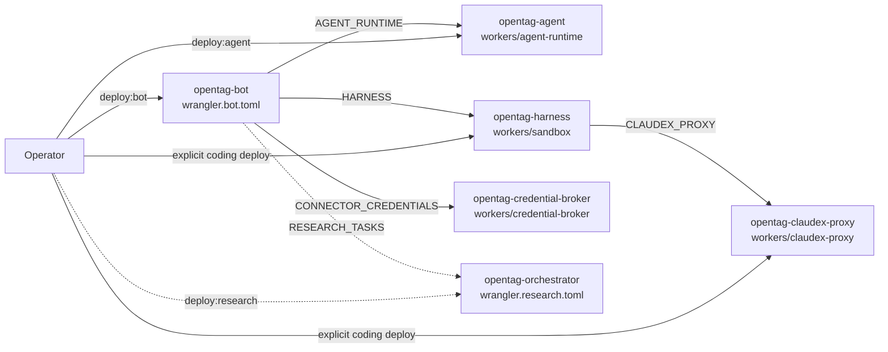
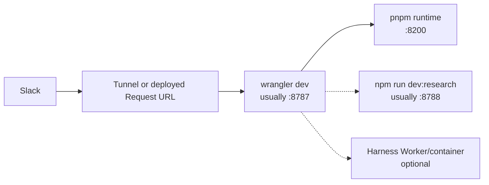

# OpenTag operations guide

Status: **current runbook**
Updated: **2026-08-01**

This guide covers local validation, deployment units, configuration, health
checks, logs, and failure diagnosis. Setup from scratch starts in
[setup.md](../setup.md); system design is in
[ARCHITECTURE.md](../ARCHITECTURE.md).

The dated production evidence for the current release is in
[current-state.md](./current-state.md). This runbook separates deployed
configuration from provider readiness: a binding or health flag is not proof
that an authenticated external broker, relay, OAuth callback, billing worker,
or deletion effect has completed.

## Deployment map


```mermaid
flowchart LR
    Operator["Operator"]
    Bot["opentag-bot<br/>wrangler.bot.toml"]
    Agent["opentag-agent<br/>workers/agent-runtime"]
    Harness["opentag-harness<br/>workers/sandbox"]
    Claudex["opentag-claudex-proxy<br/>workers/claudex-proxy"]
    Broker["opentag-credential-broker<br/>workers/credential-broker"]
    Research["opentag-orchestrator<br/>wrangler.research.toml"]

    Operator -->|"deploy:bot"| Bot
    Operator -->|"deploy:agent"| Agent
    Operator -->|"explicit coding deploy"| Claudex
    Operator -->|"explicit coding deploy"| Harness
    Operator -.->|"deploy:research"| Research

    Bot -->|"AGENT_RUNTIME"| Agent
    Bot -->|"HARNESS"| Harness
    Bot -->|"CONNECTOR_CREDENTIALS"| Broker
    Harness -->|"CLAUDEX_PROXY"| Claudex
    Bot -.->|"RESEARCH_TASKS"| Research
```

The bot, AG-UI agent, and coding harness are deployed in the current production
configuration. Research remains optional. The coding plane runs Claude Code
(native Anthropic and Claudex/CLIProxyAPI) plus the native Nanocodex CLI in the
same sandbox. Active service bindings require target-before-caller deploy order:
Claudex proxy, harness, bot. Nanocodex needs harness Worker secret
`OPENAI_API_KEY` (no Claudex proxy dependency).

## Local prerequisites

- Node.js 22 for parity with GitHub Actions
- npm for `edge/` and harness packages
- pnpm for the root runtime/research tests
- Wrangler authentication for deploy or remote tailing
- Docker for harness-image build/smoke validation
- Workers Paid for Cloudflare Containers
- TinyGo and `wasm-opt` only when rebuilding the optional WASM dispatcher

## Install and validate

### Bot spine, exact CI sequence

```bash
cd edge
npm ci
npm run typecheck
npm test
npm run test:e2e
```

This is the sequence in `.github/workflows/edge-ci.yml`. It uses only
`edge/package-lock.json`, so dependencies required by files included in
`edge/tsconfig.json` must be declared at the edge package level. The harness
container types therefore pin `@cloudflare/containers` directly in `edge`.

### Harness Worker package

```bash
cd edge/workers/sandbox
npm ci
npm run typecheck
```

The edge test suite already covers the router, egress policy, wire contract,
harness server, tool host, and client. Build the image when Docker is available:

```bash
docker build --platform linux/amd64 \
  -f containers/harness/Dockerfile \
  -t opentag-harness:local .
```

The harness pins an `amd64` Ubuntu package and Cloudflare's deployment image
target is `linux/amd64`. Apple Silicon Docker otherwise selects `arm64` and
fails at `dpkg` before project code runs.

### Claudex proxy package

```bash
cd edge/workers/claudex-proxy
npm ci
npm run typecheck
```

Its Container image is also `linux/amd64`. The Worker is private
(`workers_dev = false`) and is reached from the harness only through the
`CLAUDEX_PROXY` service binding.

### Root runtime and research

```bash
pnpm install
pnpm run check-types
pnpm test
```

## Local development topology


```mermaid
flowchart LR
    Slack["Slack"] --> Tunnel["Tunnel or deployed Request URL"]
    Tunnel --> Bot["wrangler dev<br/>usually :8787"]
    Bot --> Agent["pnpm runtime<br/>:8200"]
    Bot -.-> Research["npm run dev:research<br/>usually :8788"]
    Bot -.-> Harness["Harness Worker/container<br/>optional"]
```

Start the default conversational path:

```bash
# terminal 1, repository root
pnpm runtime

# terminal 2
cd edge
cp .dev.vars.example .dev.vars
npm run dev
```

Root `pnpm start` and `pnpm dev` intentionally exit with a pointer to the edge
Worker. They are not alternate Slack bots.

For signed local probes:

```bash
cd edge
./scripts/e2e-local.sh
./scripts/e2e-smoke-local.sh
```

## Configuration ownership

| Name | Kind | Owner | Purpose |
| --- | --- | --- | --- |
| `SLACK_BOT_TOKEN` | Secret | Bot | Slack Web API |
| `SLACK_SIGNING_SECRET` | Secret | Bot | Slack HMAC verification |
| `SLACK_BOT_USER_ID` | Var | Bot | Exact installed bot user ID required by trusted rich-payload mentions |
| `SLACK_TRUSTED_TRIGGER_ACTORS` | Var | Bot | Exact `bot:B...` / `app:A...` allowlist; unset disables the feature |
| `AGENT_URL` | Secret/string | Bot | AG-UI request URL/path |
| `AGENT_RUNTIME` | Service binding | Bot | Same-zone call to `opentag-agent` |
| `AGENT_AUTH_HEADER` | Secret | Bot + agent | Optional AG-UI authentication |
| `SUPERMEMORY_API_KEY` | Secret | Bot | Knowledge retrieval provider credential |
| `SUPERMEMORY_URL` | Deploy var | Bot | Knowledge retrieval provider origin |
| `ADMIN_SECRET` | Secret | Bot | `/admin/*`, `/debug/*`, `/tasks/start` |
| `SESSION_VIEWER_BASE_URL` | Var | Bot | Public bot origin for signed, expiring session links |
| `QUICK_BASE_DOMAIN` | Var | Bot | Artifact host suffix eligible for final action cards |
| `DEFERRED_INGRESS` | Durable Object binding | Bot | Stable quick-click and delayed-file jobs, owned before Slack acknowledgement |
| `BOT_SELF` | Service binding | Bot | Authenticated alarm replay into `opentag-bot` |
| `SLACK_RATE_LIMIT` | Durable Object binding | Bot | Cross-isolate per-channel Slack dispatch reservations |
| `BLOBS` | R2 binding | Bot + harness + research | Durable staged attachments and research blobs; bot/harness must name the same bucket |
| `DELIVERY_METRICS` | Analytics Engine binding | Bot | Confirmed `streamed`, `answer_visible`, and `failed_size_limit` outcomes |
| `INTERNAL_SECRET` | Secret | Bot + research | Internal research authentication |
| `RESEARCH_TASKS` | Service binding | Bot | `opentag-orchestrator` |
| `HARNESS` | Service binding | Bot | Production `opentag-harness` call |
| `HARNESS_URL` | Var/secret string | Bot | Harness base URL and path fallback |
| `HARNESS_AUTH_TOKEN` | Secret | Bot + harness | `/turn` and `/interrupt` bearer |
| `HARNESS_REPO_URL` | Var | Bot | Default repository for coding turns |
| `HARNESS_ALLOWED_REPO_HOSTS` | Var | Harness | Allowed git hosts, default `github.com` |
| `HARNESS_ALLOWED_REPO_ORGS` | Var | Harness | Required non-empty organization allowlist |
| `ANTHROPIC_API_KEY` or `CLAUDE_CODE_OAUTH_TOKEN` | Secret | Harness Worker | Native Claude Code credential, injected at the Anthropic boundary |
| `CLAUDEX_PROXY_URL` | Var | Harness Worker | Synthetic `https://claudex.internal` origin routed through the private service binding |
| `CLAUDEX_MODEL` | Var | Harness | Optional Claudex default, `gpt-5.6-sol` when omitted |
| `CLIPROXY_CLIENT_KEY` | Secret | Claudex proxy Worker | Internal key shared only with the trusted CLIProxyAPI container |
| `CLIPROXY_INTERNAL_KEY` | Secret | Claudex proxy Worker | Protects credential import/export between the Worker and its container |
| `GITHUB_TOKEN` | Secret | Harness Worker | Private clone and approved remote writes |
| `OPENTAG_TOOL_BIN` | Var | Harness | Optional tool-host executable |
| `OPENAI_API_KEY` | Secret | Agent | Default AG-UI model |
| `LINEAR_API_KEY` | Secret | Agent | Linear MCP |
| `LINEAR_TEAM_KEY` | Secret/var | Agent | Linear team display name or ID |
| `CONNECTOR_CREDENTIALS` | Service binding | Bot | Short-lived opaque connector credential resolution |
| `CONNECTOR_CREDENTIAL_BROKER_TOKEN` | Secret | Bot + credential broker | Internal service-binding authentication; never a provider credential |
| `PLATFORM_STATE` | Durable Object binding | Bot | Secret-free provisioning, custody, OAuth, billing, memory, and effect ledger |
| `/admin/platform/memory/deletion/receipt` | Admin route | Bot | Source-scoped deletion proof; does not delete memory |
| `/admin/platform/provision/step` | Admin route | Bot | Receipt-bound provisioning step advancement |
| `ROUTER_MEASUREMENTS` | Durable Object binding | Bot | Workspace-scoped classifier shadow, outcome, and feedback records |
| `BUZZ_OPEN_TAG_SIGNER_SECRET` | Secret | Bot | NIP-OA signer for Buzz wake receive; missing or malformed values fail closed |
| `BUZZ_RELAY_HTTP_BASE_URL` | Deploy var | Bot | Allowlisted Buzz relay query origin |
| `BUZZ_OPEN_TAG_ALLOWED_RELAY_ORIGIN` | Deploy var | Bot | Independent relay-origin grant; never derived from fetch base |
| `BUZZ_CHANNEL_TENANT_MAP` | Deploy var | Bot | Server-owned channel-to-tenant directory |
| `BUZZ_OPEN_TAG_AUTH_TAG_SECRET` | Secret/var | Bot | Optional bounded Buzz auth-tag material |
| `NOTION_TOKEN`, `NOTION_MCP_AUTH_TOKEN` | Secret | Agent | Optional Notion sidecar |

Same-zone Worker calls should use service bindings. `AGENT_URL` and
`HARNESS_URL` still supply a request URL/path, but public `workers.dev` fetches
between Workers in the same zone can fail with Cloudflare 1042.

AG-UI requests carry the exact execution ID to the named runtime Container.
Stop calls `/opentag/control/interrupt` through `AGENT_RUNTIME` and only reports
success after the runtime returns matching accepted/quiescent proof. Signed
`/sessions/:token` links are read-only, expire after seven days, return
`Cache-Control: private, no-store`, and require `ADMIN_SECRET` as their HMAC
key; rotate that secret to revoke outstanding links.

## 2026-08-01 live rollout record

The current production smoke used merged baseline `ff8d649` and a narrow
identity-read fix on the reconciliation branch. The bot deployment is
`bf1f47bf-b569-46cd-9e85-46141ed86d24`; the harness deployment was
`58c47ab9-daf9-456b-b17c-73fc66e6b25d`. The image digest and feature-by-feature
result matrix are in [current-state.md](./current-state.md).

The live checks covered `/health`, flexible Slack response routing, exact Slack
markers for the normal turn, native Nanocodex, and Claudex, ordinary knowledge
retrieval, indexed knowledge search, concurrency feedback, router summary/list,
synthetic platform provisioning and effect leases, the corrected identity read
route, and the Buzz fail-closed probe. `POST /buzz/wake` returned HTTP 503
`buzz_receive_not_configured` without contacting the relay.

The Slack routing canary is [here](https://berendo.slack.com/archives/C0BA1MKPRE3/p1785630816681659).
It demonstrated an untagged problem/action request, a passive conversational
statement with no bot turn, an explicit marker, and an untagged question. The
explicit marker sent while the problem/action turn was still running received
the expected genuine-concurrency warning; after the first turn rendered
`Complete`, a later explicit marker returned exactly
`OPENTAG_ROUTING_FINAL_IDLE_OK` without a stale-turn warning. The earlier stale
thread was safely cleared with an explicit Stop
[here](https://berendo.slack.com/archives/C0BA1MKPRE3/p1785626165915119).
A separate [passive-only smoke](https://berendo.slack.com/archives/C0BA1MKPRE3/p1785629853529029)
used a fresh top-level user message and an untagged `yo`; after the prior turn
was idle, Slack showed no bot reply.

Do not report the following as live passes from this rollout: Drive or Linear
provider calls, OAuth callback, billing, deletion execution, authenticated Buzz
NIP-OA admission, a live Stop/HITL click, provider checkpoint reconnect, or a
fresh one-click installation. Those require credentials, external effecters,
or a controlled test workspace.

## Deploy the AG-UI agent

```bash
cd edge/workers/agent-runtime
npm ci
npx wrangler secret put OPENAI_API_KEY
npx wrangler secret put LINEAR_API_KEY
npx wrangler secret put LINEAR_TEAM_KEY
# optional: AGENT_MODEL, NOTION_TOKEN, NOTION_MCP_AUTH_TOKEN, AGENT_AUTH_HEADER
npm run deploy
```

Keep `TriageContainer.envVars` as a class field. A getter is shadowed by the
Containers base class and silently drops runtime secrets.

## Deploy the bot

```bash
cd edge
npx wrangler secret put SLACK_BOT_TOKEN --config wrangler.bot.toml
npx wrangler secret put SLACK_SIGNING_SECRET --config wrangler.bot.toml
npx wrangler secret put AGENT_URL --config wrangler.bot.toml
npx wrangler secret put ADMIN_SECRET --config wrangler.bot.toml
npx wrangler secret put INTERNAL_SECRET --config wrangler.bot.toml
npm run deploy:bot
```

Slack Request URLs must point to the deployed bot Worker:

- `/slack/events`
- `/slack/commands`
- `/slack/interactions`

After a Slack scope change, reinstall the app and refresh the bot token secret.
The Linear requester-assignee flow requires `users:read.email` on the installed
token, not only in the manifest.

## Platform effect handoff

### Credential broker deployment order

The credential broker can be deployed before its custody backend to publish a
fail-closed health surface, but it must not be considered connector-ready until
all three boundaries exist:

1. Deploy `workers/credential-custody/` with an approved
   `CUSTODY_AUTH_TOKEN`, Secrets Store binding map, and non-production secret
   smoke; the binding map contains only credential references, versions,
   binding names, and expiry metadata.
2. Deploy `workers/credential-broker/` with the cross-Worker
   `PLATFORM_STATE` binding and its `CUSTODY` service binding. Set the separate
   `CUSTODY_AUTH_TOKEN`; the custody Worker owns provider tokens and OAuth
   refresh material, while neither the broker nor the bot may persist them.
3. Set `CONNECTOR_CREDENTIAL_BROKER_TOKEN` as a secret on the bot and broker,
   then deploy the bot with its `CONNECTOR_CREDENTIALS` binding.

Verify `/health` reports `providerResolutionEnabled: true` only after the
custody binding is present. Until then, Drive and Linear must remain disabled
for live workspaces and resolution must return
`credential_custody_unavailable` or
`credential_custody_auth_unconfigured`.

The platform ledger does not call Slack, Google, Linear, a custody system, a
billing provider, or a memory backend. State transitions create secret-free
effect intents in the `PLATFORM_STATE` Durable Object. A separately deployed
effect worker should claim them through the internal DO/service-binding path,
perform the provider operation, and report one of:

- `POST /effect/complete` with the lease token and a bounded external receipt
  reference;
- `POST /effect/fail` with a safe error code and explicit retryability; or
- `POST /effect/cancel` when revocation or operator action supersedes it.

Claims are leased and reclaimable after expiry. Completion and failure require
the active lease, so a late worker cannot commit after a newer worker has
reclaimed the intent. The admin-only forwarding equivalents are
`/admin/platform/effect/{enqueue,get,list,claim,complete,fail,cancel}` and are
for diagnosis/bootstrap only, not a substitute for a dedicated effect worker.
Never put provider tokens, OAuth codes, prompts, query text, or deletion
payloads in effect metadata. Marketplace updates and credential/OAuth
rotations create separate intents so external revocation cannot be silently
skipped when local metadata advances.

Memory deletion is not complete when the request is accepted. An approved
external executor must submit one epoch-matching receipt per requested source
through `/admin/platform/memory/deletion/receipt`; `deleted` and `not_found`
complete a source, while `failed` makes the request terminally failed. The
Worker stores only the receipt metadata and opaque external reference. It does
not delete, inspect, or accept memory contents.

Provisioning step updates must include `schemaVersion`, the provisioning
idempotency key, required step, outcome, opaque `externalReceiptRef`, and
`observedAt`. A complete step cannot be marked retryable. The platform ledger
stores the receipt and reaches `active` only after all required steps have
completed with evidence; it does not perform the external provisioning work.

## Deploy and connect the harness

This is an explicit operator action. The repository ships active production
bindings, so deploy every target before its caller.

1. Set a non-empty organization allowlist in
   `edge/workers/sandbox/wrangler.toml` or its deployment environment.
2. Verify the harness `BLOBS` R2 binding names the same bucket as the bot
   binding. Staged references fail closed if the binding, object, size, or
   digest does not match.
3. Configure harness Worker secrets. Native Claude needs one Anthropic
   credential; Claudex-only operation does not:

```bash
cd edge/workers/sandbox
npx wrangler secret put HARNESS_AUTH_TOKEN
npx wrangler secret put ANTHROPIC_API_KEY
npx wrangler secret put GITHUB_TOKEN
```

`CLAUDE_CODE_OAUTH_TOKEN` can replace `ANTHROPIC_API_KEY` for native Claude.
For Claudex, complete `cliproxyapi --codex-login` on a trusted local machine,
identify the resulting `codex-*.json` file, and upload only that JSON to the
private R2 object named by `CODEX_AUTH_OBJECT` (default
`codex-primary.json`). Never print the file contents:

```bash
cd edge/workers/claudex-proxy
npx wrangler r2 object put \
  opentag-claudex-auth/codex-primary.json \
  --file /absolute/path/to/codex-account.json \
  --remote
```

The proxy Worker loads that bounded object into its trusted Container and
persists refreshed state back to R2. Generate two distinct random values of at
least 32 characters and set them interactively:

```bash
cd edge/workers/claudex-proxy
npx wrangler secret put CLIPROXY_CLIENT_KEY
npx wrangler secret put CLIPROXY_INTERNAL_KEY
npm run deploy
```

Do not mount `~/.cli-proxy-api` or ChatGPT/Codex OAuth state into the harness
container. Claude and repository tools receive only a sentinel client token;
the Harness Worker strips it and forwards only `/v1/messages`,
`/v1/messages/count_tokens`, and `/v1/models` through `CLAUDEX_PROXY`.

Select Claudex in Slack with either form:

```text
--claudex Fix the failing tests
--claudex --model gpt-5.6-sol Review this change
```

Both modes run the same pinned Claude Code binary and preserve the same Stop,
repository, egress, git-approval, and postcondition enforcement. The macOS
`claudex` alias remains useful for direct local use, but its
`http://127.0.0.1:8317` endpoint is not reachable from a Cloudflare container.

4. Verify the already-shipped `CLAUDEX_PROXY` and `HARNESS` service bindings:

```toml
# edge/workers/sandbox/wrangler.toml
[[services]]
binding = "CLAUDEX_PROXY"
service = "opentag-claudex-proxy"

# edge/wrangler.bot.toml
[[services]]
binding = "HARNESS"
service = "opentag-harness"
```

5. Deploy the harness, then set matching bot configuration and deploy the bot:

```bash
cd edge/workers/sandbox
npm run deploy
cd ../..
npx wrangler secret put HARNESS_AUTH_TOKEN --config wrangler.bot.toml
# configure HARNESS_REPO_URL as a non-secret var or deployment-specific value
npm run deploy:bot
```

For a new installation, the same order is available through the one-command
installer. It reads secret values only from `OPENTAG_SECRET_*` environment
variables, sends them to Wrangler over stdin, never writes them to the
repository, deploys the harness first, and deploys the bot second:

```bash
cd edge
OPENTAG_SECRET_OPENAI_API_KEY='...' \
OPENTAG_SECRET_HARNESS_AUTH_TOKEN='...' \
OPENTAG_SECRET_KNOWLEDGE_ACTOR_TOKEN_SECRET='...' \
OPENTAG_SECRET_SLACK_BOT_TOKEN='...' \
OPENTAG_SECRET_SLACK_SIGNING_SECRET='...' \
OPENTAG_SECRET_AGENT_URL='...' \
OPENTAG_SECRET_ADMIN_SECRET='...' \
OPENTAG_SECRET_INTERNAL_SECRET='...' \
OPENTAG_SECRET_SUPERMEMORY_API_KEY='...' \
OPENTAG_VAR_SUPERMEMORY_URL='https://memory.example' \
npm run deploy:one-click -- --require-secrets
```

Existing secrets can be left in place by omitting their corresponding
environment variables. Use `npm run deploy:one-click -- --no-deploy` to
configure only the supplied secrets, or `--dry-run` to inspect the Wrangler
commands without sending values or deploying.

`NANOCODEX_NATIVE_RESPONSES=true` enables the typed native Responses adapter
for non-coding Nanocodex turns. Coding turns continue through the CLI harness
because the native adapter deliberately exposes no shell, repository, or
remote-git tools. The provider checkpoint and replay state is stored in the
per-thread `SessionEventDO`; it is not kept only in the container process.

6. Verify bot and proxy `/health`, a read-only Claudex turn, Stop during a live
   turn, a local commit-only coding turn, then a separately approved push/PR
   turn. The exact-response Slack smoke is:

```text
--claudex --model gpt-5.6-sol Reply with exactly: SLACK_CLAUDEX_OK
```

The accurate runtime description is: OpenTag launches the pinned Claude Code
CLI directly in a session-scoped, recyclable Cloudflare Container. It does not
embed the Claude Agent SDK. A session checkout may be reused; each execution
receives a fresh writable `HOME` that is quarantined and removed before the
terminal event.

Do not place real Anthropic or GitHub tokens in the container image or bot turn
body. The container receives sentinels; outbound handlers replace them.

## Deploy research

```bash
cd edge
npm run deploy:research
```

This command rebuilds the optional WASM dispatcher first. The research Worker
must share `INTERNAL_SECRET` with the bot and have delivery/model secrets needed
by its configured adapters.

The research Worker is not a Slack Request URL. Its `/slack/*` routes return
`410 slack_demoted` intentionally. A confirmed final research delivery includes
Retry, Dig deeper, and Export buttons. Those clicks return to
`opentag-bot`'s `/slack/interactions`, acquire exact durable pre-admission using
the click identity, and then enter the ordinary synthetic-turn sink.

## Health checks

| Surface | Request | Expected |
| --- | --- | --- |
| Bot | `GET /health` | `ok`, product, StateStore, bot engine, trusted-rich-trigger readiness |
| Agent | Agent Worker health route | Worker/Container reachable |
| Harness Worker | `GET /health` | `{ok:true, worker:"opentag-harness"}` |
| Harness container | Internal `GET /health` | Claude Code version |
| Claudex proxy | Internal `GET /health` through `CLAUDEX_PROXY` | `{ok:true, proxy:"ready", auth:"configured"}` |
| Research | `GET /health` | `role:"research-task"`, `slack:"demoted"` |

The bot's `/debug/store` is admin-authenticated and exercises KV, list, lock,
and dedup. Do not expose admin secrets in shell history or logs.

## Structured lifecycle metrics

The current system emits JSON log lines rather than a Prometheus exporter.
Useful metric names include:

| Metric | Meaning |
| --- | --- |
| `turn_started` | Exact turn admitted and entering execution |
| `turn_completed` | Runtime completed normally |
| `turn_failed` | Lifecycle raised before confirmed completion |
| `turn_duplicate` | Stable execution already handled |
| `turn_duplicate_pre_admission` | Slack redelivery rejected before enrichment |
| `slack_message_routed` | Response-worthiness decision (`respond` or `observe`) plus bounded reason before turn admission |
| `turn_concurrent_rejected` | Another execution owns the thread/session |
| `busy-note:<threadKey>` | Durable dedup namespace for bounded concurrent-turn feedback |
| `turn_interrupted` | Exact turn was stopped |
| `turn_interrupted_pre_execution` | Stop won before runtime work |
| `fallback_sent` | Alarm recovery made an answer visible |
| `error_visible` | Explicit error/retry surface reached Slack |
| `obligation_deferred` | Recovery found live or ambiguous execution |
| `obligation_silent_clear` | Terminal/interrupt state required no new post |
| `obligation_stale_execution` | Session `executing` marker outlived its exact active-turn row; crash recovery proceeds |
| `stop_command_received` | Stop parser accepted the Slack message |
| `streamed` | Slack confirmed the first non-final streamed update |
| `answer_visible` | Slack confirmed the final answer render |
| `failed_size_limit` | Slack definitively rejected the final answer for size and confirmed the bounded visible error |
| `late_file_repair_timeout` | A correlated delayed upload did not reach exact thread idle within the repair window |
| `session_history_compacted` | Alarm recovery compacted events through a caller-proven replay cursor |
| `session_history_compaction_error` | Best-effort compaction failed after the visible obligation was safely served |
| `trusted_rich_mention_admitted` | Exact allowlisted rich-payload mention entered durable admission |
| `trusted_rich_mention_ignored` | Rich-trigger candidate failed closed with a bounded reason |
| `runtime_default_selected` | Runtime selection source labels for the accepted turn |
| `permission_snapshot_generated` | Redacted snapshot generation by actor kind and surface |

Filter by `threadKey` and `executionId` to reconstruct a turn. The same exact
execution ID should appear across pre-admission, SessionEventDO, harness, Stop,
and final render logs.

## Inspect effective permissions

- Agent turn: call the reserved `show_permissions` tool.
- Operator: `GET /admin/permissions?teamId=<team>&channelId=<channel>` with the
  existing admin bearer. Responses are `Cache-Control: no-store`.
- Coding harness: run `opentag permissions` during the active execution.

These surfaces are informational. They never grant a tool, secret, network
destination, git operation, or write. Automation snapshots deliberately omit
MCP endpoint and secret-reference names.

## Configure channel runtime defaults

Use `/config runtime show`, `/config runtime set --harness claudex
--model gpt-5.6-sol`, and `/config runtime clear`. Slack `/config` edits
channel context and runtime defaults only — never the trusted system prompt
overlay, policies, or access bundle. The authenticated `POST /admin/config`
surface owns `systemPromptOverlay` (with optimistic `expectedRevision`),
policies, bundle, and the same `runtimeDefaults` object and validation.
Legacy DO `/putConfig` rejects policy/bundle/overlay elevation
(`use_putAdminConfig_for_policies` / `use_putAdminConfig_for_overlay`).

### Rollback notes (P0/P1 progress + config)

- Progress UX: disable live progress by not wiring `onHarnessEvent` / omitting
  `SLACK_BOT_TOKEN` locally; final answer remains never-silent without progress.
- Overlay: omit `contractVersion: 2` / `systemPromptOverlay` to fall back to
  base-only prompts; Container and turn-contract both reject digest mismatches.
- Config authority: channel managers keep `/putChannelContext`; restore
  policies only via `/putAdminConfig`. Do not re-enable policy writes on
  `/putConfig`.
- Redaction: Worker boundary remains authoritative; Container
  `output-redaction.ts` is defense-in-depth and safe to leave enabled.

Effective precedence is explicit message flag, sticky thread
choice, channel default, then deployment default. Existing sticky threads keep
masking a changed channel default until overwritten or expired.

If a channel selects a coding harness while the harness is disconnected, the turn
fails visibly and never falls back to AG-UI. Reasoning defaults and unsupported
harnesses are rejected.

## Enable trusted rich-payload mentions

The feature is disabled unless both variables are valid:

```text
SLACK_BOT_USER_ID=U0123456789
SLACK_TRUSTED_TRIGGER_ACTORS=bot:B0123456789,app:A0123456789
```

Matching is exact against verified raw Slack IDs. A trusted actor must also
contain an exact `<@SLACK_BOT_USER_ID>` mention inside `blocks` or
`attachments`; top-level text alone does not use this fallback. Own-bot posts,
untrusted actors, malformed payloads, DMs without a rich mention, edits, and
other subtypes fail closed. No new Slack scope or reinstall is required by this
source change.

Invalid allowlist tokens are ignored and reported only as a bounded count in
the startup warning and `GET /health`. An allowlist with no valid entries, or
valid entries without a valid bot user ID, makes readiness fail with
`invalid_config` or `missing_target_id`; raw payload text and invalid tokens are
never logged.

Rollback is immediate: unset `SLACK_TRUSTED_TRIGGER_ACTORS`. Clear channel
defaults with `/config runtime clear`.

For a concurrent rejection, confirm the request is genuinely distinct. Stable
redeliveries intentionally stay silent; a distinct ask should produce no more
than one busy note per thread per minute.

### Slack routing and false active-turn warnings

The bot reads every human reply in a Slack thread, but it does not answer every
reply. The expected policy is:

- DMs, files, explicit bot mentions, and trusted triggers are eligible;
- unmentioned questions, action requests, and problem reports are eligible;
- passive conversation such as `yo` is observed in history and does not wake the
  agent;
- top-level unmentioned channel chatter remains silent.

If an explicit mention is delivered by both `app_mention` and threaded
`message`, the duplicate `message` should be rejected before pre-admission. A
`slack_message_routed` structured metric records `respond` or `observe` with a
bounded reason; inspect it with the event ID, channel, and thread key. Do not
delete an active row manually as the first response. A genuine distinct
concurrent ask should produce the bounded busy note; a stale warning after a
completed turn indicates a regression in duplicate admission or final-render
confirmation and should be reproduced with the focused routing/admission tests.

The deployed `/health` response currently reports `modelConfigured: false` for
the agent. Routing can still be verified, but a routed turn may end in the
explicit no-text terminal until the model binding/secret is configured.

## Failure diagnosis

### Slack event acknowledged but no answer

1. Find `turn_started`, `turn_failed`, or `turn_interrupted` for the execution.
2. Check `SESSION_EVENTS` state: live execution, terminal done, or interrupt
   tombstone.
3. Check whether a render obligation remains and when its alarm is due.
4. Look for `obligation_deferred`, `fallback_sent`, or `error_visible`.
5. `obligation_stale_execution` means the runtime owner stopped refreshing its
   active-turn row; the alarm intentionally treats the session marker as a
   crash orphan instead of deferring forever.
6. Verify the final Slack render was confirmed, not merely attempted.

Do not delete the obligation as a first response. It is the recovery mechanism.

Every request-time Slack client reserves its dispatch slot in the
`SLACK_RATE_LIMIT` Durable Object named for the channel. Production requests
are therefore spaced at one call per second across Worker isolates, and a Slack
`Retry-After` response replays the identical form body through the same durable
discipline. Render-obligation alarm recovery is a separate sequential Durable
Object owner and persists its own deferred/retry timing.

Quick clicks and delayed-file repairs are stored in `DEFERRED_INGRESS` and have
an alarm armed before Slack receives HTTP 200. The alarm calls the authenticated
`BOT_SELF` route, retries with bounded backoff, and retains an exhausted record
plus `deferred_ingress_exhausted` metric rather than silently discarding work.

If a live AG-UI render was visible but replay has no output, look for
`session_event_mirror_failed`. Session output and tool events are canonical
before delivery; an append or replay failure suppresses runtime/final delivery
and leaves the exact active turn plus obligation retryable. The obligation must
still produce an explicit retry/error surface rather than remain silent.

### Stop says nothing or appears stuck

1. Confirm the message qualifies: an explicitly bot-mentioned threaded stop,
   a DM stop, or a top-level channel stop that mentions the bot.
2. Confirm execution and Stop derived the same thread key.
3. Inspect the active-turn status: `cancelled`, `cancel_controlled`,
   `cancel_ack_in_flight`, or `cancel_confirmed`.
4. If a research effect exists, verify cancellation returned both `cancelled`
   and `quiescent`.
5. If a harness effect exists, inspect `/interrupt` and process-group cleanup.
6. Leave the row for the alarm continuation if the Slack acknowledgement was
   ambiguous.

### HITL button appears dead

- Use a card created by current code; older cards may not contain `choiceId`.
- Confirm `/slack/interactions` reaches `opentag-bot`.
- Inspect the HTTP status. A `503` means durable persistence failed and Slack
  should retry; a false `200` would be a bug.
- Verify `hitl-id:<choiceId>` and cancellation tombstones in `BOT_STATE`.

### Agent returns Cloudflare 1042

The bot is fetching a same-zone Worker publicly. Configure `AGENT_RUNTIME` (or
`HARNESS`) service binding and retain the URL only for the request path.

### Linear assignee email is missing

- Reinstall the Slack app after adding `users:read.email`.
- Refresh `SLACK_BOT_TOKEN` locally and in Cloudflare.
- Verify the installed token's `x-oauth-scopes` header.
- Keep Slack Web API bodies form-urlencoded; JSON `users.info` can omit/fail the
  profile lookup.

### Harness rejects repository

- Use canonical `https://host/org/repo` or `.git` URL with no credentials,
  port, query, or fragment.
- Confirm the host and lowercase org are allowlisted.
- Confirm `codingTask` includes a repository.
- Confirm IDs match the `ot1e_` / `ot1m_` wire formats.

### Harness rejects a staged attachment

- Confirm bot and harness `BLOBS` bindings point to the same R2 bucket.
- Check for `staged_attachment_store_unavailable`, `not_found`,
  `size_mismatch`, or `digest_mismatch`; each is a deliberate fail-closed
  boundary and the turn is not silently run without the attachment.
- The authenticated harness frontend resolves at most 32 MiB decoded across
  at most five attachments. The container keeps rejecting any staged ref that
  crosses its boundary unresolved.

### Harness cannot push or create a PR

- Confirm the Slack remote-git approval completed durably for the exact turn.
- Confirm `GITHUB_TOKEN` is a harness Worker secret.
- Push only `opentag/session-<session-prefix>`.
- Use repository-scoped REST for PR creation, not GraphQL.
- Include the exact standalone requester attribution line.
- A successful Claude exit is insufficient; inspect the postcondition error.

### Harness turn ends without `done`

The outer client writes explicit `error` and failed `done` events so the event
log does not remain live forever. Investigate container transport, process exit,
timeout, or event-mapping errors using the preserved failure kind.

### CI passes locally but clean CI fails

Reproduce from `edge/` using `npm ci` under Node 22. Do not rely on a nested
`workers/sandbox/node_modules`; edge TypeScript includes `workers/**/*.ts` and
must declare their compile-time packages in `edge/package.json`.

## Slack knowledge index operations (disabled until named gates)

The Supermemory Local integration is an optional sidecar index. Slack still
terminates only at `opentag-bot`; `ConversationStateDO`, `SessionEventDO`,
`WorkspaceConfigDO`, and existing durable fences remain authoritative. A
tracked source is disabled unless one exact `(teamId, projectId, channelId)`
row is explicitly enabled, and only one project may be enabled for a team and
channel. Disabling a source is an immediate authorization change.

Source lifecycle administration is a separate fail-closed surface. Every call
requires both `ADMIN_SECRET` and a one-use Ed25519 artifact in
`X-OpenTag-Knowledge-Source-Grant`. The external artifact binds its issuer/key,
named human or service actor, exact team/project/channel, exact action, request
digest, issue/expiry time, and the expected config version for mutations.
`WorkspaceConfigDO` atomically consumes the grant, rejects replay/config drift
and active ingestion effects, performs the action, and durably stores the
actor, grant/digest, scope, versions, outcome, and time without storing the
artifact or a signing key.

The routes are deliberately distinct:

- `POST /admin/knowledge/sources/inspect` and `/list` read one exact scope;
  there is no workspace/channel wildcard list.
- `POST /admin/knowledge/sources/stage` creates only a missing disabled row at
  expected version `0`; `/update-disabled` changes only a never-enabled staged
  row.
- `POST /admin/knowledge/sources/enable-first` performs the sole first-enable
  transition, and `/disable` performs the later disable transition. Re-enable
  remains blocked until the pinned Local deletion/reindex contract is proven.

The Worker has no grant issuer, private key, or fallback authority.
`KNOWLEDGE_SOURCE_AUTH_PUBLIC_KEY`, `KNOWLEDGE_SOURCE_AUTH_ISSUER`, and
`KNOWLEDGE_SOURCE_AUTH_KEY_ID` remain unset in production until C1/S1 approves
the external authority and exact staging matrix. With any verifier field
missing, lifecycle routes return unavailable; `ADMIN_SECRET` alone never
authorizes a source.

Automatic ingestion is `waitUntil -> KnowledgeDO -> Cloudflare Queue ->
opentag-bot queue() -> Supermemory Local`. The production Queue and DLQ binding
remain absent until the named C1 gate approves exact resources and retry
policy. C1 must configure distinct exact `KNOWLEDGE_QUEUE_NAME` and
`KNOWLEDGE_DLQ_NAME` values; the primary name cannot use the `-dlq` role suffix
and the DLQ name must use it. Any Queue delivery with missing, identical,
swapped, or unknown names is retried and throws before a message body is parsed.
Missing Slack or Local runtime configuration is recorded as retryable
degradation; it must not delay Slack acknowledgement or cause a turn to call
ingestion. Slack source-level `ok:false` errors `not_in_channel`,
`channel_not_found`, and `thread_not_found` are instead recorded as durable
`permanent_failure` skips with the exact Slack error code; the Queue message is
acknowledged and reconciliation blocks the source. Transport, rate-limit, and
timeout failures remain retryable. During a turn, only the bounded
`search_slack` tool may call Local.
It returns `knowledge_unavailable` without failing the turn when Local is down,
and it returns no citation after a source disable, policy/version change,
tombstone, or ledger/revision mismatch.

Local update and delete semantics for the pinned server remain unverified.
Edits to an already indexed revision stop as
`unsupported_update_contract`. Slack `message_deleted` handling preserves the
exact deleted `ts`: only a well-formed deletion proving that timestamp is the
actual root emits `delete`, persists a source tombstone, and stops as
`unsupported_delete_contract`. A reply or `thread_broadcast` deletion emits
`reply_delete` for the exact parent `thread_ts`, refetches the whole thread, and
uses the edit/reconciliation path. If canonical content changed after an
indexed revision, it stops non-searchable as `unsupported_update_contract`;
it never tombstones the parent. Missing or contradictory `previous_message`
identity is never granted root-tombstone authority; where an exact distinct
parent and envelope `deleted_ts` remain available it can only request a parent
refetch, otherwise it is ignored. Operators
must not simulate deletion with a second add. Disabling config removes
authorization immediately, and the
config RPC rejects later re-enable until a verified deletion/reindex contract
exists, so an old indexed revision cannot become authorized again. Retention
execution is likewise not enabled before that contract is proven.
`processing_unconfirmed` means a bounded poll timed out. Reconciliation resumes
the same durable Local document ID and never issues another add for that
revision. Only Local status `done` sets `indexed_revision`; `queued`,
`extracting`, `chunking`, `embedding`, and `indexing` are not searchable states.

An `ambiguous_add_contract` stop means Local may have accepted an add but the
Worker did not durably record the returned internal ID. Do not replay or issue
a second add: keep the source blocked until the pinned release proves a safe
get-by-custom-ID/idempotency recovery contract or an operator resolves it under
an approved synthetic procedure.

Knowledge recovery controls remain inert until their corresponding
bindings/data gates are approved. The source-level scheduled entry is the
convergence engine, but no live cron trigger or production configuration exists
in `wrangler.bot.toml`. C1 must approve the trigger, Queue resources, and exact
comma-separated `KNOWLEDGE_RECONCILIATION_TEAM_IDS` scope before setting
`KNOWLEDGE_RECONCILIATION_SCHEDULE_ENABLED=true`. The scheduled reconciliation
coordinator requires that explicit flag, producer binding, exact primary/DLQ
names, and nonempty exact team scope together; partial configuration fails
closed.

The scheduled reconciliation coordinator in the global operator KnowledgeDO
durably fences one scheduler cycle, freezes the
ordered team scope and its SHA-256 digest, and preserves the active team/run ID
across isolate restart. Each team run preserves its source-key cursor and
uncommitted page. An overlapping invocation returns `busy`; an expired lease
reclaims the same run; config drift begins a fresh exact-scope cycle only after
the prior lease expires. Each invocation is bounded to 25 rows per page, eight
pages, and four teams. Partial-page failure leaves the page uncommitted and
persists exponential backoff capped at one hour. Later scheduled invocations
continue until every team run is complete, without manual continuation calls.
Structured JSON metrics are
`knowledge_reconcile_run_started`, `knowledge_reconcile_page_completed`,
`knowledge_reconcile_lag_seconds`, `knowledge_reconcile_run_error`, and
`knowledge_reconcile_run_completed`; they expose scope digest/team ordinal and
counts, not source content.

Manual diagnostic reconciliation is one exact team at a time:
`POST /admin/knowledge/reconcile` remains a one-page control for that exact
team. The first call may omit `runId`; continuation supplies the returned
`runId`. Neither that route nor repeated operator calls are the periodic
convergence mechanism. A page commits only when each application-level
descriptor result was accepted or an authoritative ledger/config read proves
the exact duplicate, converged state, or safe supersession. Response loss is
reported as `accepted_response_lost` only when the exact durable descriptor is
proved. Active leases are skipped; expired leases, incomplete work, retryable
failures, and `processing_unconfirmed` can be requeued. Tombstones, disabled
sources, permanent failures, unsupported mutation states, and unproved
descriptor rejection do not advance silently.

The future C1 DLQ consumer is selected only when the delivery name exactly
matches the role-validated `KNOWLEDGE_DLQ_NAME`; only the exact
`KNOWLEDGE_QUEUE_NAME` can reach normal ingestion. No binding or value is
present in the current production configuration. The DLQ handler records each
actual DLQ message in the operator
KnowledgeDO before acknowledging it. DLQ inspection reads the durable records
with
`GET /admin/knowledge/dlq?cursor=<n>&limit=<1..100>`. Replay is never automatic
or bulk: after correcting the root cause, call
`POST /admin/knowledge/dlq/<recordId>/replay` with the exact expected
`sourceKey` and a bounded root-cause correction reference. Replay reloads the
exact enabled source/config and rejects drift, malformed records, wildcard
scope, and a second replay. A successful replay creates one new reconcile
descriptor through the normal KnowledgeDO outbox; it does not send directly to
Local or bypass the Queue. Replay parses the application-level descriptor
result. `replayed` is recorded only for a directly observed `accepted` result.
An exact authoritative `accepted_response_lost` proof, exact duplicate, already
converged work, or safely superseded newer descriptor is a terminal `disposed`
record with an explicit disposition. Unproved rejection or config drift
releases the replay claim for retry/operator action.

Backfill likewise has no all-workspace default.
`POST /admin/knowledge/backfill/discover` requires one team, one project, a
caller-chosen bounded `manifestId`, a non-empty exact channel list, a bounded
time range, `maximumCount`,
`maximumRatePerMinute`, `maximumErrors`, exact `releaseIds`, and a
`rollbackOwner`. There is no caller cursor field: the caller selects the stable
manifest identity before the first request, and the server creates or resumes
only that exact immutable scope. It persists each exact channel as `unvisited`,
`pending` with its own Slack cursor, or `exhausted`. Each invocation reads at
most 20 Slack pages; resumption sends the same manifest ID and exact immutable
request. Because the ID is known before the first Slack read, even a failed
first invocation can resume the persisted page state. Page candidates and
cursor advancement merge atomically behind the expected channel state, so an
isolate restart or concurrent resume cannot skip a page.

Discovery continues across channels even after the candidate count exceeds the
maximum. A manifest becomes approvable only after every exact channel/range is
exhausted and the persisted deduplicated count is within `maximumCount`.
`complete_over_budget` and `blocked_config_drift` are terminal, inert states;
an operator must start a new exact manifest. Only complete persisted candidates
produce the canonical version-2 dry-run manifest, jobs, count, per-channel page
evidence, and SHA-256 digest. Discovery never executes jobs.

`POST /admin/knowledge/backfill/<manifestId>/approve` accepts only `teamId` and
the exact manifest digest in its JSON body. It also requires a compact EdDSA
artifact in `x-opentag-knowledge-backfill-approval`. The Worker verifies only
an externally configured Ed25519 public key, issuer, and key ID; it has no
private key or minting route. The signed one-use P1 artifact binds approval ID,
human approver identity, manifest ID/digest, exact team/project/channels/range,
maximum count/rate/error budget, release IDs, rollback owner, issued time, and
expiry. The KnowledgeDO atomically rejects replay and records redacted evidence.
Caller-supplied `approvalGate`, reference, approver, or approval time fields are
rejected. `ADMIN_SECRET` remains execution/transport authority and cannot mint
P1 authority. The verifier variables remain unset until an external P1 issuer
and key are explicitly approved:
`KNOWLEDGE_BACKFILL_APPROVAL_PUBLIC_KEY`,
`KNOWLEDGE_BACKFILL_APPROVAL_ISSUER`, and
`KNOWLEDGE_BACKFILL_APPROVAL_KEY_ID`.

Execution through
`POST /admin/knowledge/backfill/<manifestId>/execute` rechecks the stored digest,
unexpired independently verified P1 evidence, exact team/project/channels,
every current source config version, and the count/rate/error budgets before
claiming a bounded restart-safe page. Rate reservations are durable per minute.
A digest, scope, config, approval-expiry, or budget mismatch blocks the
manifest; there is no caller-supplied replacement scope.
KnowledgeDO rejects `reason: "backfill"` on its ordinary descriptor endpoint;
only a job in the currently claimed page of that persisted P1-approved
manifest can enter the outbox. Every enqueue response is parsed. The pending
page durably records each `accepted`, exact duplicate,
`accepted_response_lost`, authoritatively converged, or explicitly safe
superseded disposition. The page cursor advances only when every exact job has
one of those dispositions. An unproved rejection records an operator-visible
partial-page error and error-budget consumption while leaving the successful
job results and page cursor restart-safe; it never reports the whole page as
enqueued.
Approval expiry is enforced at page claim, each enqueue, disposition/failure
recording, and commit. An expired approval therefore cannot authorize another
effect, but it also does not discard a pending page: the page token, accepted
dispositions, next index, error count, and rate reservation remain durable
across restart. If the original fixed rate window elapsed before renewal, the
new window reserves only the still-unclassified jobs; if it has not elapsed,
the original reservation remains authoritative. After the prior approval
expires, the same approve route may
consume a new independently signed one-use artifact only for the exact
unchanged manifest digest, scope, releases, rollback owner, and
same-or-stricter budgets. The new issuance cannot overlap the prior unexpired
approval;
expired renewals and replayed IDs are rejected. The append-only approval audit
links each renewal to the approval it supersedes. Execution resumes only under
the current unexpired approval and skips already classified jobs; a second
expiry requires another exact-scope, same-or-stricter reapproval.
Every live canary and each backfill manifest requires separate P1 approval.

`wrangler.bot-store.toml` is a local/workerd test alias. It has no package
deploy script and embeds no admin credential; Vitest injects its test bearer
through Miniflare bindings. Run `npm run validate:deploy-config` from `edge/`
to reject any deploy script targeting a test/debug TOML and any tracked
Wrangler TOML containing `ADMIN_SECRET` or a known/default admin credential.

The remaining external gates are independent: R1 covers the exact Railway
service/volume/domain/runtime plan; R2 covers backup restoration and key
rotation rehearsal; C1/S1 cover Cloudflare bindings/secrets and Slack changes;
P1 covers each canary/backfill; D1 covers exact cleanup targets. No live
ingestion, canary, or backfill begins before backup restoration and
cross-workspace authorization tests pass. Local bind, health, generated-key,
complete data-path, inherited database-variable, and non-root volume behavior
remain R1 runtime proofs rather than current operational facts.

## Rollback and safety

- Bot, agent, Claudex proxy, harness, and research deploy independently, but
  service-binding targets must exist before callers are deployed.
- A Claudex proxy outage affects only `claudex` turns; native `claudecode`
  remains available when its Anthropic credential is configured.
- Disconnecting the `HARNESS` binding makes coding or explicitly harness-routed
  turns fail visibly. The bot must not silently reinterpret that intent as an
  AG-UI turn; restore the binding or deliberately select an AG-UI mode.
- Do not delete DO migrations from a deployed config.
- Do not force-push a recovery commit over concurrent Bugbot or automation
  changes.
- Do not deploy from an unclean tree without reviewing the exact package and
  config being shipped.
- Keep remote git, Slack messages to real channels, and Cloudflare deploys
  behind explicit user/operator approval.

## Post-deploy smoke checklist

- [ ] Bot `/health` returns expected bindings/product metadata.
- [ ] Mention receives a streaming answer and status clears.
- [ ] An explicitly bot-mentioned thread follow-up works.
- [ ] An unmentioned thread question/action/problem report wakes without a tag;
      passive chatter remains history-only and does not wake the bot.
- [ ] A duplicate `app_mention`/threaded `message` delivery cannot create a
      second active turn or a later false busy warning.
- [ ] `/agent` uses the same lifecycle and never double-posts its ack.
- [ ] Supported `--model`/`--claudex`/`--claude` flags are stripped and saved
  only when the coding harness is connected; `-rsn`/unsupported harnesses fail visibly.
- [ ] `stop` during AG-UI suppresses later output.
- [ ] Create/Cancel HITL works across isolates.
- [ ] Linear create defaults to requester profile email.
- [ ] Quick Retry creates a synthetic turn as the clicking user.
- [ ] Research start delivers to the same thread; Stop cancels it quiescently.
- [ ] Harness read-only turn reaches only allowlisted hosts.
- [ ] Harness Stop revokes git approval and terminates descendants.
- [ ] Approved coding turn creates a new commit and attributed PR.
- [ ] Unapproved coding turn cannot push or create a PR.
- [ ] Alarm recovery produces one visible terminal outcome, never two.

## Knowledge base K2 (file-only until gates)

Slack B0–B4 remains behind R1/C1/S1/P1. K2 adds wiki/code/custom connectors, distillation libraries, RRF unified search, MCP (`POST /mcp/knowledge`), and project scope helpers without enabling production ingestion.

Operator checklist (still inert without approvals):

- [ ] `SUPERMEMORY_MUTATION_CONTRACT=verified` only after R1 Local update/delete smoke.
- [ ] Grant `search_*` / `search` tools via workspace access bundles (not default).
- [ ] MCP callers use `ADMIN_SECRET` bearer; never accept caller-supplied `containerTag` / `customId`.
- [ ] Project isolation `tag_fanout` / `tag_duplicate` only after Local project-tag contract proof.
