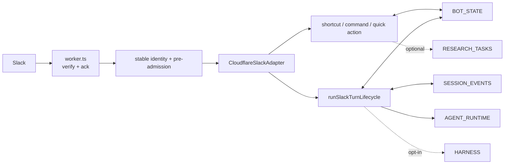

# OpenTag edge

The `edge/` workspace is the testable Cloudflare target: the Slack bot,
Durable Object state, optional research Worker, production AG-UI Container,
and optional Claude Code harness.

Current architecture: [ARCHITECTURE.md](../ARCHITECTURE.md)

Operations: [docs/operations.md](../docs/operations.md)

Extension rules: [docs/extending.md](../docs/extending.md)

## Deployment units

| Config or package | Role | Status |
| --- | --- | --- |
| `wrangler.bot.toml` | `opentag-bot`, production Slack surface | Active target |
| `wrangler.toml` | `opentag-edge`, local/development bot | Active target |
| `workers/agent-runtime/` | `opentag-agent`, AG-UI triage Container | Production runtime |
| `workers/sandbox/` | `opentag-harness`, Claude Code Container | Code-complete, opt-in |
| `wrangler.research.toml` | `opentag-orchestrator`, internal research | Optional task plane |
| `wrangler.bot-store.toml` | StateStore workerd alias | Test-only |
| `workers/wasm-dispatch/` | Intent dispatcher | Optional research build path |

## Install and test

```bash
cd edge
npm ci
npm run typecheck
npm test
npm run test:e2e
```

GitHub Actions runs these under Node 22. `edge/tsconfig.json` includes
`workers/**/*.ts`, so compile-time packages used by the sandbox Worker must
also be declared in `edge/package.json`.

Harness package check:

```bash
cd workers/sandbox
npm ci
npm run typecheck
```

## Bot request flow



`runSlackTurnLifecycle()` is the only production model-turn entry point. It:

1. adopts or refreshes the pre-admitted active turn;
2. resolves override flags and verifies the exact turn remains pending;
3. writes the initial render obligation;
4. admits the exact execution in SessionEventDO;
5. exits silently for a duplicate redelivery, or emits one durable-deduped
   busy note for a genuinely concurrent ask;
6. refreshes the obligation cursor after accepted admission;
7. requests remote-git HITL for qualifying coding turns;
8. routes to AG-UI or the authoritative Claude Code harness;
9. fences every turn render and non-Slack side effect;
10. leaves final cleanup to confirmed terminal visibility or exact Stop.

AG-UI incremental Markdown is mirrored best-effort into SessionEventDO before
Slack updates so alarm recovery can replay it. Harness NDJSON uses the same
exact execution log. Session input is override-stripped and recovery filters
events by execution ID.

## Durable Objects

| Binding | Class | Responsibilities |
| --- | --- | --- |
| `BOT_STATE` | `ConversationStateDO` | generic StateStore, active/effect/render fences, obligations, Stop continuation, HITL, memory |
| `SESSION_EVENTS` | `SessionEventDO` | execute/forward dedup, append events, replay, exact interrupts |
| `WORKSPACE_CONFIG` | `WorkspaceConfigDO` | prompts, bundles, channel policy |
| `KNOWLEDGE` | `KnowledgeDO` | channel knowledge |

Production and development configs have separate migration histories. Do not
rename Durable Object classes or delete migration tags after deployment.

## Slack renderer and identity

- streaming uses one placeholder, conflation, and bounded updates;
- Markdown blocks are capped at Slack limits and terminal `done` remains last;
- all Slack Web API bodies use form encoding;
- DMs use `DM_SCOPE`;
- a channel mention uses its own/root message timestamp;
- a top-level slash command uses channel scope because Slack provides no ts;
- a DM slash command may look up a recent DM timestamp solely for assistant
  status while retaining `DM_SCOPE` as its conversation identity;
- stable wire IDs are `ot1e_…` for executions and `ot1m_…` for forwarded messages.

## Stop and recovery

Stop is detected before bot dispatch. It claims the exact turn, cancels HITL,
interrupts SessionEventDO, controls AG-UI/harness/research, posts a fenced
acknowledgement, and clears only after visibility. Partial work continues by
the ConversationStateDO alarm.

Render obligations replay only the obligated execution. A live session is
deferred only while its exact active-turn row still exists; an orphaned
`executing` marker is treated as a crash so recovery cannot defer forever.

## Runtime selection

The default is `AGENT_RUNTIME` plus the `AGENT_URL` path. Same-zone
`workers.dev` fetches can fail with Cloudflare 1042, so use the service binding.
The harness is selected only when the sticky override is `claudecode` and its
binding/URL is configured. Qualifying coding work does not fall back to AG-UI.

## Deploy

Deployment is always an explicit operator action:

```bash
npm run deploy:agent
npm run deploy:bot
npm run deploy:research   # optional
```

The harness has separate secrets, allowlists, and deployment steps in
[docs/operations.md](../docs/operations.md). Do not deploy it merely because
its package typechecks.

## Workers-safe CopilotKit Channels

Normal installs use `@copilotkit/channels` from
`vendor/copilotkit-channels-0.1.1.tgz`; UI and Slack packages come from npm.
The tarball removes `createRequire(import.meta.url)`, which crashes workerd.
A sibling CopilotKit checkout is needed only to refresh the tarball; see
[vendor/README.md](./vendor/README.md).
