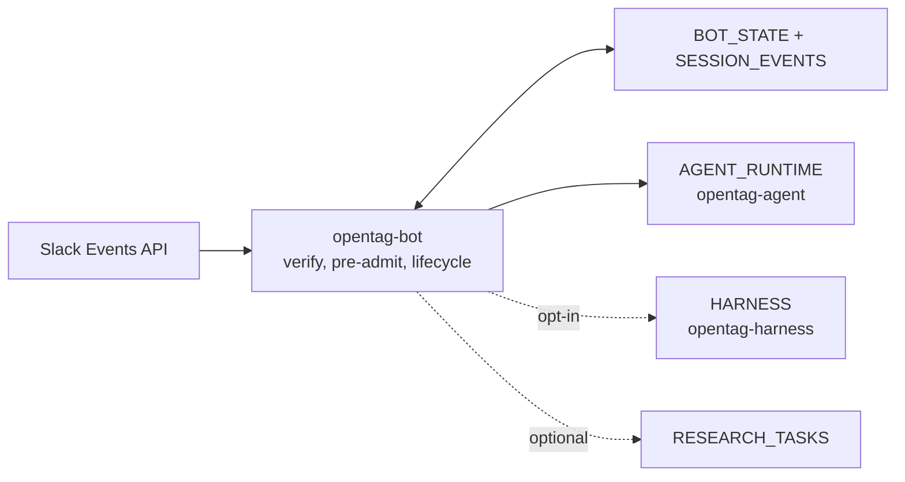

# OpenTag — setup & configuration

> **Start here:** [README.md](./README.md) · [PRODUCT.md](./PRODUCT.md) ·
> [ARCHITECTURE.md](./ARCHITECTURE.md) · [docs/operations.md](./docs/operations.md).
> Slack ingress is the **Cloudflare bot Worker** (Events API). There is no Socket Mode bot.
> Locked decisions: [DECISIONS.md](./DECISIONS.md).

## How it fits together



The bot must call the agent via the **`AGENT_RUNTIME` service binding** (same-zone
`workers.dev` fetch returns Cloudflare error 1042). `AGENT_URL` still supplies
the request path.

## Production deploy

Requires **Workers Paid** (Cloudflare Containers).

```bash
# 1. Triage agent Container
cd edge/workers/agent-runtime
npm ci
npx wrangler secret put OPENAI_API_KEY
npx wrangler secret put LINEAR_API_KEY
npx wrangler secret put LINEAR_TEAM_KEY   # display name, e.g. Berendo — not a bare key like CPK
# optional: AGENT_MODEL, NOTION_TOKEN, NOTION_MCP_AUTH_TOKEN, AGENT_AUTH_HEADER
npm run deploy

# 2. Bot Worker
cd ../..
printf '%s' 'https://opentag-agent.<account>.workers.dev/api/copilotkit/agent/triage/run' \
  | npx wrangler secret put AGENT_URL --config wrangler.bot.toml
npx wrangler secret put SLACK_BOT_TOKEN --config wrangler.bot.toml
npx wrangler secret put SLACK_SIGNING_SECRET --config wrangler.bot.toml
npm run deploy:bot
```

No laptop `pnpm runtime` or cloudflared tunnel is required for production Slack.

## Local / quick iterate (dev-only)

```bash
# Agent (repo root) — optional when iterating on prompts without redeploying the image
cp .env.example .env          # OPENAI_API_KEY, LINEAR_*, optional Notion
pnpm install && pnpm runtime  # :8200

# Bot Worker
cd edge
cp .dev.vars.example .dev.vars   # SLACK_BOT_TOKEN, SLACK_SIGNING_SECRET, AGENT_URL
npm ci && npm run dev            # uses vendored @copilotkit/channels — see edge/README.md
```

Point Slack Request URLs at the Worker (`/slack/events`, `/slack/commands`,
`/slack/interactions`) — see [`slack-app-manifest.yaml`](./slack-app-manifest.yaml).
For local Slack inbound, tunnel the wrangler port (often `:8787`) or deploy
`npm run deploy:bot`.

## 1. Create a Slack app

1. [api.slack.com/apps](https://api.slack.com/apps?new_app=1) → **From a manifest** → paste
   [`slack-app-manifest.yaml`](./slack-app-manifest.yaml).
2. **OAuth & Permissions** → Install → copy **Bot User OAuth Token** (`xoxb-…`) → `SLACK_BOT_TOKEN`.
3. **Basic Information** → **Signing Secret** → `SLACK_SIGNING_SECRET`.
4. Set Request URLs to your Worker (`socket_mode_enabled: false`).
5. **After any scope change, reinstall the app** and update `SLACK_BOT_TOKEN` in
   both `edge/.dev.vars` and Cloudflare (`wrangler secret put SLACK_BOT_TOKEN --config wrangler.bot.toml`)
   if Slack shows a new token.

### Required bot scopes (manifest)

Critical for Linear create-from-Slack:

| Scope | Why |
| --- | --- |
| `users:read` | Resolve user IDs → names |
| **`users:read.email`** | Default Linear assignee from Slack profile |
| `files:read` | Download uploads for the agent |
| `reactions:write` | Hourglass / thanks reactions |
| `chat:write` (+ public / customize as needed) | Replies and cards |
| `app_mentions:read`, `*:history`, `*:read` | Mentions + thread continuity |

Verify the **installed** token (not just the manifest):

```bash
curl -sD - -o /dev/null -X POST https://slack.com/api/auth.test \
  -H "Authorization: Bearer $SLACK_BOT_TOKEN" | grep -i x-oauth-scopes
# Expect users:read.email and files:read among others.
```

## 2. Environment variables

| Variable | Where | Purpose |
| --- | --- | --- |
| `SLACK_BOT_TOKEN` | bot secrets / `.dev.vars` | Bot Web API (must include `users:read.email` for assignee) |
| `SLACK_SIGNING_SECRET` | bot secrets / `.dev.vars` | Events HMAC verify |
| `AGENT_URL` | bot secrets / `.dev.vars` | AG-UI triage path (`opentag-agent` in prod) |
| `AGENT_RUNTIME` | `wrangler.bot.toml` binding | Service binding to agent Worker (prod) |
| `OPENAI_API_KEY` | agent secrets / root `.env` | Model for triage runtime |
| `LINEAR_API_KEY` | agent secrets / root `.env` | Linear MCP |
| `LINEAR_TEAM_KEY` | agent secrets / root `.env` | Team **display name** (e.g. `Berendo`) |
| `NOTION_*` | agent secrets / root `.env` | Optional Notion MCP sidecar |
| `ADMIN_SECRET` / `INTERNAL_SECRET` | edge | Admin routes / research forward |
| `HARNESS` | `wrangler.bot.toml` service binding | Optional Claude Code Worker |
| `HARNESS_AUTH_TOKEN` | bot + harness secrets | Exact service authentication |
| `ANTHROPIC_API_KEY` / `CLAUDE_CODE_OAUTH_TOKEN` | harness secrets | Claude Code provider credential, injected at egress |
| `GITHUB_TOKEN` | harness secret | Repo read and approved write operations, injected at egress |
| `HARNESS_ALLOWED_REPO_HOSTS` / `HARNESS_ALLOWED_REPO_ORGS` | harness vars | Canonical repository allowlists |

See [`.env.example`](./.env.example) and [`edge/.dev.vars.example`](./edge/.dev.vars.example).

## 3. Linear create flow (what to expect)

1. `@bot create a linear ticket for me` → bot asks for title/description only
   (assignee defaults to the requester’s Slack email).
2. User sends fields (typos / missing colons OK) → `confirm_write` card with
   structured Title / Description / Team / Assignee.
3. **Create** → durable HITL (`choiceId` in `BOT_STATE`) → immediate
   `⏳ Creating Linear issue…` → agent `save_issue` + `issue_card` + URL.

If Create seems dead: confirm bot deploy includes `edge/src/hitl/durable-choice.ts`
and that you clicked a card from a **new** turn (old cards lack `choiceId`).
If assignee is always asked for: token is missing `users:read.email` (reinstall).

## 4. Integrations (runtime)

Linear and Notion MCP wiring lives in [`lib/triage-agent.ts`](./lib/triage-agent.ts) /
[`runtime.ts`](./runtime.ts). In the Container, Notion starts as a sidecar when
`NOTION_TOKEN` + `NOTION_MCP_AUTH_TOKEN` are set. Locally: `pnpm notion-mcp`.

**Container pitfall:** `TriageContainer.envVars` must be a **class field**, not a
getter — otherwise secrets never reach the process (see DECISIONS §10).

## Research tasks

```bash
cd edge && npm run dev:research
# or mock: RESEARCH_MOCK=1 pnpm e2e:research
```

See [docs/research-actors.md](./docs/research-actors.md).

## Tests

```bash
cd edge && npm test && npm run test:e2e && npm run typecheck
cd .. && pnpm check-types && pnpm test
cd edge/workers/sandbox && npm run typecheck
```

The edge suite covers durable choice, active turns, render obligations, exact
Stop, identity parity, concurrent/duplicate admission, harness routing/server/
egress, remote-git approval, coding postconditions, and research cancellation.

## Doc index

See [docs/README.md](./docs/README.md).

## Claude harness zero-trust egress

The optional `edge/workers/sandbox` Claude Code harness uses Cloudflare
Container outbound interception. Configure `ANTHROPIC_API_KEY` (or
`CLAUDE_CODE_OAUTH_TOKEN`), `GITHUB_TOKEN`, and `HARNESS_AUTH_TOKEN` as secrets
on the **harness Worker**, never as image variables. The Container receives
only sentinel credential values. Set `HARNESS_ALLOWED_REPO_HOSTS=github.com`
and a non-empty comma-separated `HARNESS_ALLOWED_REPO_ORGS` allowlist.

Internet access is deny-by-default. Anthropic and GitHub traffic crosses
Worker handlers that inject credentials; Git clone reads are restricted to the
configured orgs, and pushes/PR creation additionally require the short-lived
per-turn HITL scope for the exact repository and `opentag/session-*` branch.
Package/source mirrors are GET/HEAD-only. The runtime entrypoint installs
Cloudflare's ephemeral `/etc/cloudflare/certs/cloudflare-containers-ca.crt`
into Ubuntu's trust store and exposes it to Node via `NODE_EXTRA_CA_CERTS`.

Build for the deployment architecture (important on Apple Silicon):

```bash
docker build --platform linux/amd64 \
  -f containers/harness/Dockerfile \
  -t opentag-harness:local .
```

Enable remote git only after all of the following are configured:

1. Set a non-empty organization allowlist in
   `edge/workers/sandbox/wrangler.toml` or deployment configuration.
2. Put `HARNESS_AUTH_TOKEN`, the Anthropic credential, and `GITHUB_TOKEN` on
   the harness Worker.
3. Deploy from `edge/workers/sandbox` with `npm run deploy`.
4. Add the `HARNESS` service binding to `edge/wrangler.bot.toml` and the
   matching `HARNESS_AUTH_TOKEN` to the bot.
5. Deploy the bot explicitly and test read-only, Stop, commit-only, and a
   separately approved push/PR turn.

Do not treat a successful package typecheck or image build as authorization to
deploy. The harness remains opt-in until the binding and policies are reviewed.
